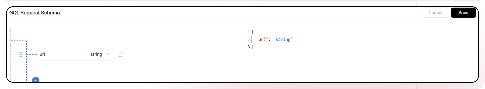
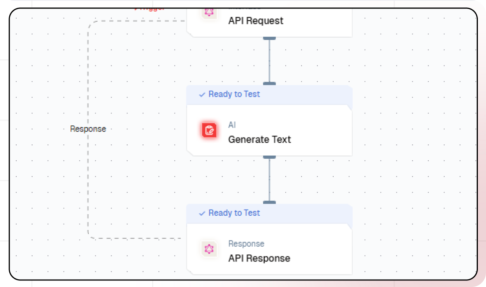
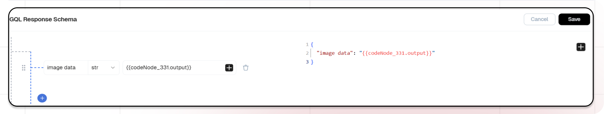

# Recipe Generation With AI

This guide will help you build an AI-powered recipe Generation system. The system processes image links provided by users, identifies food in the images, and generates a structured output. Each identified dish includes its name, ingredients, and cooking instructions, offering a seamless way to analyze and generate recipe ideas from food images.

## What You'll Build

A simple API that processes image links provided by users, identifies food in the images, and generates a structured output. Each identified dish includes its name, ingredients, and cooking instructions. This API enables seamless extraction of meaningful data from food images, ensuring efficient and accurate recipe generation for a wide range of culinary applications.

## Getting Started

### 1. Project Setup

1. Sign up at [Lamatic.ai](https://lamatic.ai/) and log in.
1. Navigate to the Projects and click **New Project** or select your desired project.
1. You'll see different sections like Flows, Context, and Connections
   

### 2. Creating a New Flow

1. Navigate to Flows, select New Flow.
2. Click **Create from scratch** as starting point.
   

### 3. Setting Up Your API

1. Click "Choose a Trigger"
2. Select "API Request" under the interface options
   
3. Configure your API:
   - Add your Input Schema
   - Set url as parameter in input schema
   - Set response type to "Real-time"
     
   - Click on save

### 4. Adding AI Text Generation

1. Click the + icon to add a new node
2. Choose "Generate Text"
   
3. Configure the AI model:
   - Select your "Gemini" credentials
   - Choose "gemini-1.5-pro-latest" as your Model
4. Under prompts section click the + icon to add prompt
5. Set up your prompt:

   ```
   Instructions:
   Analyze the image at the given URL:
   URL: {{triggerNode_1.output.url}}
   Task Objectives:
   Identify the dish shown in the image (e.g. sushi, biryani, etc.).
   Provide a detailed recipe for the identified dish.
   Recipe Details:

   Include:
   Dish name.
   Description.
   Serving size (e.g., "Yields: 2 servings").
   Prep time and cook time.
   Ingredients Section:
   Group ingredients logically (e.g., "noodles," "sauce," "stir-fry").
   Instructions Section:
   Provide step-by-step preparation and cooking directions.

   ```

- You can add variables using the "insert Variable" button

### 5. Configuring the reponse

1. Click the API response node
   
2. Add Output Variables by clicking the + icon
3. Select variable from your Code Node

### 7. Test the flow

1. Click on 'API Request' trigger node
2. Click on Configure test
   
3. Fill sample value in 'url' and click on test

### 8. Deployment

1. Click the Deploy button
   
2. Your API is now ready to be integrated into Node.js or Python applications
3. Your flow will run on Lamatic's global edge network for fast, scalable performance

### 9. What's Next?

- Experiment with different prompts
- Try other AI models
- Add more processing steps to your flow
- Integrate the API into your applications

### 10. Tips

- Save your tests for reuse across different scenarios
- Use consistent JSON structures for better maintainability
- Test thoroughly before deployment

Now you have a working AI-powered API! You can expand on this foundation to build more complex applications using Lamatic.ai's features.
