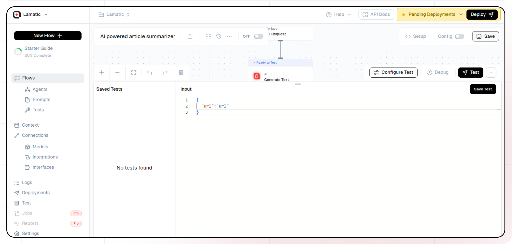

import { Accordion, AccordionItem } from "@nextui-org/react";
import SectionRows  from '@/components/SectionRows'
import { Callout } from 'nextra-theme-docs'
import {buttonVariants, Button} from '@/components/ui/button'

# AI Powered Image Description Generator.

<div className="grid md:grid-cols-1 gap-2 mb-8">
  <div className="">
    <SectionRows 
      section="Difficulty Level" 
      chips={["Beginner"]} 
    />
    
    <SectionRows 
      section="Nodes" 
      chips={[
         "Multi Modal LLM"
      ]} 
    />
    
    <SectionRows 
      section="Tags" 
      chips={[
        "Engineering",
        "Product",
        "Marketing"
      ]} 
    />
  </div>
</div>

<div className="mt-4 mb-4">
  <Callout>
  Try out this flow yourself at Lamatic.ai. Sign up for free and start building your own AI workflows.
  <Button variant="destructive" className="mt-3" href="https://studio.lamatic.ai/_?templateSlug=caption-image" size="sm" asChild>
    <a href="https://studio.lamatic.ai/_?templateSlug=caption-image" target="_blank">Add to Lamatic</a>
  </Button>
</Callout>
</div>

This guide will help you build an AI-powered system that generates image descriptions using a multimodal node. The system processes image URLs, analyzes the content, and produces detailed textual descriptions. This tool can be used for various applications, including accessibility, content tagging, and automated captioning.

## What You'll Build

A smart image processing API that takes an image URL as input, uses a multimodal node to analyze the image, and generates a structured description. The generated output provides detailed insights about the image, enabling seamless and accurate image-to-text conversion for a wide range of applications.

## Getting Started

### 1. Project Setup

1. Sign up at [Lamatic.ai](https://lamatic.ai/) and log in.
1. Navigate to the Projects and click **New Project** or select your desired project.
1. You'll see different sections like Flows, Context, and Connections
   

### 2. Creating a New Flow

1. Navigate to Flows, select New Flow.
1. Click **Create from scratch** as starting point.
1. Next, click Choose a Trigger, where you can select an API Request, App, or Widget Interface as your trigger. We’ll use the API Request under the interface option.
   
1. Set the url param in API Request Node
     

### 4. Adding Multi Modal Node

1. Click the + icon to add a new node.
2. Choose "Multi Modal LLM".

3. Configure the AI model:
   - Select your "Open AI" credentials
   - Choose "gpt-4" as your Model
4. Set up your prompt:

```
You are a photo editor. Your task is to craft a concise, vivid, and engaging caption that accurately describes the attached photo, making it easy for someone to visualize the scene without seeing it.
Focus on key details, emotions, and context to create a compelling description: {{triggerNode_1.output.photo}}
```


5. In the attachments add Image URL as variable.

### 5. Configuring the reponse

1. Click the API response node
   
2. Add Output Variables by clicking the + icon
3. Select variable from your **Multi Modal LLM** Node

### 6. Test the flow

1. Click on 'API Request' trigger node
2. Click on Configure test
   
3. Fill sample value in 'url' and click on test

### 7. Deployment

1. Click the Deploy button
   
2. Your API is now ready to be integrated into Node.js or Python applications
3. Your flow will run on Lamatic's global edge network for fast, scalable performance

### 8. What's Next?

- Experiment with different prompts
- Try other AI models
- Add more processing steps to your flow
- Integrate the API into your applications

### 10. Tips

- Save your tests for reuse across different scenarios
- Use consistent JSON structures for better maintainability
- Test thoroughly before deployment

Now you have a working AI-powered API! You can expand on this foundation to build more complex applications using Lamatic.ai's features.
