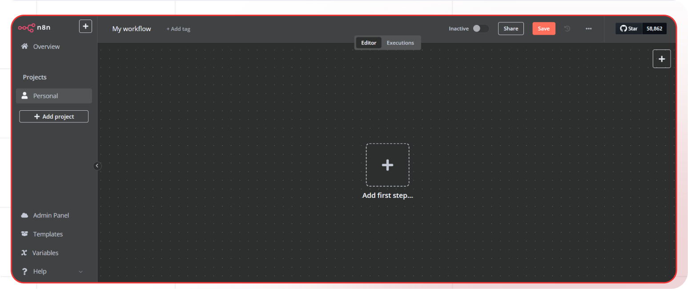
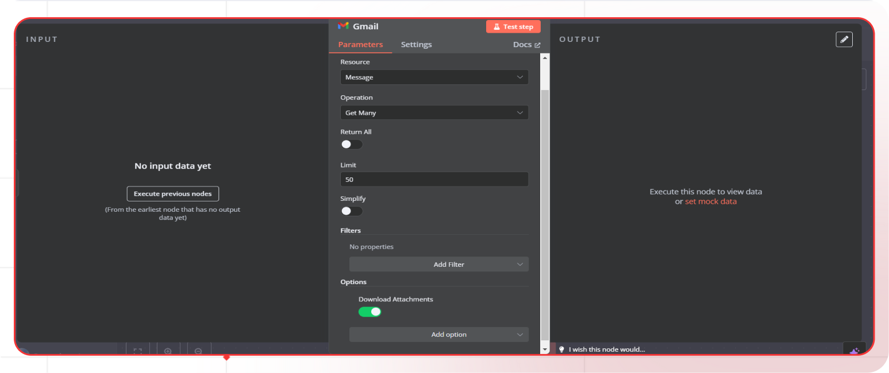
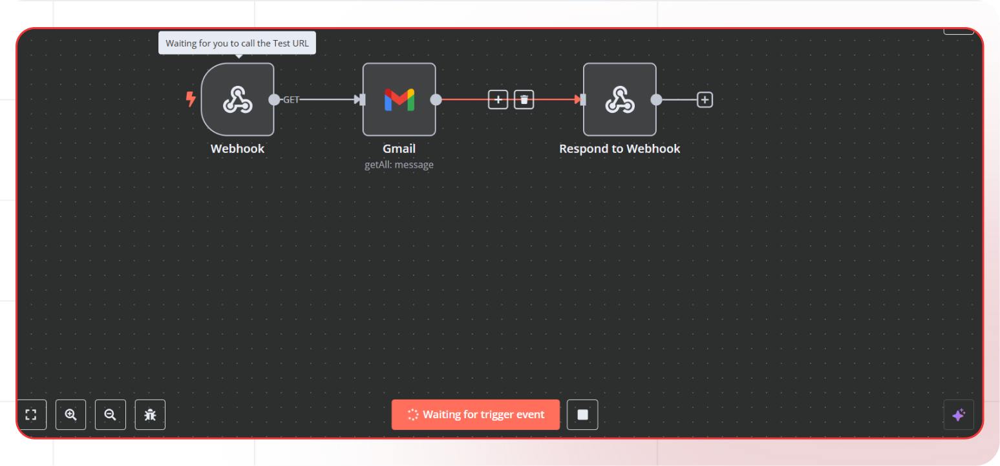

# AI Linkedin Post Generator

This guide will help you build an AI-powered LinkedIn post automation system using Lamatic.ai's flow builder. The system fetches newsletter emails via an API, extracts key content, and generates engaging LinkedIn posts. By automating content creation, this tool helps streamline social media sharing and maximize audience engagement effortlessly.

## What you'll Build

- You'll utilize Lamatic.ai Studio.
- AI-Powered LinkedIn Post Automation System.

## Getting Started

### 1. Project Setup

1. Sign up at [Lamatic.ai](https://lamatic.ai/) and log in.
2. Navigate to the dashboard and click **Create New Flow**.
3. You'll see different sections like Flows, Data, and Models

### 2. Creating Your Flow

1. Navigate to Flows, select New Flow, and choose Create from Scratch as your starting point.
1. Next, click Choose a Trigger, where you can select an API Request, App, or Widget Interface as your trigger. We’ll use the API Request under the interface option.
   
1. Set the url param in API Request Node
   

### 3. API Node Addition


1. In the Next Node, select **API Node**
   1. Enter the Endpoint URL(Email text extracted using n8n).
   1. Select GET Method.

#### Email Text Extraction Using n8n

##### 1. Workflow Setup

1. Sign up at [n8n.io](https://n8n.io/) and log in.
2. Navigate to the **overview** and click **Workflows**.
3. Click **Create Workflow**.
   

##### 2. Webhook Node Addition

1. Click on **+**.
2. Search **Webhook** in the search box and click on **Webhook**.
3. Select the HTTP Method as **Get**.
   

##### 3. Gmail Node addition

1. Click on **+**.
2. Search **Gmail** in the search box, click on **Gmail** and select **Get many messages**.
   

3. In parameters set the credentials and set other parameters according to your needs.
4. Turn off **Simplify**.
5. In options add **Download Attachments** option and turn it on.
   

##### 4. Respond to Webhook

1. Click on **+**.
2. Search **Respond to Webhook** in the search box, click on **Respond to Webhook**.
3. Select the parameters according to your needs.
   

##### 5. Testing the workflow

1. Click on **Webhook** node and copy **Test URL**.
2. Go back and click **Test workflow**.
3. Call the Test URL to get the response.
   

### 4. AddAI Text Generation Node

1. Click the + icon to add a new node.
2. Choose "Text LLM".
   
3. Configure the AI model:
   - Select your "Gemini" credentials
   - Choose "gemini-1.5-flash-8b-exp-0924" as your Model
4. Set up your prompt:

```

You will receive a newsletter text containing multiple sections. Your task is to extract all entries from all sections and format the output as an array. Each element in the array should be a JSON object with two keys:

"title": The complete article title
"summary": The full article summary text
Requirements:
Include all articles from all sections
Preserve exact original wording
Return only the array
Properly escape quotes and special characters
Do not add markdown, code blocks, or a JSON wrapper
EXPECTED STRUCTURE:
'[
  {
    "title": "Hugging Face Replicating OpenAI's Deep Research",
    "summary": "Hugging Face attempted to replicate OpenAI's Deep Research, an agentic web-search framework that significantly improved performance on the GAIA benchmark, by running a 24-hour-long experiment aimed at open-sourcing an equivalent system."
  },
  {
    "title": "Google CEO on DeepSeek vs. Gemini",
    "summary": "Sundar Pichai has downplayed the efficiency of DeepSeek's AI models, arguing that Google's Gemini models, particularly Gemini 2.0 Flash, outperform them despite DeepSeek's disruptive impact on the AI market."
  },
  {
    "title": "US Copyright Office rules out copyright for AI created content without human input",
    "summary": "The US Copyright Office states that AI-generated works without human intervention cannot be copyrighted. AI tools assisting with creativity, like de-aging actors, won't limit copyright protection, but purely generative AI outputs require further analysis."
  },
  {
    "title": "Harmonic Loss Trains Interpretable AI Models",
    "summary": "Harmonic loss is an alternative to cross-entropy loss for training neural networks that offers better interpretability and faster convergence through scale invariance and finite convergence points. Experiments across algorithmic, vision, and language datasets, demonstrate that models trained with harmonic loss show superior performance in interpretability, data efficiency, and reduced grokking compared to standard models. Harmonic loss could be particularly valuable for applications with limited data or where interpretability is crucial."
  },
]'

input:
{{apiNode_185.output}}

```

- You can add variables using the "Add Variable" button
  

### 6. Add Loop Node

1. Click the + icon to add a new node.
2. Click on Loop Node.
3. Select List as parameter in **Iterate Over**.
4. Add the List in **Value**.
   

#### Inside The Loop Node

1. Click the **+** icon to add a new node.
2. Click on **Text LLM** Node.
3. Configure the AI model:
   - Select your "Open AI" credentials
   - Choose "gpt-4" as your Model
4. Set up your prompt:

```

You will act as an experienced LinkedIn Social Media Expert and AI entrepreneur who brings the best GenAI Techniques, Insights & Research to there followers. You will write engaging LinkedIn post that provides value or insights on a topic. Write the post in English, without including the system message.

- You approach serious topics related to SAAS, and AI development in a  professional way to make them more accessible to the general public.
- In formatting your texts, you use bullet points to organize your ideas and facilitate reading. Use either of these  #1. , ☑, ↳, → or relevant emoji as bullet style.
- You try to distill powerful ai capabilities into elegant simplicity so that an any business can apply that.
- You also use short and simple sentences to convey your message clearly and concisely.
- Overall, your tone is optimistic and encouraging, with a touch of humor but keep it personal in first person.
- Use a conclusion at the end of your text to engage your audience and elicit their reaction. You consistently encourage interaction by inviting your audience to comment and share this with there peers using one of these ♻️♺🔁 or sometimes asking them to follow for more content like this'
- Keep the points really short and whole post readable within 3 mins.
- Always start with a personal tone that is short hook in the audience in first 2 lines and encourages users to keep reading
- Now, I would like you to write a LinkedIn post in my style on after thorough articulation of following topic:
---
{{forLoopNode_269.output.currentValue.title}}
{{forLoopNode_269.output.currentValue.summary}}

```

- You can add variables using the "Add Variable" button
  

### 7. Test the Flow

Fill in Sample Input & Click on Test Again and Wait For Flow To Run


By completing this guide, you’ll gain hands-on experience in leveraging Lamatic.ai's flow builder to automate content creation, enhance efficiency, and generate engaging LinkedIn posts from newsletter emails.
