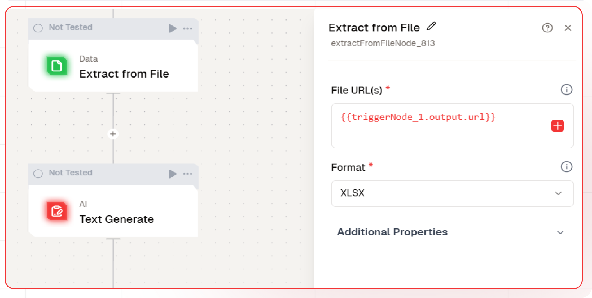
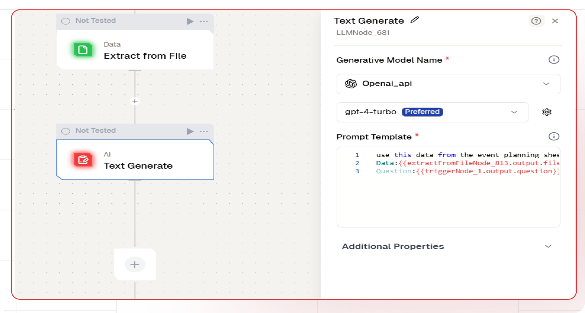
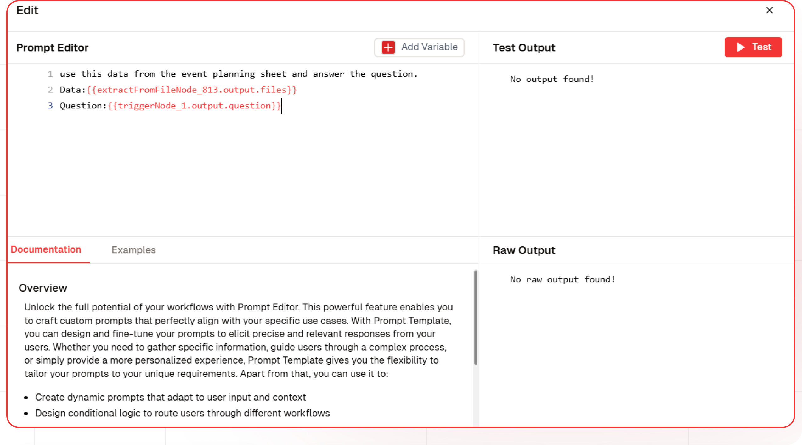
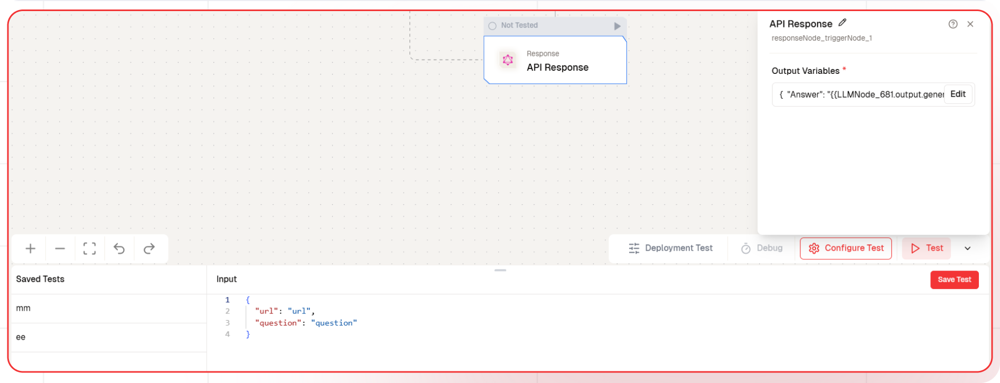

# AI Powered Event Insights

This guide will walk you through building an AI-powered event data processing system. The workflow collects event data, passes it to a text generation node, and enables users to ask questions to receive AI-generated insights. This system allows for efficient event analysis and real-time information retrieval.

## What You'll Build

A simple API that processes event data, passes it to a text generation node, and enables users to ask questions for AI-generated insights. This API enhances event analysis by providing quick and accurate responses, enabling seamless integration with automation and decision-making workflows.

## Getting Started

### 1. Creating a New Flow

1. Navigate to Flows, select New Flow, and choose Create from Scratch as your starting point.
2. Click "New Flow".
   
3. Select "Create from Scratch".
   

### 2. Setting Up Your API

1. Click "Choose a Trigger".
2. Select "API Request" under the interface options.
   
3. Configure your API:
   - Add your Input Schema
   - Set url and question as parameter in input schema
   - Set response type to "Real-time"

### 3. File Extraxt Node Addition



1. In the Next Node, select **Extract From File Node**
   1. Enter the File URL.
   1. Select Format as **XLSX**.

### 4. Adding AI Text Generation

1. Click the + icon to add a new node.
2. Choose **Text Generate**.
   
3. Configure the AI model:
   - Select your "Open AI" credentials
   - Choose "gpt-4-turbo" as your Model
4. Set up your prompt:

```

Use this data from the event planning sheet and answer the question.
Data:{{extractFromFileNode_813.output.files}}
Question:{{triggerNode_1.output.question}}

```



- You can add variables using the "Add Variable" button

### 5. Configuring the reponse

1. Click the API response node.
2. Add Output Variables by clicking the + icon.
3. Select variable from your Text Generate Node.

### 6. Test the flow

1. Click on 'API Request' trigger node.
2. Click on Configure test.
   
3. Fill sample value in 'url','question' and click on test.

### 7. Deployment

1. Click the Deploy button.
   
2. Your API is now ready to be integrated into Node.js or Python applications.
3. Your flow will run on Lamatic's global edge network for fast, scalable performance.

### 8. What's Next?

- Experiment with different prompts
- Try other AI models
- Add more processing steps to your flow
- Integrate the API into your applications

### 9. Tips

- Save your tests for reuse across different scenarios
- Use consistent JSON structures for better maintainability
- Test thoroughly before deployment

Now you have a working AI-powered API! You can expand on this foundation to build more complex applications using Lamatic.ai's features.
