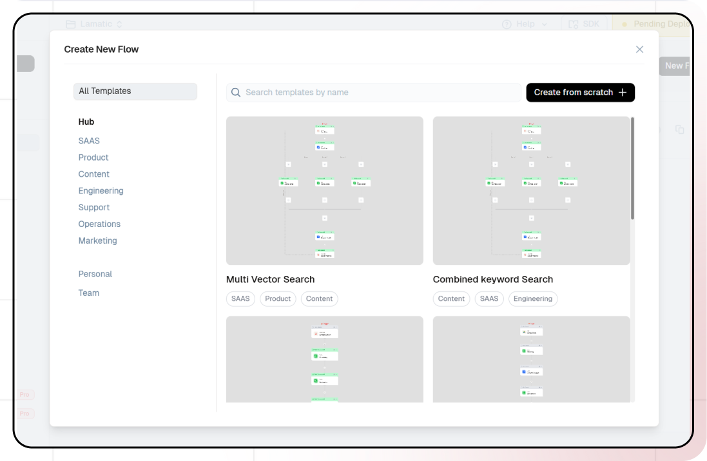
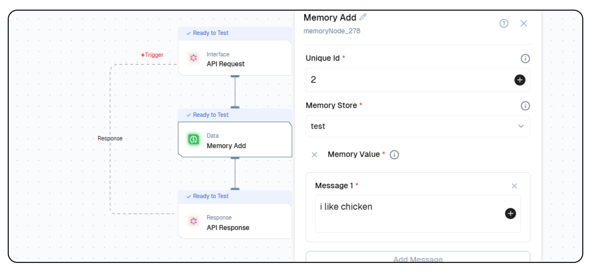
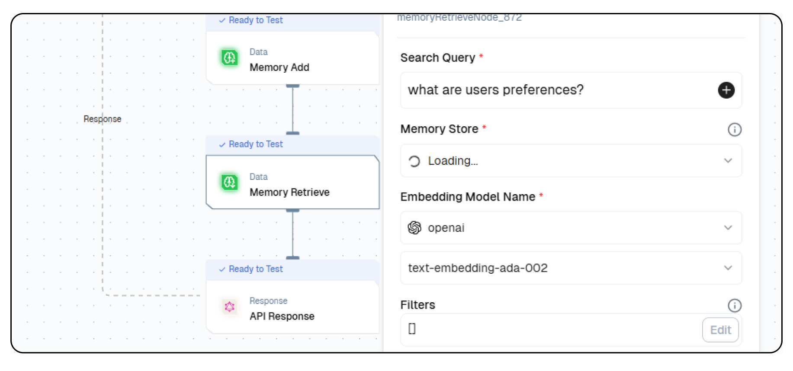
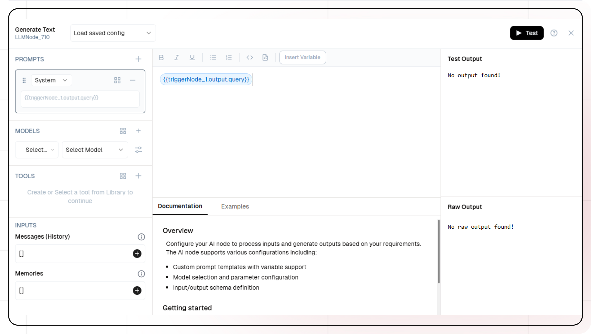
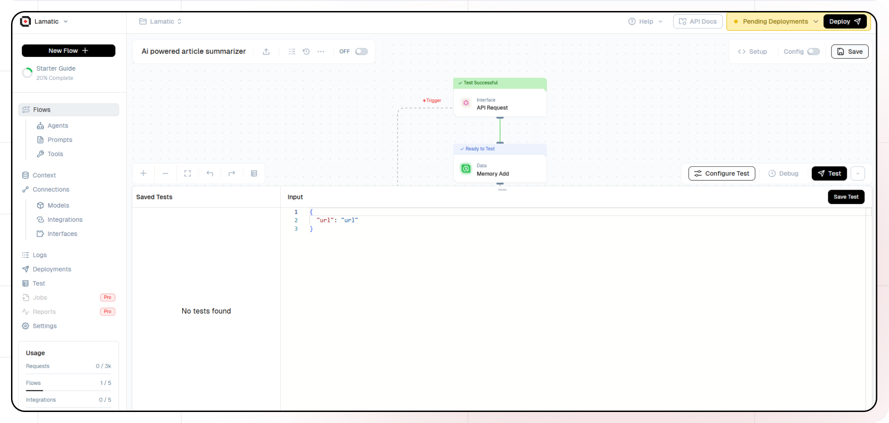

import { Accordion, AccordionItem } from "@nextui-org/react";
import SectionRows  from '@/components/SectionRows'
import { Callout } from 'nextra-theme-docs'
import {buttonVariants, Button} from '@/components/ui/button'

# AI Recipe Maker with Memory Store
<div className="grid md:grid-cols-1 gap-2 mb-8">
  <div className="">
    <SectionRows 
      section="Difficulty Level" 
      chips={["Intermediate"]} 
    />
    
    <SectionRows 
      section="Nodes" 
      chips={[
         "Memory Add",
         "Memory Retrieve",
         "Text LLM"
      ]} 
    />
    
    <SectionRows 
      section="Tags" 
      chips={[
        "Content"
      ]} 
    />
  </div>
</div>

<div className="mt-4 mb-4">
  <Callout>
  Try out this flow yourself at Lamatic.ai. Sign up for free and start building your own AI workflows.
  <Button variant="destructive" className="mt-3" href="https://studio.lamatic.ai/_?templateSlug=recipe-maker-with-memory" size="sm" asChild>
    <a href="https://studio.lamatic.ai/_?templateSlug=recipe-maker-with-memory" target="_blank">Add to Lamatic</a>
  </Button>
</Callout>
</div>


This guide will help you build an AI-powered recipe generation system with a memory node. The system processes user inputs, remembers preferences, dietary restrictions, and past interactions, and generates personalized recipes. Whether you have allergies, specific tastes, or favorite ingredients, the AI tailors its suggestions to create customized cooking instructions that suit your needs.

## What You'll Build

A smart recipe API that processes user inputs, remembers preferences, and generates structured recipe outputs. Each generated recipe includes the dish name, ingredients, and step-by-step cooking instructions while considering user-defined dietary restrictions and favorite ingredients. This API enables seamless and personalized recipe recommendations for a wide range of culinary applications.

## Getting Started

### 1. Project Setup

1. Sign up at [Lamatic.ai](https://lamatic.ai/) and log in.
1. Navigate to the Projects and click **New Project** or select your desired project.
1. You'll see different sections like Flows, Context, and Connections
   

### 2. Creating a New Flow

1. Navigate to Flows, select New Flow.
2. Click **Create from scratch** as starting point.
   

### 3. Setting Up Your API

1. Click "Choose a Trigger"
2. Select "API Request" under the interface options
   
3. Configure your API:
   - Add your Input Schema
   - Set query as parameter in input schema
   - Set response type to "Real-time"
   - Click on save

### 4. Adding Memory Node

#### Memory Add Node

1. Click the + icon to add a new node.
2. Choose **Memory Add** node.
3. Enter **Unique ID** and **Memory Store**.
4. Enter the **Messages** in the memory value.
5. Configure the Embedding model:
   - Select your "Open AI" credentials
   - Choose "text-embeddin-3-small" as your Model
6. Configure the Generative model:
   - Select your "Open AI" credentials
   - Choose "gpt-4o-mini" as your Model
     

#### Memory Retrieve Node

1. Click the + icon to add a new node.
2. Choose **Memory Retrieve** node.
3. Enter query in search query:
   ```
   What are the user's preferences?
   ```
4. Select the **Memory Store** you selected in Memory Add node.
5. Configure the Embedding model:
   - Select your "Open AI" credentials
   - Choose "text-embeddin-3-small" as your Model
     

### 5. Adding AI LLM

1. Click the + icon to add a new node
2. Choose "Generate Text"
3. Configure the AI model:
   - Select your "Open AI" credentials
   - Choose "gpt-4o-mini" as your Model
4. Click on "+" under Prompts section.
5. Set up your prompt:

   ```
   {{triggerNode_1.output.query}}

   ```

- You can add variables using the "insert Variable" button
  

5. Add output from Memory Retrieve node in **Memories**

### 6. Configuring the reponse

1. Click the API response node
2. Add Output Variables by clicking the + icon
3. Select variable from your **Generate Text** Node

### 7. Test the flow

1. Click on 'API Request' trigger node
2. Click on Configure test
   
3. Fill sample value in 'query' and click on test

### 8. Deployment

1. Click the Deploy button
   
2. Your API is now ready to be integrated into Node.js or Python applications
3. Your flow will run on Lamatic's global edge network for fast, scalable performance

### 9. What's Next?

- Experiment with different prompts
- Try other AI models
- Add more processing steps to your flow
- Integrate the API into your applications

### 10. Tips

- Save your tests for reuse across different scenarios
- Use consistent JSON structures for better maintainability
- Test thoroughly before deployment

Now you have a working AI-powered API! You can expand on this foundation to build more complex applications using Lamatic.ai's features.
