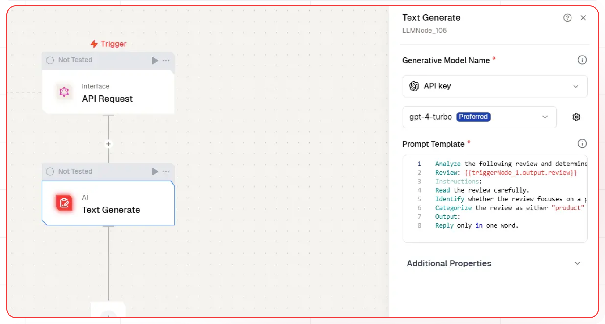
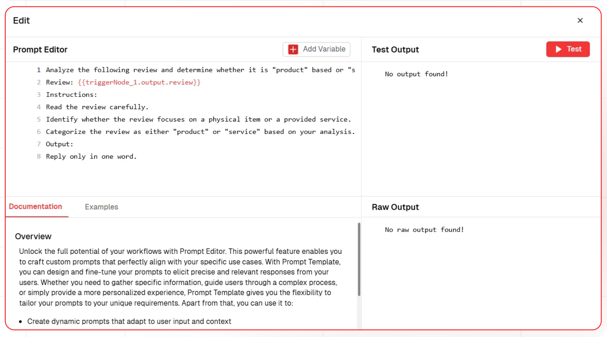
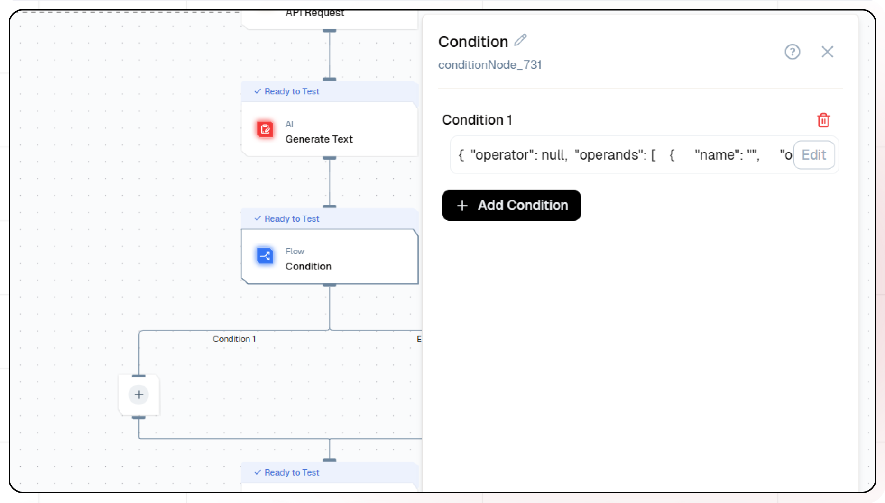
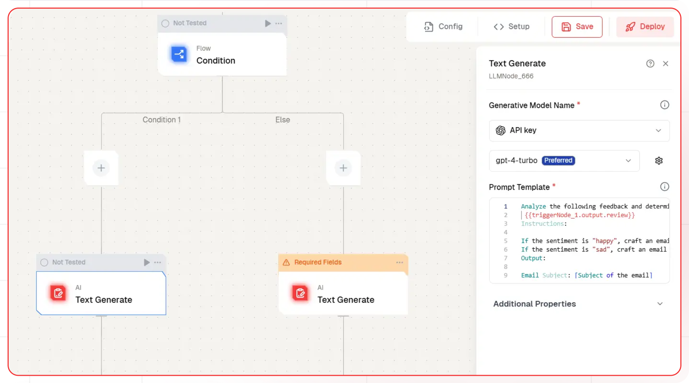
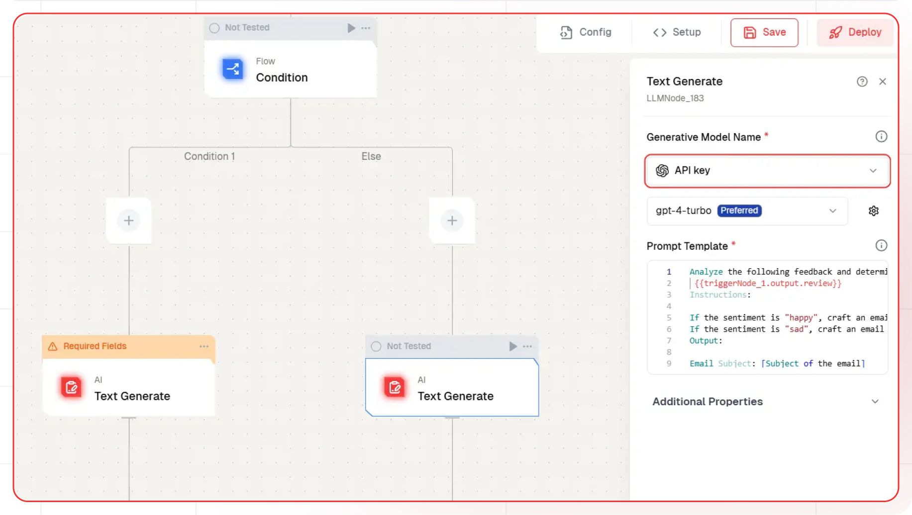
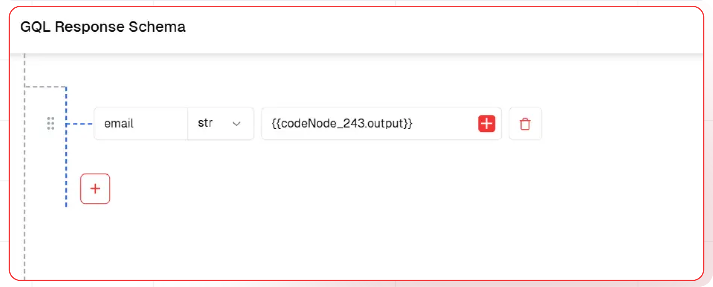
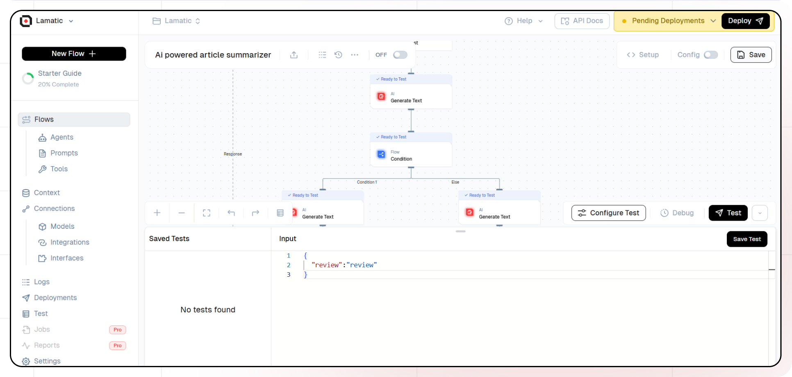

# AI Review Responder

This guide will help you build an AI-powered review analysis and response system. The system automatically classifies customer reviews into service or product categories, analyzes the sentiment of each review, and generates personalized email responses. Positive reviews receive appreciative responses, while negative ones are addressed with constructive and empathetic messages, ensuring a thoughtful and professional customer experience.

## What You'll Build

A simple API that that classifies customer reviews as either service or product-related and analyzes their sentiment. When you input a review into your system, it will automatically generate a thoughtful email response tailored to the review's category and sentiment, ensuring professional and personalized customer engagement.

## Getting Started

### 1. Project Setup

1. Sign up at [Lamatic.ai](https://lamatic.ai/) and log in.
1. Navigate to the dashboard and click **Create New Flow**.
1. You'll see different sections like Flows, Data, and Models
   

### 2. Creating a New Flow

1. Navigate to Flows, select New Flow, and choose Create from Scratch as your starting point.
2. Click "New Flow"
   
3. Select "Create from Scratch"
   

### 3. Setting Up Your API

1. Click "Choose a Trigger"
2. Select "API Request" under the interface options
   
3. Configure your API:
   - Add your Input Schema
   - Set review as parameter in input schema
   - Set response type to "Real-time"
     

### 4. Adding AI Text Generation

1. Click the + icon to add a new node
2. Choose "Text LLM"
   
3. Configure the AI model:
   - Select your "Open AI" credentials
   - Choose "gpt-4-turbo" as your Model
4. Set up your prompt:

   ```
    Analyze the following review and determine whether it is "product" based or "service" based.
    Review: {{triggerNode_1.output.review}}
    Instructions:
    Read the review carefully.
    Identify whether the review focuses on a physical item or a provided service.
    Categorize the review as either "product" or "service" based on your analysis.
    Output:
    Reply only in one word.

   ```

- You can add variables using the "Add Variable" button
  

### 5. Adding condition node

To generate an email based on the output of the text generation node, we will use a condition node. This node will evaluate the output and perform specific tasks depending on whether the condition given in node is true or false.

1. Click the + icon to add a new node
2. Click on the Condition Node
   
3. Add Condition:

   ```
    {{LLMNode_810.output.generatedResponse}} == 'product'
   ```

### 6. Condition flow execution

##### If the condition is true the condition 1 flow will be executed

1. Click the + icon to add a new node
2. Choose "Text LLM"
   
3. Configure the AI model:
   - Select your "Open AI" credentials
   - Choose "gpt-4-turbo" as your Model
4. Set up your prompt:

   ```
   Analyze the following feedback and determine whether the sentiment behind it is "happy" or "sad":
   {{triggerNode_1.output.review}}
   Instructions:
   If the sentiment is "happy", craft an email that expresses gratitude and appreciation for the positive feedback.
   If the sentiment is "sad", craft an email that acknowledges the issue, expresses empathy, and offers a resolution or next steps.
   Output:
   Email Subject: [Subject of the email]
   Email Body: [Content of the email]
   ```

##### If the condition is false the else flow will be executed

5. Click the + icon to add a new node
6. Choose "Text LLM"
   
7. Configure the AI model:
   - Select your "Open AI" credentials
   - Choose "gpt-4-turbo" as your Model
8. Set up your prompt:

   ```
   Analyze the following feedback and determine whether the sentiment behind it is "happy" or "sad":
   {{triggerNode_1.output.review}}
   Instructions:
   If the sentiment is "happy", craft an email that expresses gratitude and appreciation for the positive feedback.
   If the sentiment is "sad", craft an email that acknowledges the issue, expresses empathy, and offers a resolution or next steps.
   Output:
   Email Subject: [Subject of the email]
   Email Body: [Content of the email]
   ```

### 7. Adding code node

1. Click the + icon to add a new node
2. Click the code node
   
3. Write the JavaScript code :

```
if ({{LLMNode_318.output.generatedResponse}}) {
  output={{LLMNode_318.output.generatedResponse}}
}
else {
  output={{LLMNode_786.output.generatedResponse}}
}
```

### 8. Configuring the reponse

1. Click the API response node
   
2. Add Output Variables by clicking the + icon
3. Select variables from your Text LLM Node

### 9. Test the flow

1. Click on 'API Request' trigger node
2. Click on Configure test
   
3. Fill sample value in 'review' and click on test

### 10. Deployment

1. Click the Deploy button
   
2. Your API is now ready to be integrated into Node.js or Python applications
3. Your flow will run on Lamatic's global edge network for fast, scalable performance

### 11. What's Next?

- Experiment with different prompts
- Try other AI models
- Add more processing steps to your flow
- Integrate the API into your applications

### 12. Tips

- Save your tests for reuse across different scenarios
- Use consistent JSON structures for better maintainability
- Test thoroughly before deployment

Now you have a working AI-powered API! You can expand on this foundation to build more complex applications using Lamatic.ai's features.
