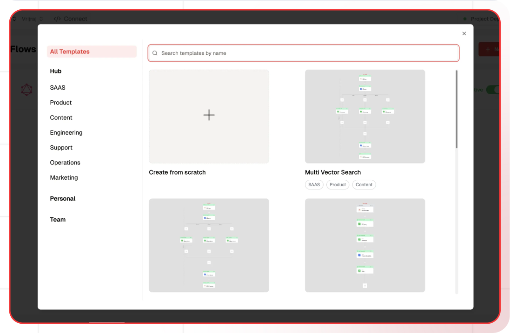

# Automated Image-Based Product Identification

This guide will help you build an AI-powered product identification system. The system processes image links provided by users, identifies products in the images, and generates a structured JSON output. Each identified product includes its name, description, and shopping link, providing a seamless way to analyze and extract meaningful data from images.

## What You'll Build

A simple API that processes image links provided by users, identifies products in the images, and generates a structured JSON output. Each identified product includes its name, description, and shopping link. This API enables seamless extraction of meaningful data from images, ensuring efficient and accurate product identification for a wide range of applications.

## Getting Started

### 1. Project Setup

1. Sign up at [Lamatic.ai](https://lamatic.ai/) and log in.
1. Navigate to the dashboard and click **Create New Flow**.
1. You'll see different sections like Flows, Data, and Models
   

### 2. Creating a New Flow

1. Navigate to Flows, select New Flow, and choose Create from Scratch as your starting point.
2. Click "New Flow"
   
3. Select "Create from Scratch"
   

### 3. Setting Up Your API

1. Click "Choose a Trigger"
2. Select "API Request" under the interface options
   
3. Configure your API:
   - Add your Input Schema
   - Set url as parameter in input schema
   - Set response type to "Real-time"
     

### 4. Adding AI Text Generation

1. Click the + icon to add a new node
2. Choose "Text LLM"
   
3. Configure the AI model:
   - Select your "Gemini" credentials
   - Choose "gemini-1.5-pro-latest" as your Model
4. Set up your prompt:

   ```
   This is the image url:{{triggerNode_1.output.url}}
   Identify multiple objects in the image and provide information about each object, including its name, company, description, and
            similar products based on product details and
            ignore the object such as human, man, woman and child.
            Example:
            Given the image, identify the products and their respective companies. For each product detected:
            1. Name of the product:
            2. Product description (in 100 words max):
            3. 4 Similar products (if any):
            Return the data in the following JSON template:
            [
                {
                    “name”: “Name of the product”,
                    “description”: “This product is used for ABC and its use cases are XYZ.“,
                    “similar_products”: [“Similar Product 1", “Similar Product 2”, “Similar Product 3", “Similar Product 4”, ...]
                },
                {
                    “product_name”: “Name of another product”,
                    “description”: “This product is used for DEF and its use cases are UVW.“,
                    “similar_products”: [“Similar Product A”, “Similar Product B”, “Similar Product C”, “Similar Product D”, ...]
                },
                ...
            ]
            remove ... from similar_products from the results and remove json word

   ```

- You can add variables using the "Add Variable" button
  

### 5. Adding code node

1. Click the + icon to add a new node
2. Click the code node
   
3. Write the JavaScript code :

```
const responseString = {{LLMNode_885.output.generatedResponse}};
data = JSON.parse(responseString);
let prod_d = [];
for (let i = 0; i < data.length; i++) {
  m[i] = {
    "Product name": data[i].name,
    "Product description": data[i].description,
    "Product link": `https://www.google.com/search?q=${encodeURI(data[i].name)}&tbm=shop`
  }
}
output = prod_d
```

### 6. Configuring the reponse

1. Click the API response node
   
2. Add Output Variables by clicking the + icon
3. Select variable from your Code Node

### 7. Test the flow

1. Click on 'API Request' trigger node
2. Click on Configure test
   
3. Fill sample value in 'url' and click on test

### 8. Deployment

1. Click the Deploy button
   
2. Your API is now ready to be integrated into Node.js or Python applications
3. Your flow will run on Lamatic's global edge network for fast, scalable performance

### 9. What's Next?

- Experiment with different prompts
- Try other AI models
- Add more processing steps to your flow
- Integrate the API into your applications

### 10. Tips

- Save your tests for reuse across different scenarios
- Use consistent JSON structures for better maintainability
- Test thoroughly before deployment

Now you have a working AI-powered API! You can expand on this foundation to build more complex applications using Lamatic.ai's features.
