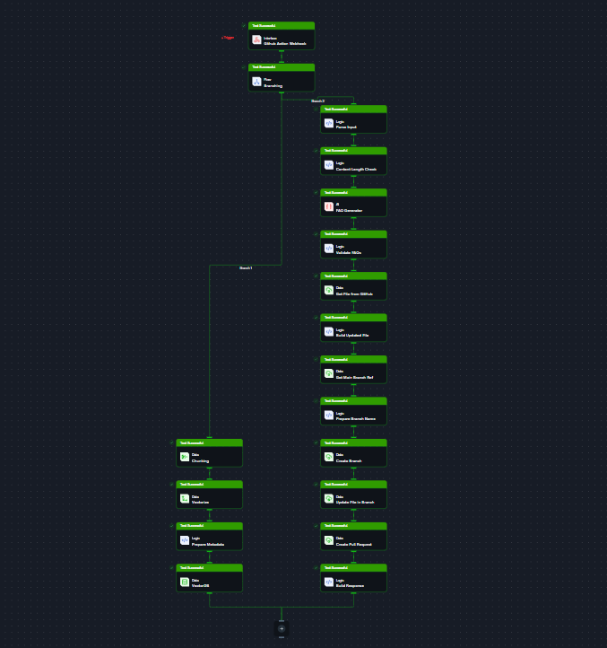
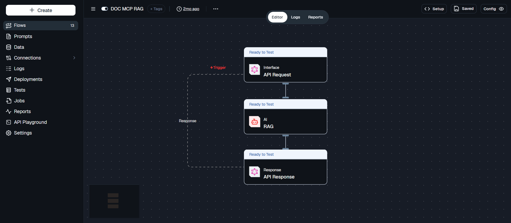

import { Callout, Steps } from 'nextra/components'

# Build Your Own Docs MCP

If you have ever wished your AI assistant could just answer questions about your own documentation instead of you copying and pasting links into a chat, this guide is for you. We are going to walk through building a Docs MCP, a small server that lets tools like Claude, Cursor, or Windsurf query your documentation directly and get accurate, grounded answers.

This is not a theoretical exercise. It is the exact setup we use to run the [Lamatic Docs MCP](/docs/mcp/docs-mcp), the one that answers questions about Lamatic itself. Everything here is built on two Lamatic flows working together, with no separate backend to maintain.

---

## What You Will Learn

* How to structure a documentation ingestion pipeline that keeps a vector database up to date
* How to build a RAG flow that turns a question into a grounded answer
* How to expose that flow as an MCP server that any AI client can connect to
* How to optionally automate FAQ generation and keep it synced back to your docs repo through a pull request

## What You Will Build

Two flows, each doing one job well.

1. **The Indexing Flow.** This one watches your documentation for changes, reads the content, and stores it in a vector database so it is ready to be searched.
2. **The RAG Query Flow.** This one takes a question, searches the vector database for relevant content, and asks a model to answer using only that content.

An MCP server sits on top of the second flow and speaks the Model Context Protocol, which is what lets AI assistants call it like a tool.

Here is the shape of it:

```
Docs change → Indexing Flow → Vector Database
                                     ↑
Question → MCP Client → MCP Server → RAG Query Flow → Answer
```

## Prerequisites

Before you start, make sure you have:

* A [Lamatic.ai](https://lamatic.ai) account and access to [Lamatic Studio](https://studio.lamatic.ai)
* A documentation source you can read from, such as a GitHub repo of Markdown files or a website you can crawl
* A Vector Database connected in your Lamatic project
* Basic comfort deploying a small Next.js app (we use Vercel, but any host that runs Node works)

---

## Part 1: The Indexing Flow

This flow is the one that keeps your vector database current. It is triggered whenever your documentation changes, and from there it splits into two independent paths using a branching node.

<Callout type="info">
  The two paths run off the same trigger but do completely different jobs. The first path is required, it is what actually populates your vector database. The second path is optional polish that keeps a FAQ file in your repo up to date automatically. Feel free to build just the first path if you want to keep things simple.
</Callout>

<Steps>

### Step 1: Create the flow

1. In Lamatic Studio, create a new **Flow from Scratch**.
2. Name it something like `Docs Indexing Flow`.
3. Set the **Trigger Node** to **Webhook**. This is what your documentation source will call whenever content changes, the same pattern used in our [GitHub Docs RAG guide](/guides/tutorials/github-docs-rag).

### Step 2: Add a branching node

Right after the trigger, add a **Branching** node. This is what splits the flow into the two paths described above. Each branch runs on the same input but handles it differently.

### Step 3: Branch one, store the content

This is the path that actually feeds your vector database. Chain these nodes together:

* **Chunking**: breaks the incoming document into smaller, overlapping pieces so the embedding model has manageable, meaningful units to work with instead of one huge block of text.
* **Vectorize**: turns each chunk into an embedding using your chosen embedding model.
* **Prepare Webhook**: shapes the vectors and their metadata, such as file name or source URL, into the format your vector database expects.
* **Vector DB**: writes the vectors into your vector database, keyed so that updates to the same document overwrite the old version instead of duplicating it.

Once this branch runs successfully, your vector database always reflects the latest version of your docs.

### Alternate way, using the VectorDB Node directly

If you'd rather not build a custom request to talk to your vector database, Lamatic has a built in **VectorDB Node** that handles writing vectors and metadata for you, no separate webhook step needed. It's a more common pattern and works well if your vector database is one of Lamatic's supported integrations.

Swap the last two nodes in Branch one for these instead:

* **Code**: after vectorizing, use a small script to pair each vector with its metadata, things like the source file name, URL, or section heading, so you can trace an answer back to where it came from later.
* **VectorDB**: select your vector database from the dropdown, set the action to `Index`, then map the vectors and metadata from the Code node into it. Set a primary key, such as the file name or URL, so updating a page overwrites its old vectors instead of creating duplicates. You can find the full configuration reference on the [VectorDB Node page](/docs/nodes/data/vectordb-node).

This path is a bit more plug and play since you don't need to hand roll the request shape yourself. The tradeoff is it's less flexible if your vector database needs custom handling that this node doesn't support yet.

### Step 4: Branch two, keep your FAQs fresh (optional)

This path takes things a step further. It reads the same content, generates FAQ entries from it, and opens a pull request to update a FAQ file in your GitHub repo automatically. It is a nice touch if you want your docs to stay self documenting, but it is entirely optional.

* **Fetch Input**: pulls the raw content and metadata from the trigger payload.
* **Content Length Check**: makes sure the content is substantial enough to be worth generating FAQs from, skipping short or placeholder pages.
* **MD Generator**: asks a model to read the content and draft candidate FAQ entries in Markdown.
* **Validate FAQs**: checks the generated FAQs for quality and format before anything gets written back to your repo.
* **Get File from GitHub**: fetches the current version of the FAQ file so new entries can be merged in rather than overwriting everything.
* **Build Updated File**: merges the new FAQ entries into the existing file content.
* **Get Blob (Branch Ref)**: reads the current branch reference from GitHub so the update can be based on the latest commit.
* **Prepare Branch Name**: generates a unique branch name for this update, so multiple updates do not collide.
* **Create Branch**: creates that branch in your GitHub repo.
* **Update File in Branch**: commits the updated FAQ file to the new branch.
* **Create Pull Request**: opens a pull request against your main branch with the changes, ready for a human to review and merge.
* **Build Response**: puts together a summary response for the webhook call, so whatever triggered this flow knows what happened.

### Step 5: Deploy and connect the trigger

1. Save and **Deploy** the flow.
2. Grab the webhook URL from the Setup Guide and the API key from **Settings > API Keys**.
3. Wire up a GitHub Action, or whatever automation watches your docs source, to call this webhook whenever content changes. If your docs live in GitHub, you can follow the same Action setup described in our [GitHub Docs RAG guide](/guides/tutorials/github-docs-rag).

</Steps>



---

## Part 2: The RAG Query Flow

This flow is much simpler, and it is the one your MCP server will actually call. Its only job is to take a question, search the vector database, and return an answer grounded in your documentation.

<Steps>

### Step 1: Create the flow

1. Create another **Flow from Scratch** in Lamatic Studio.
2. Name it `Docs RAG Flow`.
3. Set the **Trigger Node** to **API Request**, since this is what your MCP server will call over the network.

### Step 2: Add the RAG node

1. Add a **RAG Node** right after the trigger.
2. Configure it with the same embedding model you used in the Indexing Flow. This matters, the embeddings on both sides need to come from the same model or the similarity search will not make sense.
3. Point it at the same Vector Database you wrote to earlier.
4. Set the search query to the incoming question, something like `{{triggerNode_1.output.text}}`.

### Step 3: Return the response

Add a **Response** node and map it to the RAG node's `modelResponse` output. This is the answer that will eventually get sent back to whichever AI assistant asked the question.

### Step 4: Deploy

Deploy the flow and note the GraphQL endpoint and API key from the Setup Guide. You will need both in the next part.

</Steps>

---


## Part 3: Wrapping It as an MCP Server

At this point you have a working RAG flow you can call over an API. The last piece is wrapping it so AI assistants can discover and call it as a tool, which is what the Model Context Protocol is for.

You have two practical options here.

**Option A, fork the starter.** The Lamatic Docs MCP is open source, so the fastest path is to fork it and point it at your own flow instead of writing an MCP server from scratch.

[github.com/Lamatic/Lamatic-MCP-Docs](https://github.com/Lamatic/Lamatic-MCP-Docs)

**Option B, write a thin wrapper yourself.** An MCP server just needs to expose a tool that, when called, forwards the question to your flow's GraphQL endpoint and returns the answer. A minimal handler looks something like this:

```javascript
export async function queryDocs({ text }) {
  const response = await fetch(process.env.LAMATIC_FLOW_ENDPOINT, {
    method: "POST",
    headers: {
      "Content-Type": "application/json",
      Authorization: `Bearer ${process.env.LAMATIC_API_KEY}`,
    },
    body: JSON.stringify({
      query: `query { flow(input: { text: "${text}" }) { modelResponse } }`,
    }),
  });

  const data = await response.json();
  return data.data.flow.modelResponse;
}
```

Wrap that in whichever MCP server library you prefer, register it as a tool named something like `query_docs`, and deploy the whole thing to Vercel or any Node host.

<Steps>

### Step 1: Deploy your MCP server

Deploy your Next.js app (or whatever framework you chose) to Vercel, with `LAMATIC_FLOW_ENDPOINT` and `LAMATIC_API_KEY` set as environment variables.

### Step 2: Point clients at it

Add it to your MCP client config, the same way you would connect any HTTP based MCP server:

```json
{
  "mcpServers": {
    "your-docs": {
      "url": "https://your-domain.vercel.app/api/mcp"
    }
  }
}
```

### Step 3: Test it end to end

Open Claude Desktop, Cursor, or Windsurf with that config in place, and ask a question you know your docs cover. If everything is wired correctly, you should see the assistant call your tool and answer using content pulled straight from your vector database.

</Steps>

<Callout type="info">
  Want to see this running for real before building your own? Try the live [Lamatic Docs MCP](/docs/mcp/docs-mcp), it uses this exact architecture.
</Callout>

---

## What's Next

* Add more sources to your Indexing Flow, such as a changelog or an API reference, so your MCP can answer a wider range of questions
* Tune your Chunking node's size and overlap if answers feel incomplete or oddly cut off
* Watch your Lamatic logs after deploying, they will tell you quickly if the Indexing Flow or the RAG Flow is misbehaving
* Share the MCP config with your team so everyone gets the same grounded answers from the same assistant they already use
