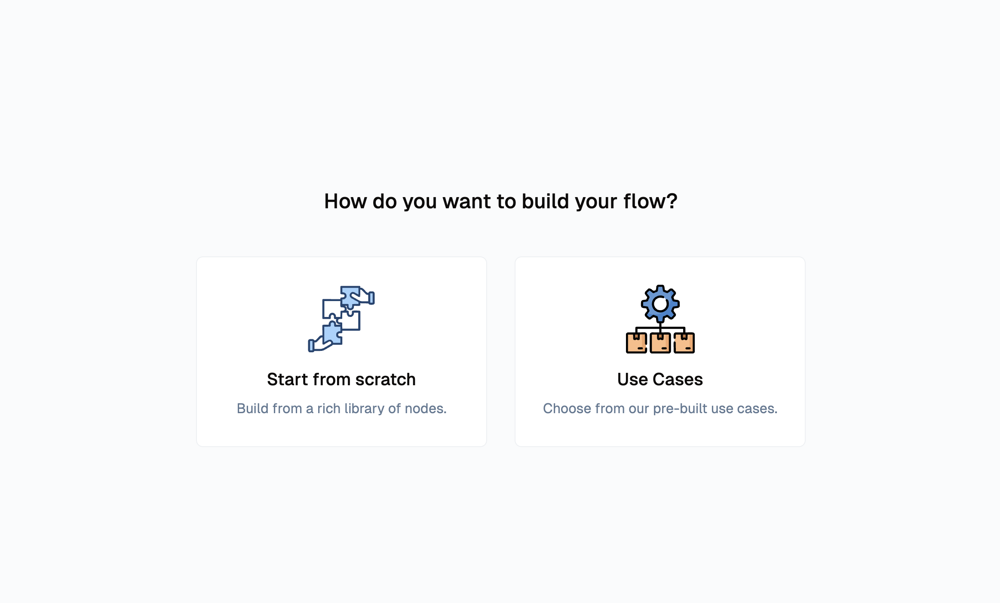
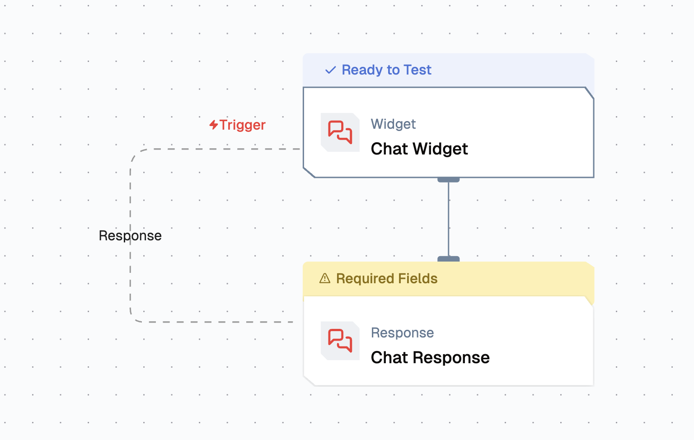
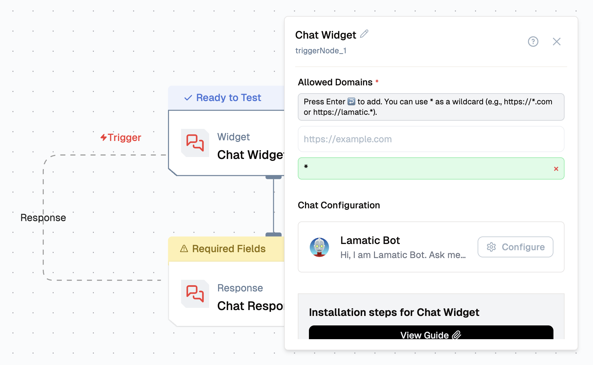
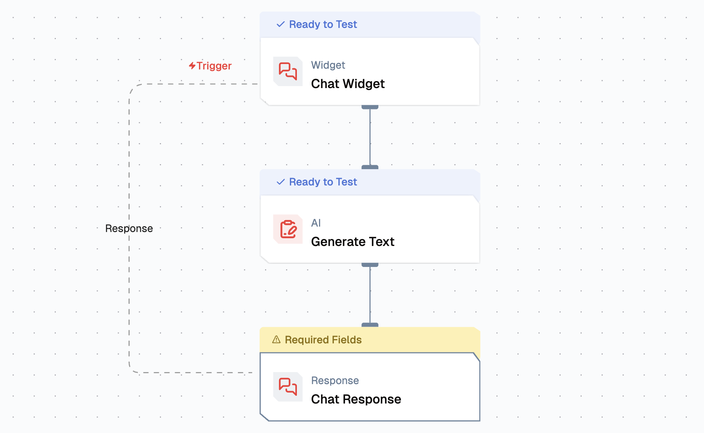
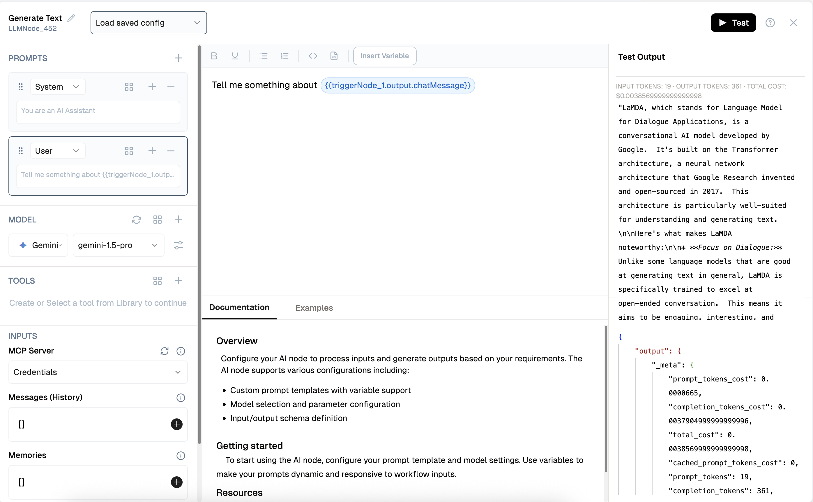
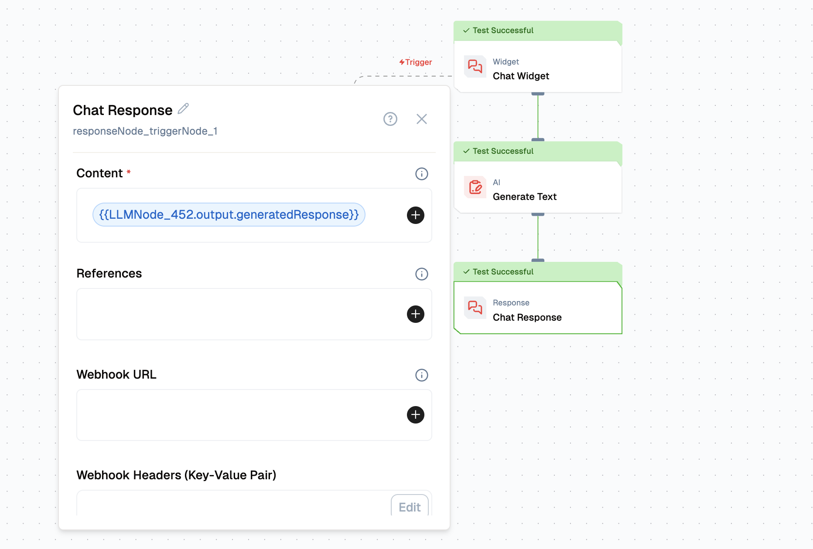
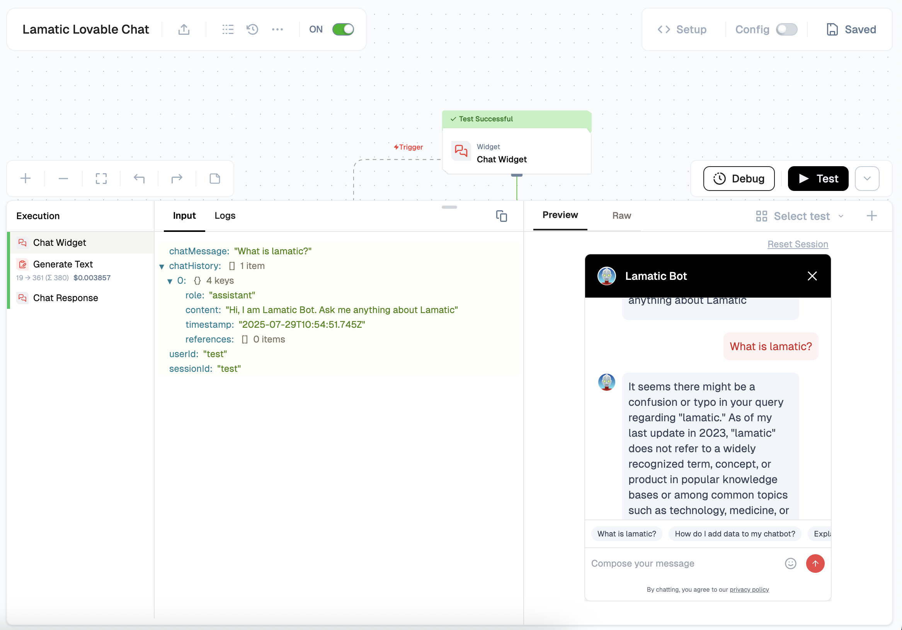
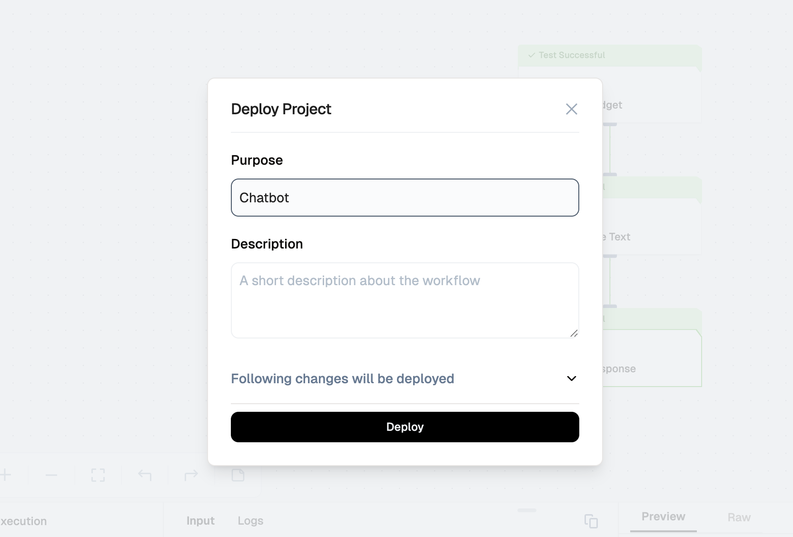

import { Accordion, AccordionItem } from "@nextui-org/react";
import SectionRows  from '@/components/SectionRows'
import { Callout } from 'nextra-theme-docs'
import {buttonVariants, Button} from '@/components/ui/button'

# Building a Chatbot

  

    <SectionRows 
      section="Difficulty Level" 
      chips={["Beginner"]} 
    />
    
    <SectionRows 
      section="Nodes" 
      chips={[
         "Text LLM"
      ]} 
    />
    
    <SectionRows 
      section="Tags" 
      chips={[
        "Support",
      ]} 
    />
  

In this Guide, We’ll walk you through creating a chatbot using Lamatic.ai, leveraging Gemini as the large language model (LLM) for content generation. You’ll learn how to seamlessly integrate AI-driven features into your chatbot, unlocking the potential for intelligent, dynamic interactions.

## What you'll Build
- You'll utilize Lamatic.ai Studio.
- Build Chat Widget using LLM

## Getting Started

### 1. Project Setup

1. Sign up at [Lamatic.ai](https://lamatic.ai/) and log in.
1. Navigate to the Projects and click **New Project** or select your desired project.
1. You'll see different sections like Flows, Context, and Connections

### 2. Creating Your Flow
1. **Start a New Flow**  
  
   Navigate to the **Flows** section, select **New Flow**, and choose **Create from Scratch** as your starting point.
  
2. **Set a Trigger**  
   Click **Choose a Trigger** and select from **API Request**, **App**, or **Widget Interface**. For this example, choose the **Chat Widget** under the **Interface** option.
  

3. **Configure Chat Widget**  
   Select **Chat Widget** and specify the **Allowed Domains** where the Chat Widget will be accessible.
  

4. **Add a Generate Text Node** 
  
   In the next node, select **Generate Text** and choose **Gemini**.  
   - Under  **Messages (History)** click "+" to include the message history.
   - Add a **Prompt Template** that includes both the user message and the chat message context.
   

6. **Generate Chat Response**  
   In the **Chat Response** node, add the generated response from the **Generate Text** node by clicking the appropriate option.
  

### 3. Test the Chat Widget
To test the chat widget, click the “Configure Test” button. A floating button will appear at the bottom right corner. Click it to start testing the chat

### 4. Deployment
Once you’ve tested the chat widget, click the Deploy button to make it live. Here you pass the deployment message. Ensure that the flow is activated.
   

### 5. Integration
To integrate the chat widget into your website, simply click the Setup button to access the code, then paste it into your website. Or you can copy the Vibe Code Prompt and use it in Lovable, Bolt, v0.dev and Firebase Studio.

Ensure that the allowed domains are specified before integrating this chat widget.

You can also check the logs in the Logs sections in the Lamatic.ai Studio.
 

By completing this tutorial, you’ve learned how to implement a Chat Widget using Lamatic.ai and seamlessly integrate it into your website. This unlocks powerful AI capabilities for your applications. As you explore further, you’ll discover how Lamatic.ai streamlines AI development, enabling you to focus on building innovative and impactful solutions.