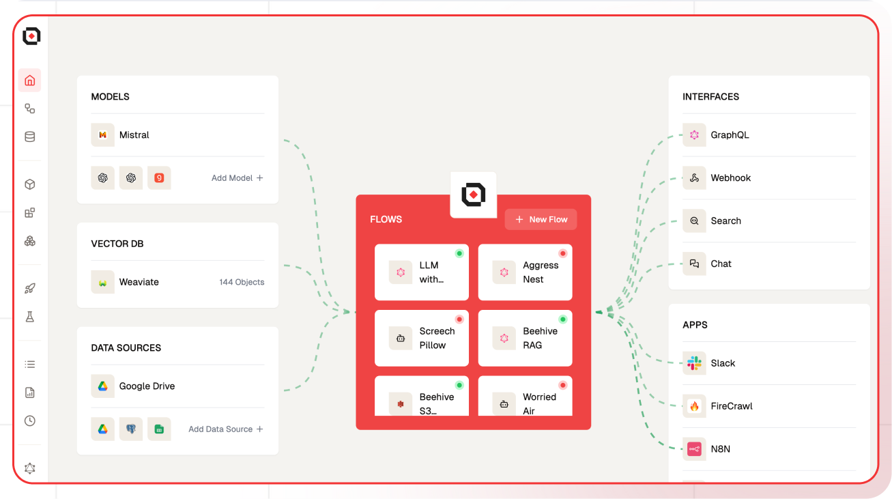

# Building a Chatbot

In this Guide, I’ll walk you through creating a chatbot using Lamatic.ai, leveraging Gemini as the large language model (LLM) for content generation. You’ll learn how to seamlessly integrate AI-driven features into your chatbot, unlocking the potential for intelligent, dynamic interactions.

## What you'll Build
- You'll utilize Lamatic.ai Studio.
- Build Chat Widget using LLM

## Getting Started

<Steps>
### 1. Project Setup
1. Visit [Lamatic.ai](https://lamatic.ai/) and sign in
2. Create a new organization
3. Create a project within your organization

4. You'll see different sections like Flows, Data, and Models

### 2. Creating Your Flow
1. Navigate to Flows, select New Flow, and choose Create from Scratch as your starting point.
1. Next, click Choose a Trigger, where you can select an API Request, App, or Widget Interface as your trigger. We’ll use the Chat Widget under the interface option.
1. Click on Chat Widget and provide Allowed Domains, where you want to access the Chat Widget
1. In the next Node, select Text Generator, then choose Gemini. Under Additional Properties, click on the plus icon in the Messages (History) section to pass the message history.
   
1. In the Prompt Template, you can include both a message and a chat message.
1. In the Chat Response node, add the generated response from the Text Generator node by clicking the 

### 3. Test the Chat Widget
To test the chat widget, click the “Configure Test” button. A floating button will appear at the bottom right corner. Click it to start testing the chat
   

### 4. Deployment
Once you’ve tested the chat widget, click the Deploy button to make it live. Here you pass the deployment message.


### 5. Integration
To integrate the chat widget into your website, simply click the Setup button to access the code, then paste it into your website.


Ensure that the allowed domains are specified before integrating this chat widget.


Source Code 

```js
<script async src="https://widget.lamatic.ai/chat/emojiPicker.js" onload="loadChatDialog()"></script>
<script async src="https://widget.lamatic.ai/chat/index.js" onload="loadChatDialog()"></script>
<script>
// Set Lamatic config
 var CHAT_DIALOG_CONFIG = {
      botName: 'Your bot name', // mandatory
      suggestions: ['What is lamatic', 'What is AI', 'What is AI-powered chatbot'], // optional array of strings
      policyUrl: 'https://lamatic.ai/docs/legal/privacy-policy', // optional chane with your policy url
      apiUrl: 'https://xxxxxxxx.lamatic.workers.dev', // mandatory
      workflowId: '7c7569d1-33b8-41bd-9a0b-xxxxxx', // mandatory
      chatHeaderBgColor: 'white', // optional
      imageUrl: 'https://your-new-image-url.com', // mandatory
      userMessageBgColor: '#E0F7FA', // optional
      userMessageTextColor: 'blue', // optional
      agentMessageBgColor: '#F1F8E9', // optional
      agentMessageTextColor: '#1B5E20', // optional
      position: 'right', // left or right only if no floatingButtonId passed
      // If you want to use your own custom button, provide its ID
      // floatingButtonId: 'your-custom-button-id', // optional - use this when you have your own button element
      // Only used when floatingButtonId is not provided
      floatingButtonIcon: '💬', // can be an emoji or image URL for the default floating button
      userId: 'your-new-user-id', // optional any userId which you use to identify the user
      errorMessage: 'Some error has taken place', // optional Error message to be shown when an error occurs
      context: 'your-context' // optional Context you want to pass convert it to string (JSON.stringify(contextObject))

};
// Load Lamatic dialog
function loadChatDialog() { new ChatDialog(CHAT_DIALOG_CONFIG) };</script> 
```

You can customize the chat widget by providing suggestions, botName, color properties.

You can also check the logs in the Logs sections in the Lamatic.ai Studio.
</Steps>


By completing this tutorial, you’ve learned how to implement a Chat Widget using Lamatic.ai and seamlessly integrate it into your website. This unlocks powerful AI capabilities for your applications. As you explore further, you’ll discover how Lamatic.ai streamlines AI development, enabling you to focus on building innovative and impactful solutions.