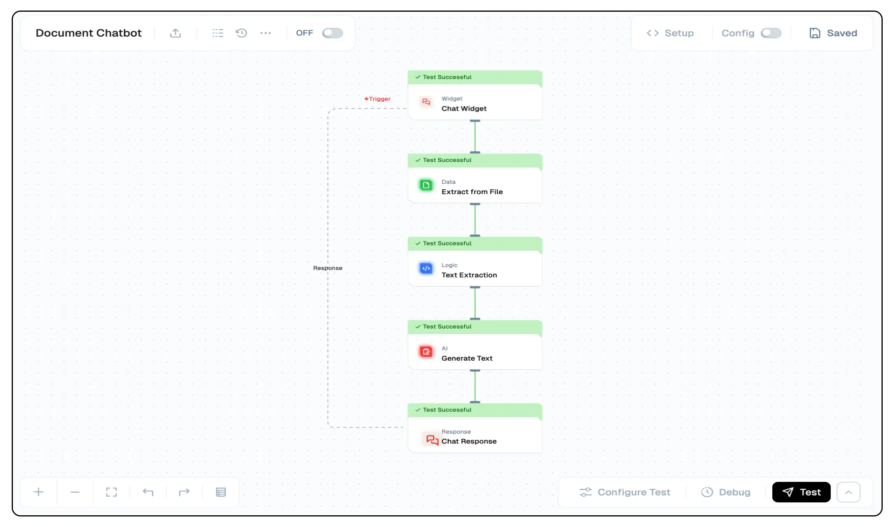

# Document Chatbot
In this tutorial, you'll learn how to build a document based chatbot that can answer questions based on your media file content in a ready made chat interface.



## What you'll Build
- You'll utilize Lamatic.ai Studio.
- Build Chatbot Widget to answer questions based on your media files.
- Implement RAG with Extract File and Text LLM

## Getting Started
### 1. Account Creation and Create a New Flow
1. Sign up at [Lamatic.ai](https://lamatic.ai/) and log in.
2. Navigate to the Projects and click **New Project** or select your desired project.
3. You'll see different sections like Flows, Context, and Connections
4. Select the "Create from Scratch"
5. You will have to create 4 nodes - Chatbot Widget (Trigger Node), Extract File (Extract File Node), Extract Text (Code Node), Text LLM (AI Node), and Chat Response (Response Node).

### 2. Chatbot Widget
1. Add the chatbot widget to your flow as a trigger node, and configure the input domains. 
2. You will be choosing the allowed domains for the chatbot widget to be embedded in or use wildcard (*) to allow all domains.
3. Along with that, there would be steps to install the chatbot widget on your website.

### 3. Extract File Node
1. Add the "Extract File" node to your flow.
2. Configure the file extraction settings to take the url and type of file. If using a PDF, select 'Join Pages' to extract the text from all pages.
3. The file contents and details will be extracted and are to be passed to extract textual content from the file.

### 4. Extract Text Node
1. Add the "Code" node to your flow.
2. Write the following script to extract the text from the file content:
```js
const output = {{ extractFromFileNode_959.output.files }}[0]["data"][0]
return output
```
3. The extracted text will be passed to the Text LLM node for generating responses.

### 5. Text LLM Node
1. Finally, we can go ahead and add the Text LLM node to generate responses based on the extracted text.
2. Configure the Text LLM node with the extracted text and generate responses based on the user's queries and only answer based on the extracted text.
3. Set your prompts and responses to generate the answers based on the extracted text.

### 6. Chat Response Node
1. Finally, configure the Chat Response node to send the generated responses to the chatbot widget.

### 11. Test and Deploy Flow
Thorough testing ensures your chatbot provides accurate and helpful responses. Once you’ve tested the flow with your chatbot widget, click the Deploy button to make it live. Here you pass the deployment message.


You've successfully built your own intelligent chatbot widget to answer questions based on your media files!