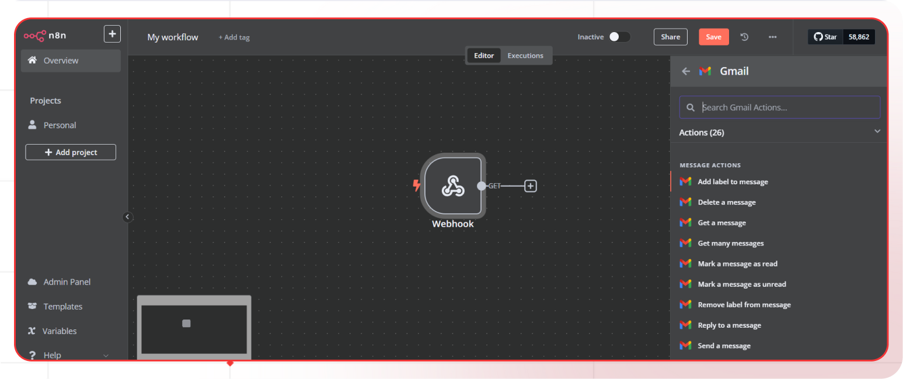
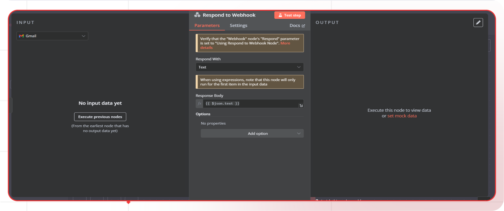

# Email text extractor

This guide will help you build an automated email text extraction system using n8n. The system fetches email messages, extracts relevant text, and structures the data for further processing or automation. This enables seamless integration with other workflows, improving efficiency in handling email-based data.

## What you'll Build

- You'll utilize n8n.
- Automated Email Text Extraction System.

## Getting Started

### 1. Workflow Setup

1. Sign up at [n8n.io](https://n8n.io/) and log in.
2. Navigate to the **overview** and click **Workflows**.
3. Click **Create Workflow**.
   

### 2. Webhook Node Addition

1. Click on **+**.
2. Search **Webhook** in the search box and click on **Webhook**.
3. Select the HTTP Method as **Get**.
   

### 4. Gmail Node addition

1. Click on **+**.
2. Search **Gmail** in the search box, click on **Gmail** and select **Get many messages**.
   

3. In parameters set the credentials and set other parameters according to your needs.
4. Turn off **Simplify**.
5. In options add **Download Attachments** option and turn it on.
   

### 5. Respond to Webhook

1. Click on **+**.
2. Search **Respond to Webhook** in the search box, click on **Respond to Webhook**.
3. Select the parameters according to your needs.
   

### 6. Testing the workflow

1. Click on **Webhook** node and copy **Test URL**.
2. Go back and click **Test workflow**.
3. Call the Test URL to get the response.
   

By completing this guide, you’ll gain hands-on experience in leveraging n8n to automate email text extraction, streamline data processing, and integrate extracted content into various workflows for improved efficiency.
