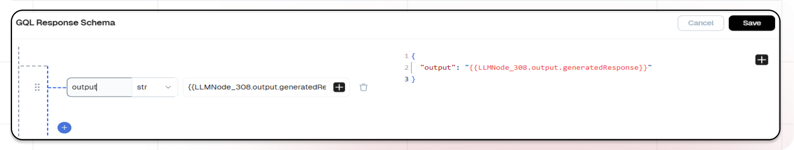
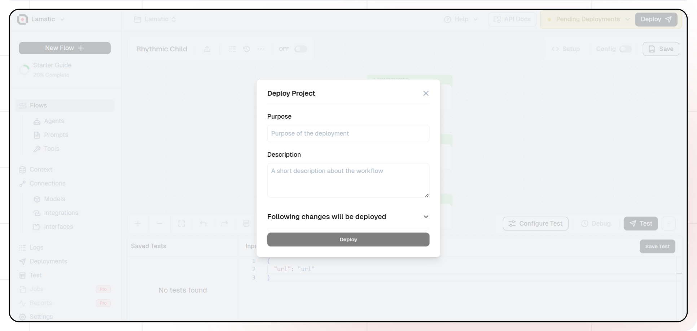

import Image from 'next/image'

# Getting Started

Welcome to Lamatic.ai! This guide will show you how to create your first AI-powered API using the Gemini model. We'll break it down into simple steps.

## What You'll Build
A simple API that generates text based on topics using Gemini's AI model. When you send a topic to your API, it will return AI-generated insights about that topic.

## Getting Started

### 1. Project Setup

1. Sign up at [Lamatic.ai](https://lamatic.ai/) and log in.
1. Navigate to the Projects and click **New Project** or select your desired project.
1. You'll see different sections like Flows, Context, and Connections
   

### 2. Creating a New Flow

1. Navigate to Flows, select New Flow.
2. Click **Create from scratch** as starting point.
   

### 3. Setting Up Your API

1. Click "Choose a Trigger"
2. Select "API Request" under the interface options
   
3. Configure your API:
   - Add your Input Schema
   - Set topic as parameter in input schema
   - Set response type to "Real-time"
   - Click on save

### 4. Adding AI Text Generation
1. Click the + icon to add a new node
1. Choose "Generate Text"
   
1. Configure the AI model:
   - Select "Gemini" as your Generative Model
   - Choose "gemini-1.5-pro" as your Model
1. Set up your prompt:
   - In the Prompt Template, write: `Give me inside on topic: {{triggerNode_1.output.topic}}`
   - You can add variables using the "insert Variable" button

### 5. Configuring the Response
1. Click on the API Response Node

1. Add Output Variables by clicking the + icon
1. Select variables from your Text LLM Node

### 6. Testing
You can develop a wide range of test cases within your project, making them adaptable for various flows and scenarios. This strategy streamlines the management of JSON structures across different use cases, saving time and minimizing errors. By leveraging reusable test cases, you enhance both the consistency and efficiency of your testing process.

1. Click the Test button
1. Enter a test input 
1. Save your test
1. Run the test to see the results

### 7. Deployment

1. Click the Deploy button
   
2. Add the purpose and description of your project
3. Your API is now ready to be integrated into Node.js or Python applications
4. Your flow will run on Lamatic's global edge network for fast, scalable performance

### 8. What's Next?

- Experiment with different prompts
- Try other AI models
- Add more processing steps to your flow
- Integrate the API into your applications

### 9. Tips

- Save your tests for reuse across different scenarios
- Use consistent JSON structures for better maintainability
- Test thoroughly before deployment

Now you have a working AI-powered API! You can expand on this foundation to build more complex applications using Lamatic.ai's features.
