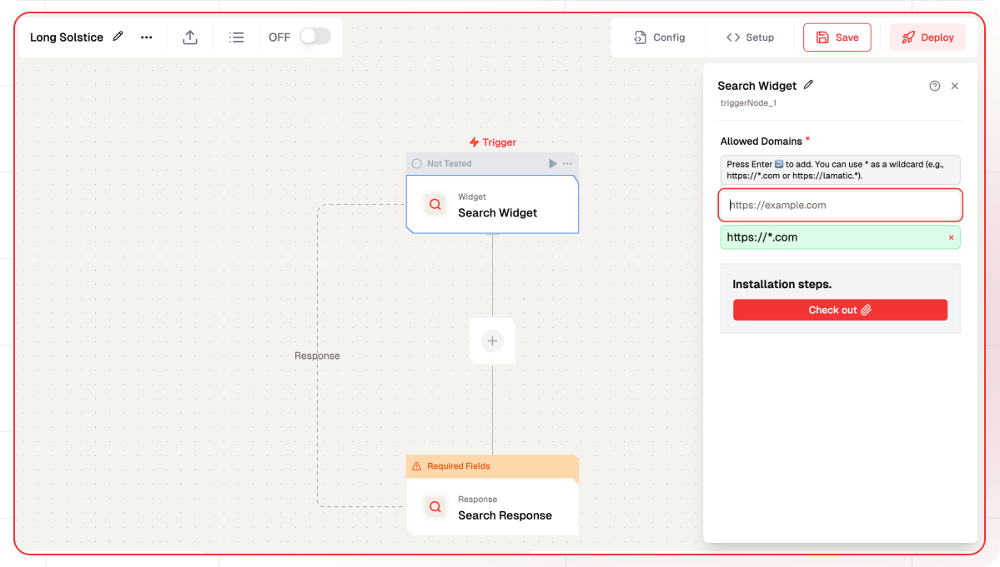
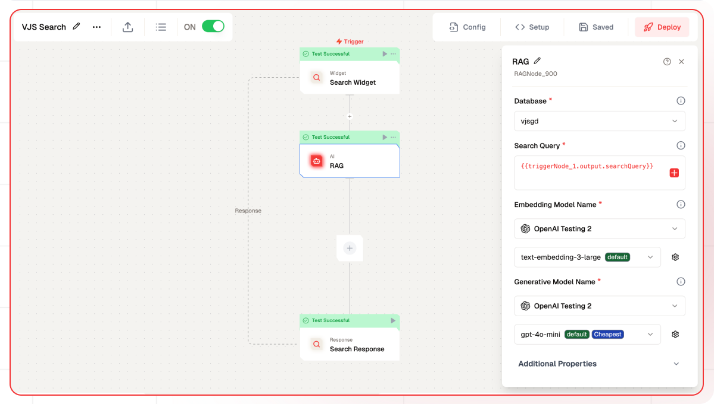
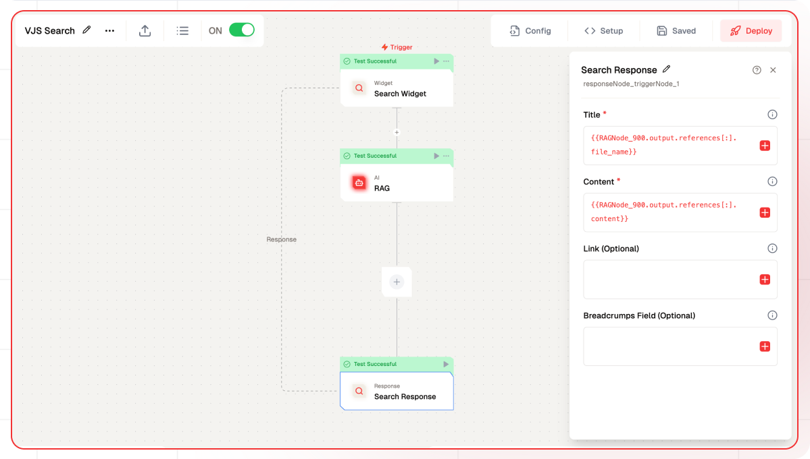
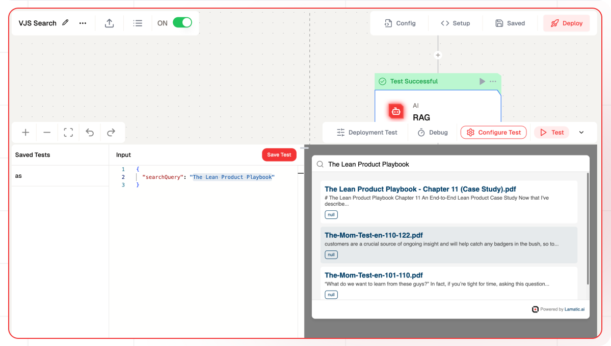
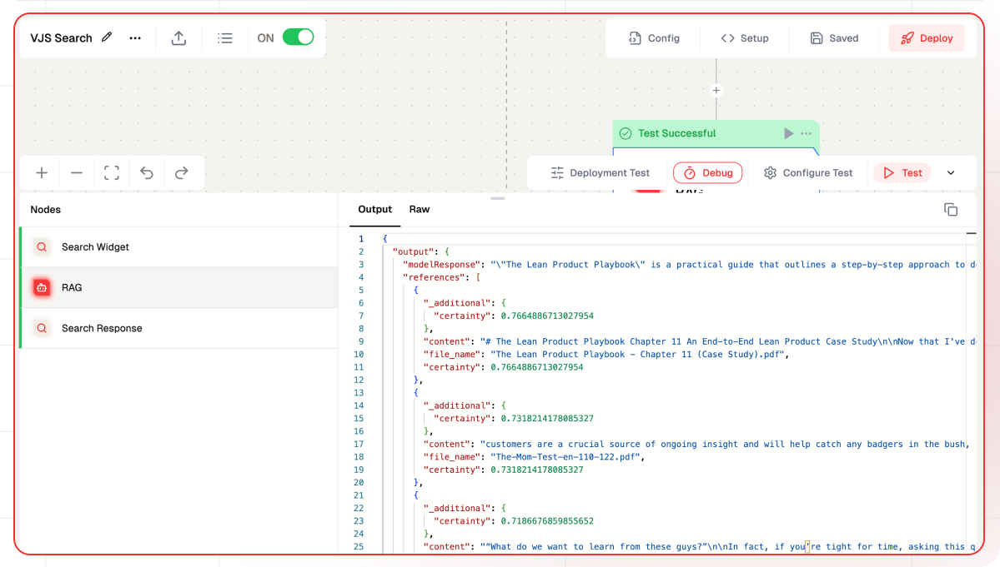
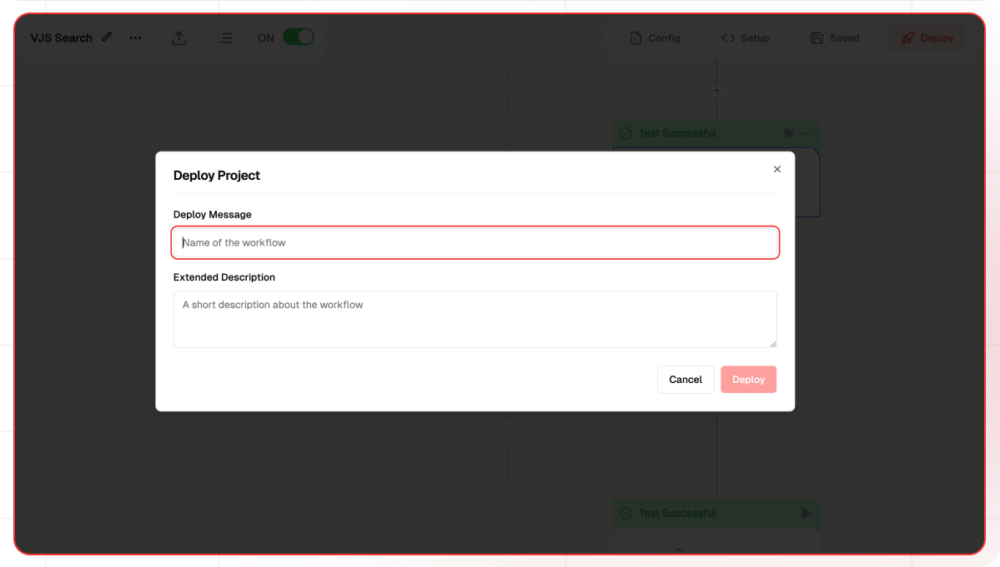
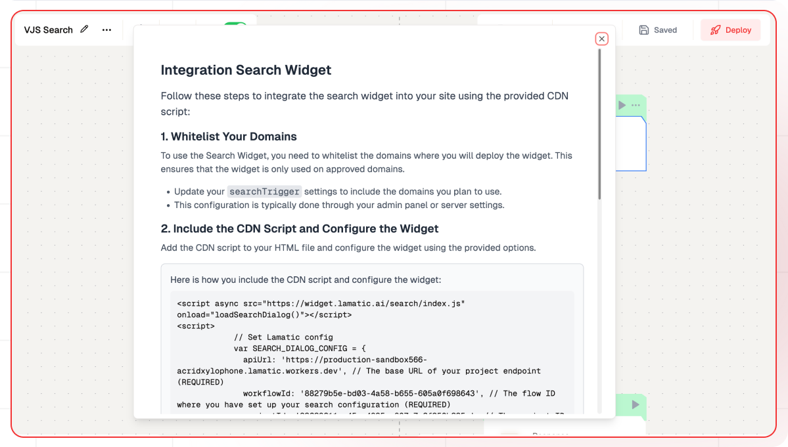

# Getting Started with the Search Widget
This guide will walk you through using the Search Widget in Lamatic. We'll use a Vector Database and a RAG Node to retrieve data from the database.

## What You'll Build
- A Search Widget powered by AI-driven search technology

## Prerequisites
- A [Lamatic.ai](https://lamatic.ai/) account
- A Vector Database with vectored data in Lamatic Studio

## 1. Setting Up Your Project
1. Sign up or log in to [Lamatic.ai](https://lamatic.ai/).
2. Go to the **Dashboard** and click **Create New Flow**.
3. You'll see sections like **Flows**, **Data**, and **Models**.

## 2. Creating a New Flow

1. Click on **Flows** and create a new one.
2. Select **Search Widget** as the **Trigger Node**.
3. Click on the **Search Widget** node.
4. Whitelist the domains where you’ll deploy the widget. This ensures that the widget works only on approved domains.
   ```js
   Press Enter ↩️ to add. You can use * as a wildcard (e.g., https://*.com or https://lamatic.*).
   ```

## 3. Configuring the RAG Node

1. Add a **RAG Node**, which will connect to the Vector Database.
2. Configure the following settings:
   - **Select Vector Database**.
   - **Pass Search Query** dynamically by clicking the **+** icon.
   - **Embedding Model:** Use OpenAI’s `text-embedding-3-large`.
   - **Generative Model:** Use OpenAI’s `gpt-40-mini`.
3. Optional: Add additional properties to refine search results:
   - **System Prompt:** Guide the AI on how to respond.
   - **Number of References:** Limit the number of returned results.
   - **Certainty:** A value between 0 and 1 representing the similarity score.
   - **Filters:** Apply JSON-based filters for better search refinement.

## 4. Updating the Response Node

The RAG Node provides `modelResponse` along with an array of `references`. We'll use these references to display results in the search widget.

1. Click on the **Search Response Node**.
2. Set the **Title** field using:
   ```js
   {{RAGNode_900.output.references[:].file_name}}
   ```
   The `:` represents all elements in the array.
3. Set the **Content** field using:
   ```js
   {{RAGNode_900.output.references[:].content}}
   ```
4. Optional: Add properties like **Link** and **Breadcrumbs** to enhance the response.

## 5. Testing Your Setup

Before testing, ensure you have data in the Vector Database.

1. Click **Configure Test**.
2. Click on **Search Widget** and enter a query.
3. View the results.
4. Click the **Test** button to inspect each node's response.


## 6. Deployment & Integration

1. Click **Deploy** and enter a commit message.
    
2. Once deployed, click **Setup** to integrate the Search Widget into your website.
3. Follow the setup instructions and ensure your domains are whitelisted.
    

Now your AI-powered Search Widget is ready to enhance your website’s search experience!

