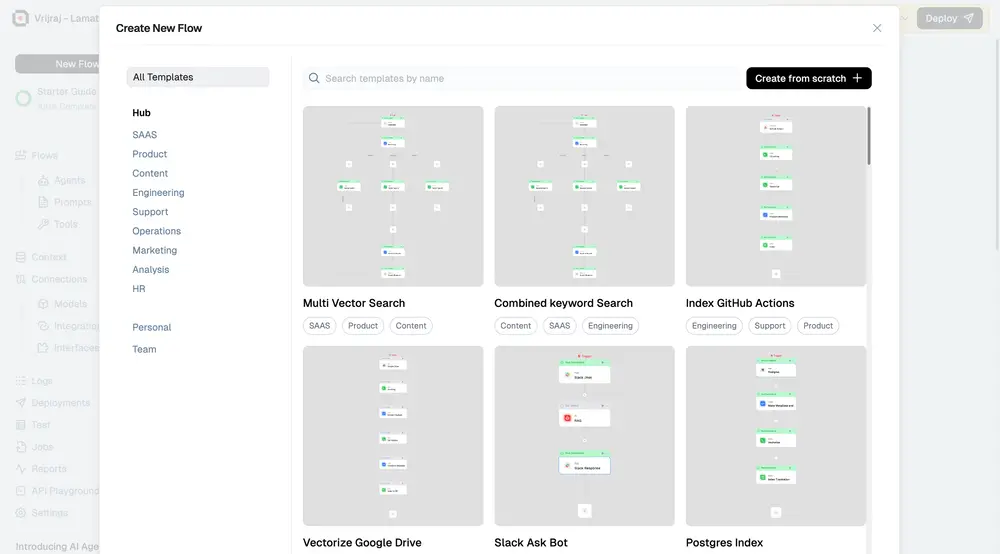
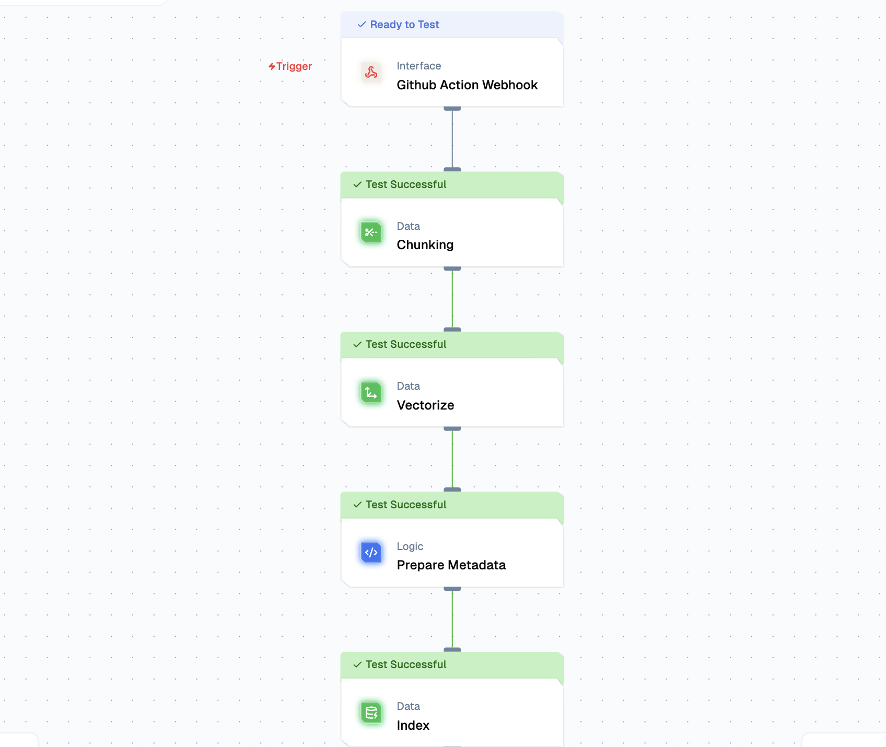
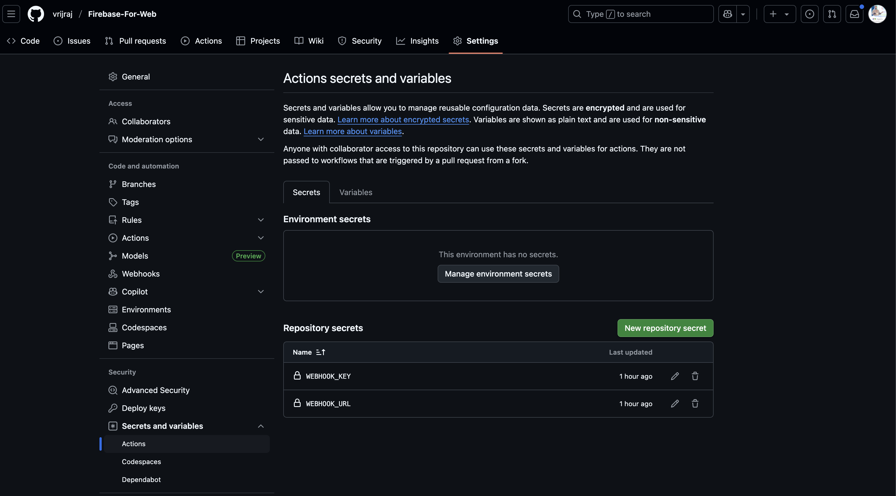
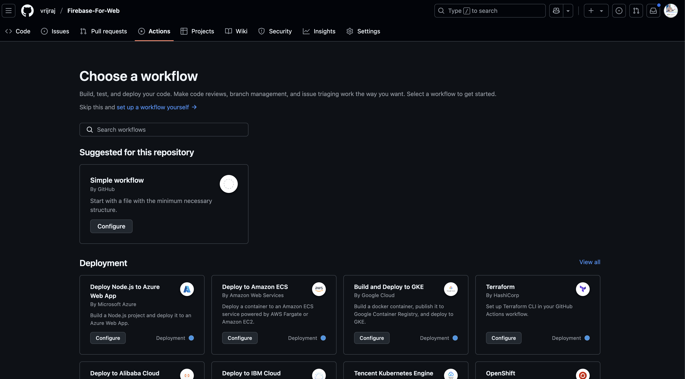
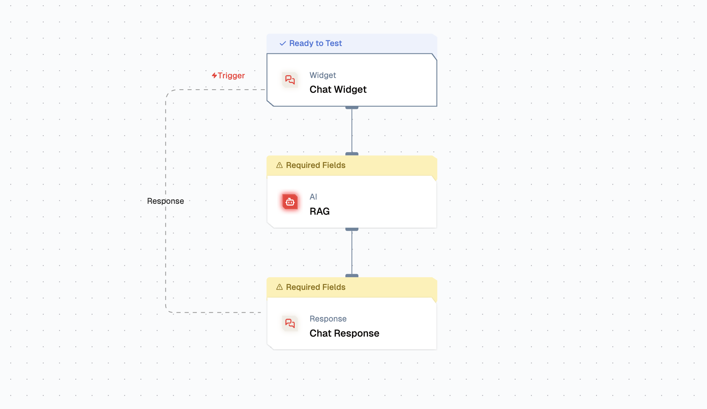
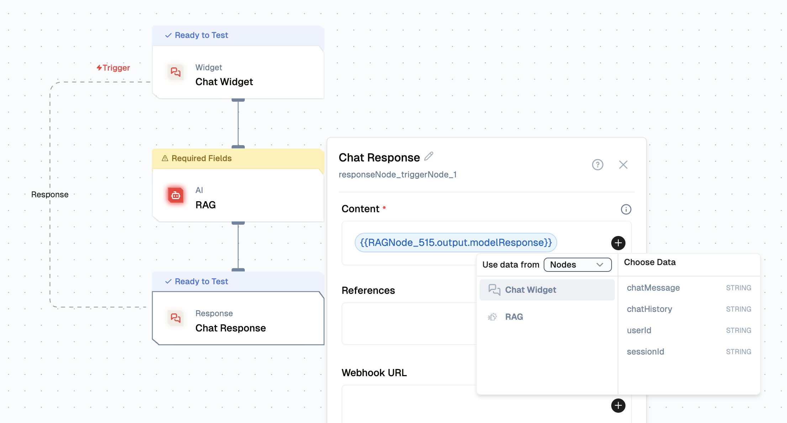
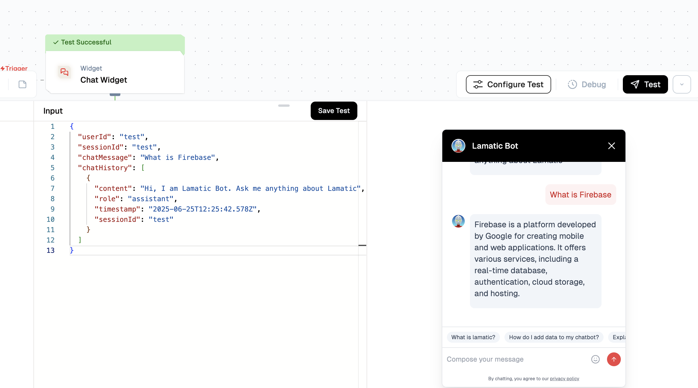
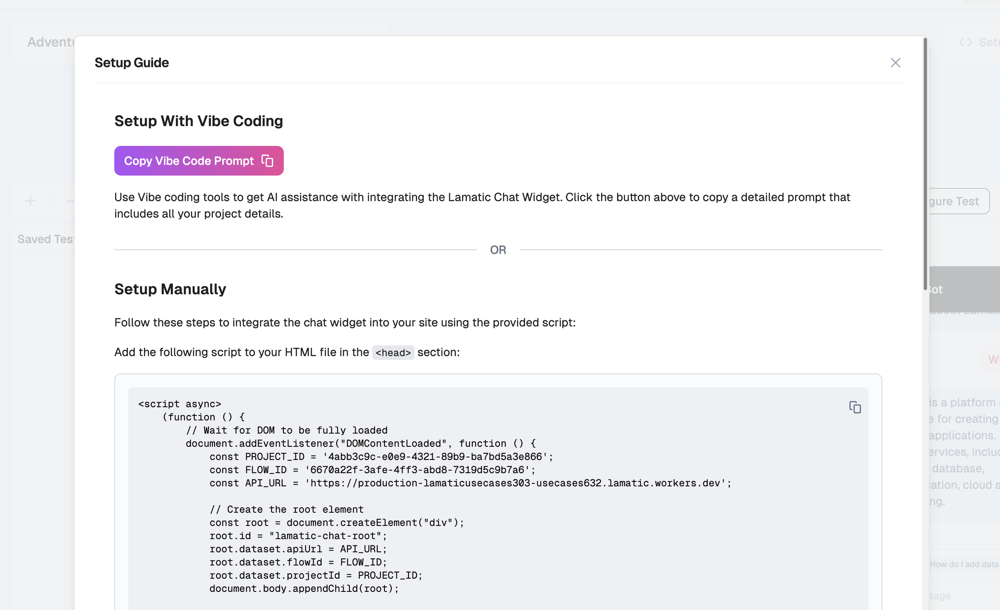

# Build a RAG-Powered Chatbot with GitHub Docs
This guide will show you through building a chatbot that uses Retrieval-Augmented Generation (RAG) to answer questions from GitHub-hosted MD documentation using Lamatic AI.

## What You Will Learn

- How to extract content from MD documentation
- How to upload and index documents in Lamatic AI
- How to build a chatbot using RAG
- How to embed the chatbot into a website

## Prerequisites
Before starting, ensure you have:
- A GitHub repository with `.md` documentation
- Access to [Lamatic Studio](https://studio.lamatic.ai)

## Architecture Overview

To implement Retrieval-Augmented Generation (RAG) utilizing GitHub documentation, we need to construct two distinct flows:

1. **GitHub Indexing Flow**: Encompasses webhook integration for data acquisition from GitHub and subsequent RAG implementation
2. **Chat Widget Flow**: Facilitates the RAG chatbot functionality

---

## Part 1: GitHub Indexing Flow

The implementation of this workflow utilizes the following nodes:

- **Webhook Node**: Configured as the Trigger Node
- **Chunking Node**: For content segmentation
- **Vectorize Node**: To perform data chunk transformation into numerical vector representations via an embedding model
- **Code Node**: For metadata transformation
- **Index Node**: For data storage within the vector database

<Steps>

### Step 1: Create the Flow

1. Go to **Lamatic Studio**
2. Create a new **Flow from Scratch**
    
3. Update the Flow name: `GitHub Indexing Flow`

### Step 2: Configure Trigger Node

1. Click on the **Trigger Node** and use **Webhook** as the trigger Node
2. In the following sequence, add:
   - Chunking Node
   - Vectorize Node  
   - Code Node
   - Index Node
   

### Step 3: Configure Chunking Node

Select the **Chunking Node** and configure:

- To add text to a chunk, click the **+** icon and add: `{{triggerNode_1.output.content}}`
- **Number of Characters**: `1000`
- **Characters that Overlap**: `100`
- **Chunking Method**: `Recursive Character Text Splitter`
- **Separators**: `\n\n  \n  `

<Callout type="warning">
Node names might be different based on your setup. Adjust accordingly.
</Callout>

### Step 4: Configure Vectorize Node

- **Texts to vectorize**: `{{chunkNode_860.output.chunks[:].pageContent}}`
- **Embedding Model Name**: `Gemini`
- **Model**: `gemini-embedding-exp-03-07`
<Callout type="warning">
Node names might be different based on your setup. Adjust accordingly.
</Callout>

### Step 5: Set Up Code Node

1. Change the name to: `Prepare Metadata`
2. Include the following JavaScript code:

```javascript
let vectors = {{vectorizeNode_814.output.vectors}};
let metadataProps = [];
let texts = {{chunkNode_860.output.chunks}};

for (const idx in vectors) {
    let metadata = {}
    metadata["content"] = texts[idx].pageContent;
    metadata["file_name"] = {{triggerNode_1.output.filename}};
    metadataProps.push(metadata)
}

output = {"metadata": metadataProps, "vectors": vectors};
```

<Callout type="warning">
Node names might be different based on your setup. Adjust accordingly.
</Callout>

### Step 6: Set Up Index Node

Configure the Index Node with:

- **Vector DB**: Choose your preferred vector database
- **Input Vectors**: `{{codeNode_443.output.vectors}}`
- **Input Meta Data**: `{{codeNode_443.output.metadata}}`
- **Input Primary Key**: `file_name`

### Step 7: Deploy and Get Credentials

1. **Save the Flow**
2. **Deploy the Flow** and get the Webhook URL from the Setup Guide
3. Acquire the **API Key** from Settings > API Keys
4. Use the Webhook URL and API Key for GitHub Actions configuration

</Steps>

---

## Part 2: GitHub Repository Setup

<Steps>

### Step 1: Create GitHub Repository

Initialize a new Git repository and populate it with Markdown files, or fork an existing repository with documentation.

### Step 2: Configure Repository Secrets

1. Go to **Repo Settings**
2. Navigate to **Secrets and variables** in the Security section (left sidebar)
3. Select **Actions**
    
4. Establish two variables within Repository secrets:
   - `WEBHOOK_KEY`
   - `WEBHOOK_URL`

### Step 3: Create GitHub Action

1. Go to **Actions**, then select "Create new Flow"
    
2. Choose the "Simple workflow by GitHub" option
3. Click the **Configure** button
4. Update the file name: `send-to-lamatic.yml`

### Step 4: Add YAML Configuration

```yaml
name: Send File Changes

on:
  push:
    branches:
      - main  # Adjust to your branch as necessary
    paths: 
      - '**.md'  # Only trigger for changes in .md files

jobs:
  send-changes:
    runs-on: ubuntu-latest
    
    steps:
    - name: Send File Changes to Webhook
      uses: Lamatic/Index-to-lamatic@v1.6
      with:
        webhook_url: ${{ secrets.WEBHOOK_URL }}
        webhook_key: ${{ secrets.WEBHOOK_KEY }}
        github_ref: ${{ github.ref }}
        file_type: "md"
        mode: "incremental"  # or "full-refresh"
        verbose: "true"  # or "false"
```

### Step 5: Commit Changes

Commit the changes to activate the workflow.

</Steps>

<Callout type="info">
When you modify an MD file, the Lamatic webhook automatically calls and converts the information into vectors. You can view the logs and vector data in Lamatic Studio.
</Callout>

---

## Part 3: Create Chat Widget Flow

The implementation utilizes these nodes:

- **Chat Widget**: As the Trigger Node
- **RAG Node**: For RAG Response

<Steps>

### Step 1: Create Chat Flow

1. Create a **Flow from Scratch**
2. Rename as `Github AI Chatbot`

### Step 2: Configure Chat Widget

Configure the Chat Widget properties:
- Allow domain settings
- Interface properties (default message, color theme, etc.)

### Step 3: Add and Configure RAG Node

1. Add **RAG Node**
2. Configure the node:
    
   - Use `gemini-embedding-exp-03-07` embedding model (same as before)
   - Use the **Gemini Model**
   - Click **+** symbol to include a Search Query, then use `chatMessage`

### Step 4: Update Chat Response Node

Select the `modelResponse` (Click the **+** symbol to select the response from the RAG Node)

</Steps>

---

## Part 4: Test & Deployment

<Steps>

### Step 1: Test the Chat Widget

Click the **Test** button to test the Node functionality.

### Step 2: Deploy Chat Flow

Deploy your flow to make it accessible for chatbot integration. Monitor the logs in the logs section.

### Step 3: Integrate Chat Widget

1. Click the **Setup** button to access the integration code
2. Copy the provided code snippet
3. Paste it into your website

</Steps>

<Callout type="warning">
Ensure that the allowed domains are specified before integrating this chat widget into your website.
</Callout>

---

## Troubleshooting

### Common Issues

**Node name mismatches**: Node names may vary in your setup. Always check the actual node names in your flow and update the references accordingly.

**Webhook not triggering**: Ensure your GitHub Action YAML file is properly configured and the repository secrets are correctly set.

**Chat widget not loading**: Verify that your domain is added to the allowed domains list in the Chat Widget configuration.

### Best Practices

- Use descriptive names for your flows and nodes
- Test each component individually before deploying
- Monitor logs regularly for any issues
- Keep your API keys secure and rotate them periodically

