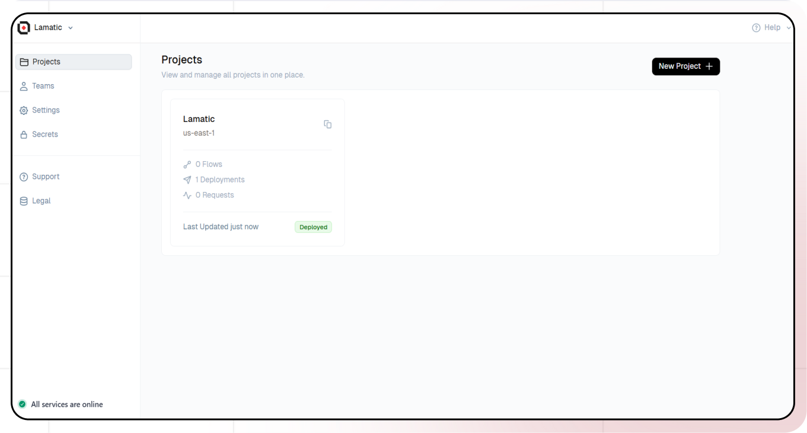
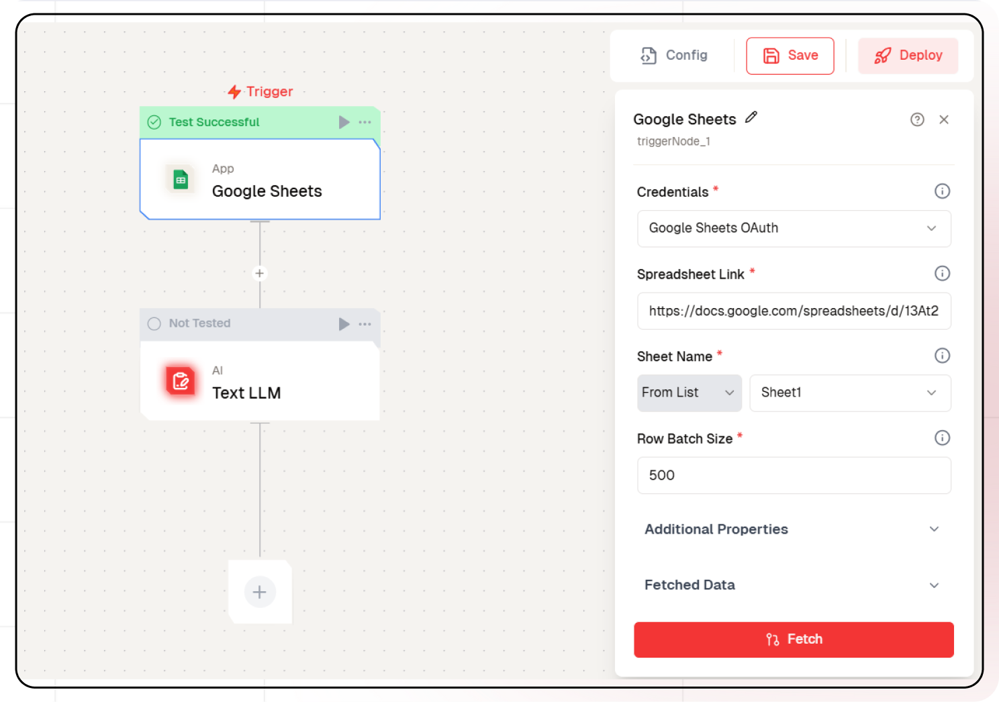

# Getting started with google sheets

This guide will help you build an AI-powered system that fetches data from a Google Sheet using a Google Sheet node and passes it to an LLM node to answer user queries. By integrating structured data with AI, this system enables seamless retrieval of relevant information, making it easier to generate insightful responses based on the stored data.

## What you'll Build


- A chatbot using Lamatic.ai Studio
- A chat system powered by an LLM
- Integration of a Google Sheet node for dynamic data retrieval
- Seamless question-answering based on structured data

# Getting Started

## Prerequisites
- A [Lamatic.ai](https://lamatic.ai/) account
- A Vector Database with vectored data in Lamatic Studio

### 1. Setting Up Your Project
1. Sign up or log in to [Lamatic.ai](https://lamatic.ai/).
2. Go to the **Dashboard** and click **Create New Flow**.
3. You'll see sections like **Flows**, **Data**, and **Models**.
   

### 2. Creating a New Flow
 
1. Click on **Flows** and create a new one.

2. Select **Google Sheets** as the **Trigger Node**.
3. Click on the **Google Sheets** node.
4. Authorize Lamatic AI to access your Google Drive by providing the required credentials.
5. Add the spreadsheet link you want to access along with the spreadsheet name.
6. In **Row Batch Size** select the number of rows you want to fetch.
7. Click on **Fetch**.

### 3. Adding AI Text LLM

1. Click the + icon to add a new node
2. Choose "Generate Text"
3. Configure the AI model:
   - Select your "Open AI" credentials
   - Choose "gpt-4-turbo" as your Model
4. Under prompts section click the + icon to add prompt
5. Set up your prompt:

   ```
     summarise this user data i got from the google sheet in form of a json
     {{triggerNode_1.output}}

   ```
  


### 4. Testing Your Setup
 


1. Click **Configure Test**.
2. Click the **Test** button to inspect each node's response.


### 5. Deployment

1. Click the Deploy button
   
2. Your API is now ready to be integrated into Node.js or Python applications
3. Your flow will run on Lamatic's global edge network for fast, scalable performance

### 6. What's Next?

- Experiment with different prompts
- Try other AI models
- Add more processing steps to your flow
- Integrate the API into your applications

### 7. Tips

- Save your tests for reuse across different scenarios
- Use consistent JSON structures for better maintainability
- Test thoroughly before deployment

Now you have a working AI-powered API! You can expand on this foundation to build more complex applications using Lamatic.ai's features.


