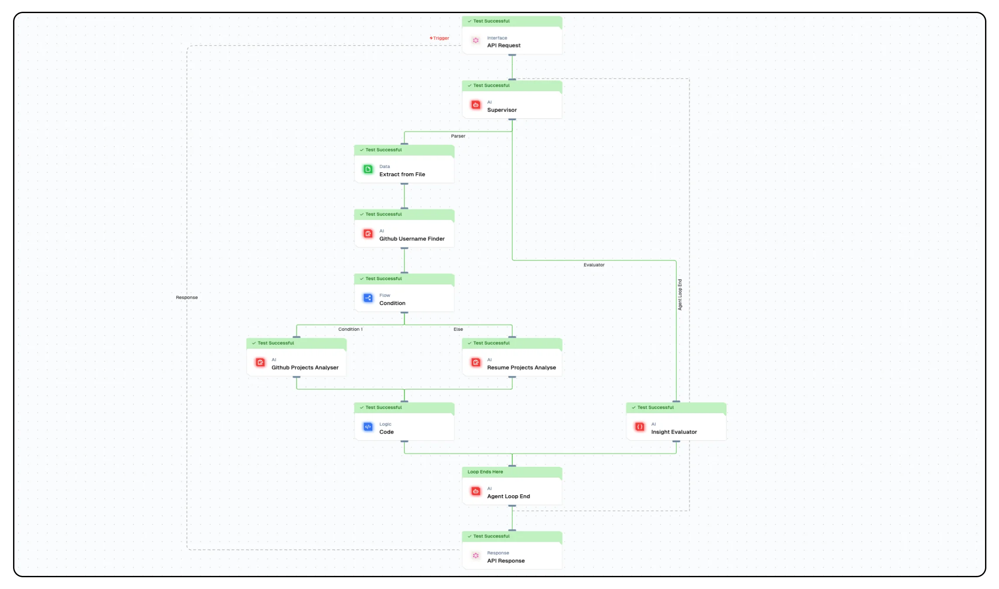
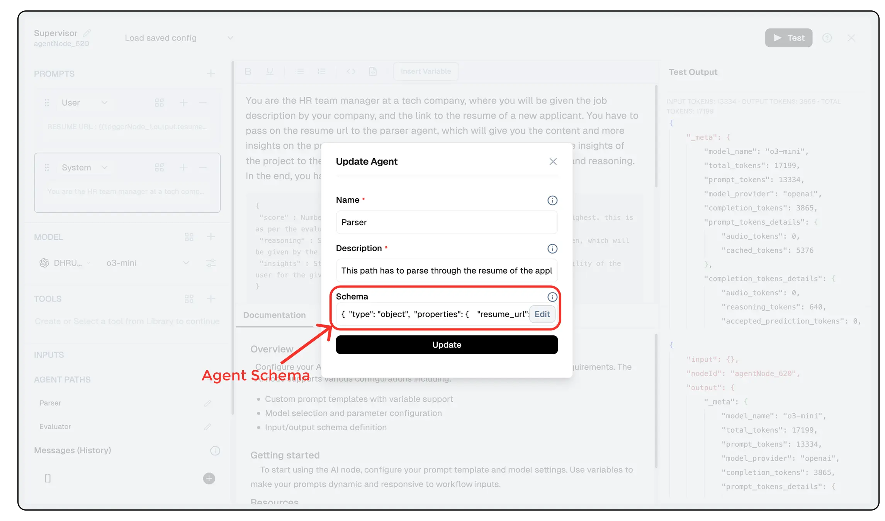

import { Accordion, AccordionItem } from "@nextui-org/react";
import SectionRows from "@/components/SectionRows";
import { Callout } from "nextra-theme-docs";
import { buttonVariants, Button } from "@/components/ui/button";

# Hiring Automation Agent

<div className="grid md:grid-cols-1 gap-2 mb-8">
  <div className="">
    <SectionRows 
      section="Difficulty Level" 
      chips={["Advanced"]} 
    />
    
    <SectionRows 
      section="Nodes" 
      chips={[
        "Supervisor Agent", 
        "Extract from File", 
        "Condition Node", 
        "Code Node",
        "Text LLM"
      ]} 
    />
    
    <SectionRows 
      section="Tags" 
      chips={["HR", "Support", "Operations"]} 
    />
  </div>
</div>

<div className="mt-4 mb-4">
  <Callout>
  Try out this flow yourself at Lamatic.ai. Sign up for free and start building your own AI workflows.
  <Button variant="destructive" className="mt-3" href="https://studio.lamatic.ai/_?templateSlug=hiring-automation-agent" size="sm" asChild>
    <a href="https://studio.lamatic.ai/_?templateSlug=hiring-automation-agent" target="_blank">Add to Lamatic</a>
  </Button>
</Callout>
</div>

In this tutorial, you'll learn how to build a sophisticated hiring automation agent that evaluates technical candidates by analyzing their resumes and GitHub projects. This system provides objective scoring and detailed insights to help hiring managers make informed decisions.

## What You'll Build

- A supervisor agent that manages the candidate evaluation process
- An intelligent resume parser that extracts skills and project information
- A GitHub repository analyzer that assesses a candidate's technical projects
- A comprehensive evaluator that scores candidates against job requirements
- An API endpoint that accepts resume URLs and job descriptions to generate evaluation reports



## Getting Started

### 1. Account Creation and New Flow Setup

1. Sign up at [Lamatic.ai](https://lamatic.ai/) and log in.
2. Navigate to Projects and click **New Project** or select your desired project.
3. Select "Create from Scratch" to build your own custom flow.
4. You'll need to create multiple nodes for this workflow: API Trigger Node, Supervisor Agent Node, Agent Loop End Node, Extract from File Node, LLM Nodes for different analysis tasks, a Condition Node, and a Code Node.

### 2. API Trigger Node Setup

1. Add an **API Trigger** Node to your canvas.
2. Configure the advanced schema to accept two parameters:
   ```json
   {
     "resume_url": "string",
     "job_description": "string"
   }
   ```
3. Set the Response Type to "realtime" for synchronous processing.

### 3. Supervisor Agent Node Configuration

1. Add a **Supervisor** Node to your canvas and connect it to the **API Trigger** Node.
2. Configure the agent with two sub-agents:

   - **Parser**: Responsible for analyzing the resume and finding GitHub projects
   - **Evaluator**: Scores the candidate based on project insights and job requirements

3. Configure each agent's schema:

   For the Parser agent:
   
   ```json
   {
     "type": "object",
     "properties": {
       "resume_url": {
         "type": "string",
         "required": true,
         "description": "This is the resume url, from which the contents and links can be extracted"
       },
       "job_description": {
         "type": "string",
         "required": true,
         "description": "This is the job description for which the applicant has applied with the current resume"
       }
     }
   }
   ```

   For the Evaluator agent:
   

   ```json
   {
     "type": "object",
     "properties": {
       "project_insights": {
         "type": "string",
         "required": true,
         "description": "This implies the project insights based on the resume of the user"
       },
       "job_description": {
         "type": "string",
         "required": true,
         "description": "This is the job description for which the applicant has applied with the current resume"
       }
     }
   }
   ```

4. Add system prompts to guide the supervisor:
   ```
   You are the HR team manager at a tech company, where you will be given the job description by your company, and the link to the resume of a new applicant. You have to pass on the resume url to the parser agent, which will give you the content and more insights on the projects of the applicant. After that, your job is to pass the insights of the project to the evaluator team, which would give back the final score and reasoning. In the end, you have to return the final output to the user in the format :
    `
      {
        "score" : Number ranging from 1 to 10, with 1 being the lowest and 10 the highest. this is as per the evaluator agent
        "reasoning" : String with the reasoning so as to why the above score is given, which will be given by the agent
        "insights" : String with the insights on the projects and technical adaptability of the user for the given job description
      }
    `

    Now, make sure the ideal order of using the agents is :

    PROJECTPARSER -> EVALUATOR

    Make sure the values for 'score' and 'reasoning' are the same as the evaluator agent gives you, and the value for 'insights' is the same as given by parser agent. They are your subordinate teams and the answers they give you are ideal.

    In the end, you final answer should have no leading statements, backticks or JSON written, just the finalised JSON which you can attain with the help of all the sub-agents.
   ```

5. Add the user prompt:
   ```
   RESUME URL : {{apiTriggerNode_620.output.resume_url}}
   JOB DESCRIPTION : {{apiTriggerNode_620.output.job_description}}
   ```

6. Set the generative model to `o3-mini` for efficient processing.
7. Set maximum iterations to 5 to allow sufficient cycles for completion.

### 4. Extract from File Node Setup

1. Add an Extract from File Node and connect it to the Supervisor Node with a conditional connection from "Parser."
2. Configure it with:
   - File URL: `{{agentNode_620.output.resume_url}}`
   - Format: pdf
   - Join Pages: true
   - Return Raw Text: false

### 5. GitHub Username Finder LLM Node

1. Add an LLM Node for finding GitHub usernames.
2. Connect it to the Extract from File Node.
3. Configure the prompts:
   - User prompt: `RESUME CONTENTS : {{extractFromFileNode_197.output.files}}`
   - System prompt:
     ```
     You have to search the contents of this applicant's resume and find if it has a github link in their resume contents, if yes then you have to give their github username straight away and if not, just give the answer "Github ID Not Found". There would be a github link which would haver their ID ideally, from which you can fetch the ID.

     Make sure you give no leading statements or backticks or any other unwanted items, just the github username extracted from the url in their resume or the "Github ID Not Found" string.
     ```
4. Set the generative model to `o3-mini`.

### 6. Conditional Logic for Project Analysis

1. Add a Condition Node and connect it to the GitHub Username Finder LLM Node.
2. Configure the condition to check if a GitHub username was found:
   ```json
   {
     "operator": null,
     "operands": [
       {
         "name": "{{LLMNode_571.output.generatedResponse}}",
         "operator": "!=",
         "value": "Github ID Not Found"
       }
     ]
   }
   ```
3. Create two branches:
   - If GitHub username is found: Connect to GitHub Projects Analyzer
   - Else: Connect to Resume Projects Analyzer

### 7. GitHub Projects Analyzer LLM Node

1. Add an LLM Node for analyzing GitHub projects.
2. Connect it to the "If" branch of the Condition Node.
3. Configure with a tool that fetches GitHub repository information.
4. Configure the prompts:
   - User prompt: `GITHUB USERNAME : {{LLMNode_571.output.generatedResponse}}`
   - System prompt:
     ```
     You will be given a the username of a github user, of which you need to gain insights of all their projects and whether those suit the required job description or not. The job description is as follows:

     {{agentNode_620.output.job_description}}

     Now, you will be given a tool called 'AllGithubRepos' to which you MUST USE AND will have to pass the github username as a parameter which will be given to you by the user, from which you will get information of all their public repositories and the languages used in those. From this, you can gain insight on all their projects and how well they suit the job description.

     Your answer should have no leading statements, just your analysis as a continuous paragraph of your findings.
     ```
5. Set the generative model to `o3-mini`.
6. Now, this node will need a tool to fetch GitHub repository information. You can use a custom tool or an API that retrieves public repositories for a given GitHub username. The tool can be configured as follows : 

    **Tool Parameters**
    ```
      {
        "username": {
          "type": "string",
          "required": true,
          "description": "This is the github username of which all repositories are to be fetched"
        }
      }
    ```

    **Tool Code**
    ```
      const response = await fetch(`https://api.github.com/users/${input.username}/repos`);
      data = await response.json(); 

      repos = []
      for (x in data) {
        if (!data[x].fork) {
          repos.push(data[x].name)
        }
      }

      output = {}
      for (i in repos) {
        const response = await fetch(`https://api.github.com/repos/${input.username}/${repos[i]}/languages`);
        repoLanguages = await response.json(); 
        
        output[repos[i]] = [];

        for (let lang in repoLanguages) {
          output[repos[i]].push(lang);
        }
      }
    ```

### 8. Resume Projects Analyzer LLM Node

1. Add an LLM Node for analyzing resume projects when no GitHub is available.
2. Connect it to the "Else" branch of the Condition Node.
3. Configure the prompts:
   - User prompt: `RESUME CONTENTS : {{extractFromFileNode_197.output.files}}`
   - System prompt:
     ```
     You are a analyser of resumes you receive of all applicants, and check how relevant they are to the given job description, which is:

     {{agentNode_620.output.job_description}}

     Now, your job is to understand how relevant their resume is for the job description, with giving first priority to their projects and practical contents. Make sure you are throughly analytical as you are part of the hiring process of a tech company, your job is to analyse their practical skills and their potential adaptability to the job.

     Your answer should have no leading statements, just your analysis as a continuous paragraph of your findings.
     ```
4. Set the generative model to `o3-mini`.

### 9. Code Node for Choosing Accurate Analysis Results

1. Add a Code Node to choose the most accurate results from both analysis paths.
2. Connect it to both the GitHub Projects Analyzer and Resume Projects Analyzer.
3. Add the following code:
   ```javascript
   if ({{ LLMNode_167.output.generatedResponse }}) {
     output = {{LLMNode_167.output.generatedResponse}}
   }
   else if ({{LLMNode_956.output.generatedResponse}}) {
     output = {{LLMNode_956.output.generatedResponse}}
   }
   ```
4. Connect this node to the Agent Loop End Node.

### 10. Insight Evaluator Node Setup

1. Add an Instructor LLM Node for evaluating candidate fit.
2. Connect it to the Supervisor Agent with a conditional connection from "Evaluator."
3. Configure the schema:
   ```json
   {
     "type": "object",
     "properties": {
       "score": {
         "type": "number",
         "required": true,
         "description": "This defines the score of how ideal the candidate is to take further for the given job description"
       },
       "reasoning": {
         "type": "string",
         "required": true,
         "description": "This defines the reasoning and logic for the score given to this candidate"
       }
     }
   }
   ```
4. Configure the prompts:
   - User prompt:
     ```
     PROJECT INSIGHTS : {{agentNode_620.output.project_insights}}
     JOB DESCRIPTION : {{agentNode_620.output.job_description}}
     ```
   - System prompt:
     ```
     You are an evaluator agent whose job is to read the project insights, social insights and a given job description, and evaluate the score so as to how ideal the candidate would be for being selected for further rounds of interview or even hiring in the company. The projects insights represent their practical and potential to learn, and you have to give it a quantitative value.

     Here, 1 implies the lowest score and 10 implies the highest. Along with each score, you should ideally also give the reasoning so as to why you have given this score. Make sure that as you are an analytical agent, keep your reasoning professional and around 300 characters so that your seniors get a concise reasoning.
     ```
5. Set the generative model to `o3-mini`.
6. Connect this node to the Agent Loop End Node.

### 11. API Response Configuration

1. Connect the Agent Loop End Node to the API Response Node.
2. Configure the output mapping:
   ```json
   {
     "output": "{{agentLoopEndNode_997.output.finalResponse}}"
   }
   ```

### 12. Testing and Deployment

1. Test your workflow with a sample resume URL and job description.
2. Deploy the workflow to make it available as an API endpoint.
3. Your hiring automation system is now ready to evaluate technical candidates.

## How It Works

This workflow executes a sophisticated evaluation process:

1. The **Supervisor Agent** receives a resume URL and job description, then delegates tasks to specialized sub-agents.
2. The **Parser Path** extracts resume content and searches for GitHub links.
3. If a GitHub username is found, the system analyzes the candidate's repositories to assess technical skills and project relevance.
4. If no GitHub is available, the system performs detailed analysis of projects mentioned in the resume.
5. The **Evaluator Agent** scores the candidate on a scale of 1-10 based on the insights gathered, providing reasoning for the assessment.
6. The final output includes a numerical score, detailed reasoning, and comprehensive project insights.

The conditional logic ensures that the system adapts to the information available, providing the most thorough assessment possible for each candidate.

## Use Cases

This hiring automation agent is perfect for:

- Technical recruitment teams screening large volumes of candidates
- HR departments standardizing evaluation criteria across hiring managers
- Startups needing objective assessment of technical skills
- Enterprise organizations implementing data-driven hiring practices
- Remote hiring processes requiring asynchronous candidate evaluation

## Advanced Customization

You can enhance this workflow by:

- Adding LinkedIn profile analysis for broader professional context
- Implementing skills-based scoring with customizable weighting
- Creating role-specific evaluation templates with predefined criteria
- Integrating behavioral assessment based on communication style in project documentation
- Adding automated follow-up questions generation for interviewers
- Implementing technical challenge recommendation based on skill gaps

By following this tutorial, you've created a powerful hiring automation system that transforms the technical recruitment process by providing objective, consistent evaluations based on candidates' actual work and skills.