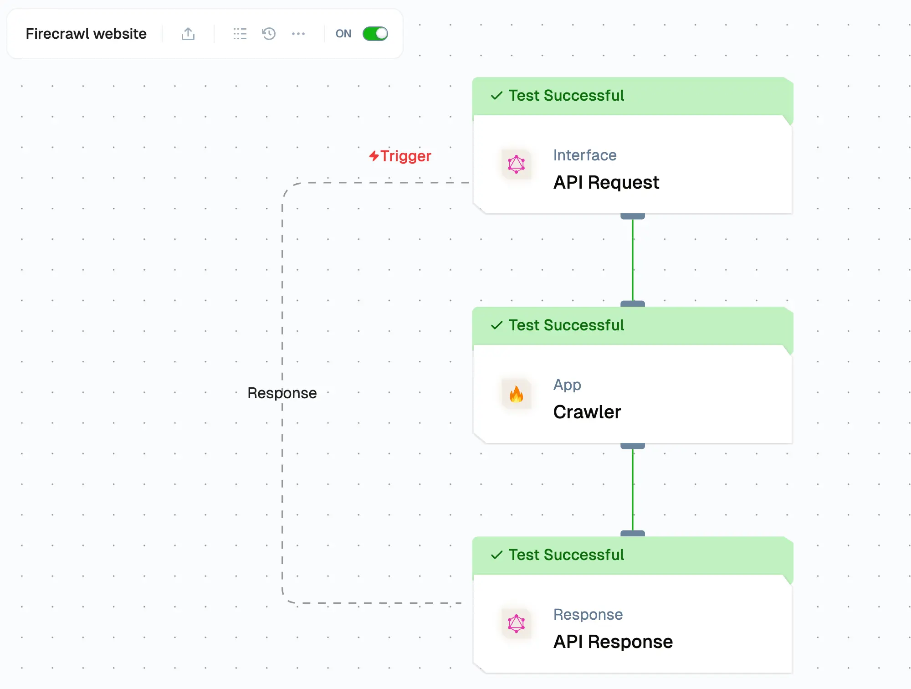
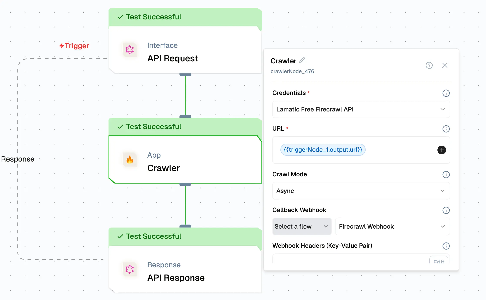
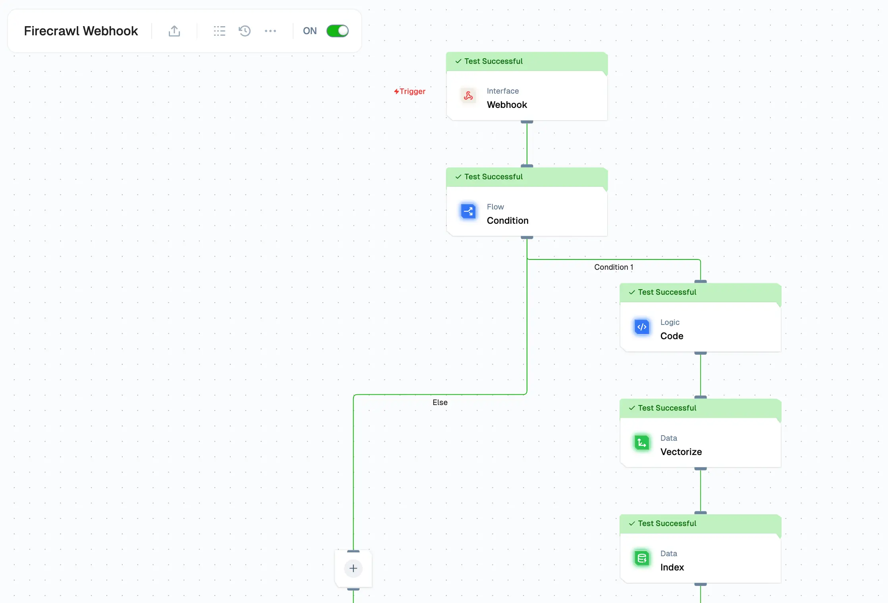
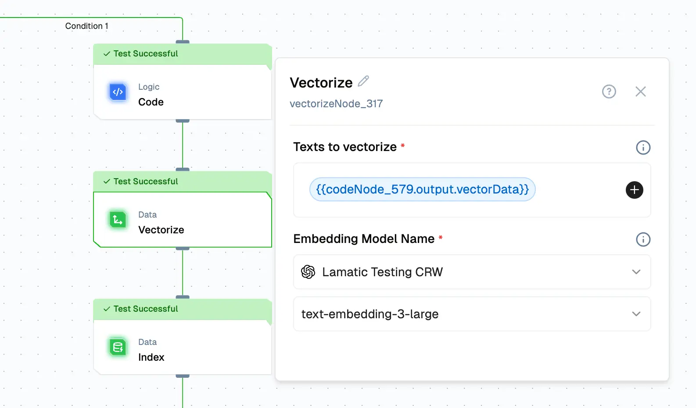
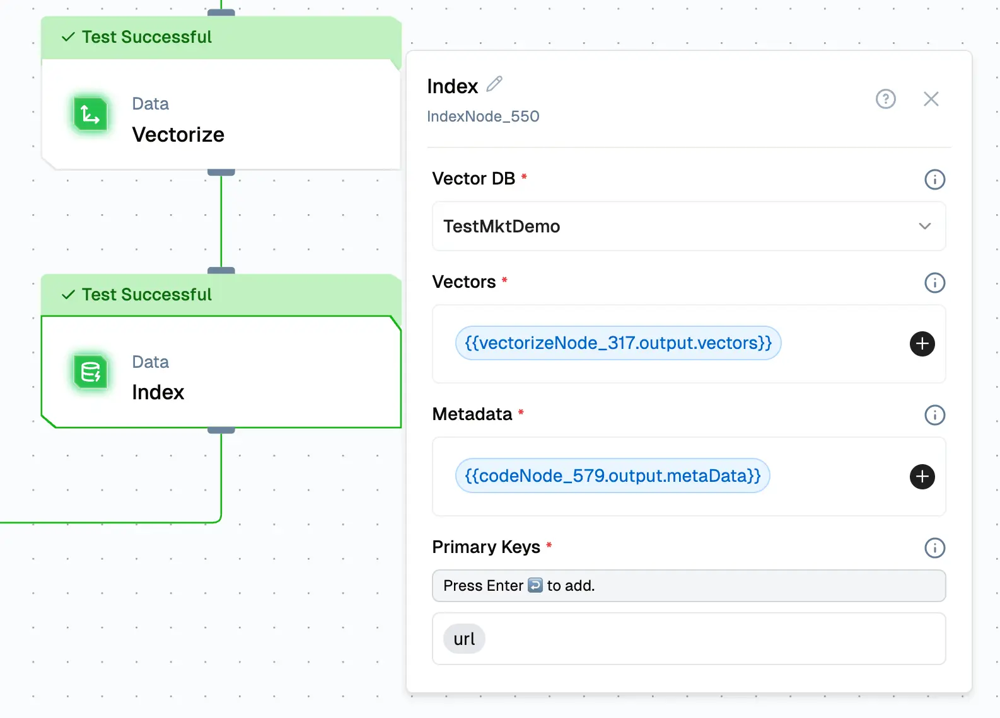

import { Accordion, AccordionItem } from "@nextui-org/react";
import SectionRows from "@/components/SectionRows";
import { Callout } from "nextra-theme-docs";
import { buttonVariants, Button } from "@/components/ui/button";

# Powerful Knowledge Chatbot with Firecrawl and RAG

<div className="grid md:grid-cols-1 gap-2 mb-8">
  <div className="">
    <SectionRows section="Difficulty Level" chips={["Intermediate"]} />

    <SectionRows
      section="Nodes"
      chips={["Crawler", "Vectorisation", "Indexing", "RAG LLM"]}
    />

    <SectionRows section="Tags" chips={["Support", "Operations"]} />

  </div>
</div>

In this tutorial, you'll learn how to build a custom knowledge chatbot using Lamatic.ai, Firecrawl, and RAG (Retrieval-Augmented Generation).

## What you'll Build

- A chatbot using Lamatic.ai Studio
- A chat widget powered by LLM
- RAG & Firecrawl for smart data retrieval

## Understanding the Components

Before we begin, let's go over the key technologies:

- **[Firecrawl](https://www.firecrawl.dev/)** A web crawling service that systematically browses and collects data from websites. It extracts structured content, follows links, and processes various content types.

- **RAG (Retrieval-Augmented Generation)**: A technique that enhances Large Language Models (LLMs) by retrieving relevant knowledge from a database, improving response accuracy and relevance.

## Architecture Overview

Our chatbot consists of three main flows:

### 1. Firecrawl Flow

This flow handles:

1. Accepting website URLs via an API
1. Setting crawling parameters (e.g., depth, filters)
1. Extracting content from web pages
1. Sending collected data to the Webhook Processing Flow

### 2. Webhook Processing Flow

This flow processes and stores the crawled data:

1. Receiving data from Firecrawl
1. Cleaning and structuring text content
1. Creating vector embeddings for efficient search
1. Storing processed data in a vector database

### 3. Chatbot Flow

This flow enables user interaction and intelligent responses:

1. Managing user input through a chat interface
1. Retrieving relevant context using RAG
1. Generating responses using the LLM
1. Handling errors and fallback scenarios

## Getting Started

### 1. Project Setup

1. Sign up at [Lamatic.ai](https://lamatic.ai/) and log in.
1. Navigate to the Projects and click **New Project** or select your desired project.
1. You'll see different sections like Flows, Context, and Connections

### 2. Setting Up the Firecrawl Flow

1. Click Create New Flow in Lamatic.ai Studio.
1. Name your flow Website Crawler.
1. Select API Request as the trigger type Node and define the schema:
   ```json
   { "url": "string" }
   ```
1. Add a Crawler Node, then enter your Firecrawl API key.
   
1. Click the "+" icon on the API Request Node to select and provide the website URL for crawling.
   
1. Use Async mode for the crawler to fetch all pages sequentially, one by one.
1. Configure the Webhook Notification (this will be set up in the next step).
1. Ensure that the Webhook Events value is set to "page" in the crawler configuration options.
1. Save the Node and Test the node.

### 3. Creating the Webhook Processing Flow



1.  Create a new flow named Firecrawl Webhook.
1.  Set Webhook as the trigger type to fetch data from Firecrawl Website Flow.
1.  Add a Conditional Node to check page data.
    ```js
      {
        "operator": null,
        "operands": [
          {
            "name": "{{triggerNode_1.output.type}}",
            "operator": "==",
            "value": "crawl.page"
          }
        ]
      }
    ```
1.  Use a Logic Node to parse data before vectorization.
    Example

    ```js
    let triggerData = {{ triggerNode_1.output.data }}

    let vectorData = "title: " + triggerData[0].metadata.title + " \n description: " + triggerData[0].metadata.description + " \n url: " + triggerData[0].metadata.url + " \n sourceURL: " + triggerData[0].metadata.sourceURL + " \n markdown: " + triggerData[0].markdown

    let metaData = {
      rawHtml: triggerData[0].rawHtml,
      markdown: triggerData[0].markdown,
      title: triggerData [0].metadata.title,
      description: triggerData [0].metadata.description,
      url: triggerData[0].metadata.url,
      sourceURL:triggerData [0].metadata.sourceURL,
    }

    output = {"vectorData":[vectorData],"metaData":[metaData]};
    ```

1.  Add a Vectorize Node by selecting an embedding model for conversion, then choose the vector data by clicking the plus icon.
    
1.  Add an Indexing Node to store vectorized data in a vector database. Choose your preferred vector database and ensure that each entry includes the vector, metadata, and the primary key url.
    
1.  Save and publish the flow.
1.  Link the Webhook to the Firecrawl Flow. Save and publish the Firecrawl Flow.
1.  Check the Webhook Processing Flow to verify the data received from the Firecrawl Node.

### 4. Building the Chatbot Flow

1. Create a new flow named RAG Chatbot 
1. Add a Chat Interface Node.
  1. [Configure the Chat Widget and whitelist the Domain](/docs/interface/widgets/chat)
1. Add a RAG Node, configure the database, and connect it to an LLM.

### 5. Testing
1. Run the Firecrawl Flow (the first flow) to collect data from the website.
1. Ensure the webhook flow is deployed before testing the first flow.
1. After execution, you should see the vectors stored in the vector database.
1. Test the Chatbot Flow to verify that it generates accurate responses.

### 6. Deployment and Integration

1. Click Deploy to make the chatbot live.
1. To integrate the chatbot into your website:
   1. Click Setup to access the embed code.
   1. Paste the code into your website’s HTML.
   1. Ensure allowed domains are configured before deployment Configure the Chat Widget.

<Callout>
Ensure that the [allowed domains](/docs/interface/widgets/chat) are specified before integrating this chat widget.
</Callout>
<br/>
Congratulations! You've completed the tutorial and created your custom knowledge chatbot using Lamatic.ai!
