# Powerful Knowledge Chatbot with Firecrawl and RAG

In this tutorial, you'll learn how to build a custom knowledge chatbot using Lamatic.ai, Firecrawl, and RAG (Retrieval-Augmented Generation).

## What you'll Build
- You'll utilize Lamatic.ai Studio.
- Build Chat Widget using LLM
- Implement RAG & Firecrawl

## Understanding the Components
Before we dive in, let’s understand the key technologies we’ll be working with:

- **[Firecrawl](https://www.firecrawl.dev/)** A web crawling service that systematically browses and collects website data. It can extract structured content, follow links, and handle various content types.
- **RAG (Retrieval-Augmented Generation)**: A technique that enhances Large Language Models (LLMs) by providing relevant context retrieved from a knowledge base. This allows the model to generate more accurate and contextual responses.

## Architecture Overview
Our implementation follows a three-flow architecture, each handling a specific aspect of the system:

### 1. Firecrawl Flow
This flow is responsible for:
1. Accepting website URLs through an API endpoint
1. Configuring crawling parameters and depth
1. Extracting relevant content from web pages
1. Forwarding collected data to the webhook flow

### 2. Webhook Processing Flow
This flow handles:
1. Receiving crawled data from Firecrawl
1. Cleaning and processing the text content
1. Creating vector embeddings for efficient retrieval
1. Storing processed data in a vector database

### 3. Chatbot Flow
This flow manages:
1. User interaction through a chat interface
1. Context retrieval using RAG
1. Response generation using the LLM
1. Handling edge cases and errors

## Getting Started


### 1. Project Setup
1. Sign up at [Lamatic.ai](https://lamatic.ai/) and log in.
1. Navigate to the dashboard and click **Create New Flow**.
1. You'll see different sections like Flows, Data, and Models

### 2. Setting Up the Firecrawl Flow
1. From the Studio, click “Create New Flow”
1. Name your flow “Website Crawler”
1. Select “API Request” as the trigger type and define the schema such as
    ```json
        { "trigger": "bool" }
    ```
1. Add a Crawler node to your flow and Add Credentials (API key from Firecrawl)
    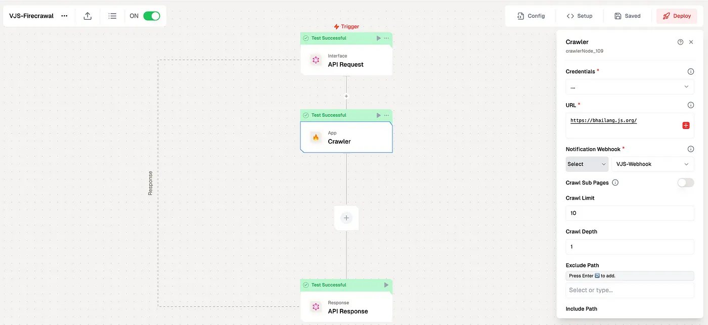
1. Add Website URL to crawl the website
1. In the Notification Webhook, Here we’ll select the Webhook which we’ll create in the next section
1. Save the Node and Test the node.

### 3. Creating the Webhook Processing Flow
1. Create a new flow named “Crawler Data Processor”
1. Select “Webhook” as the trigger type and Click on Fetch to collect the data from Crawler Flow.
    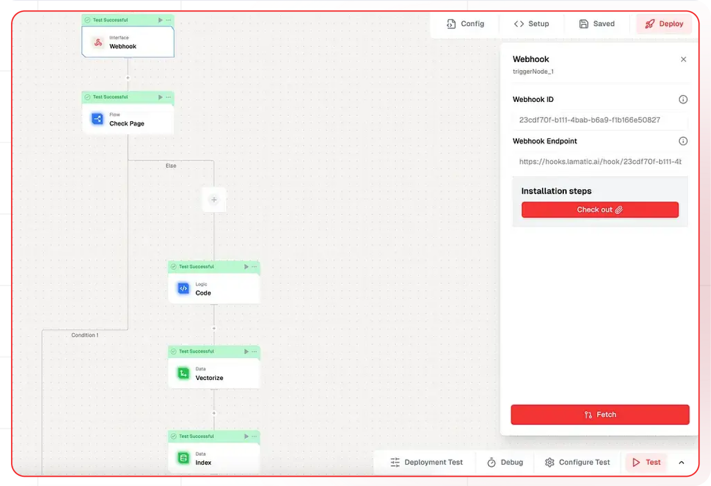
1. Add a Conditional Node to check the page data
    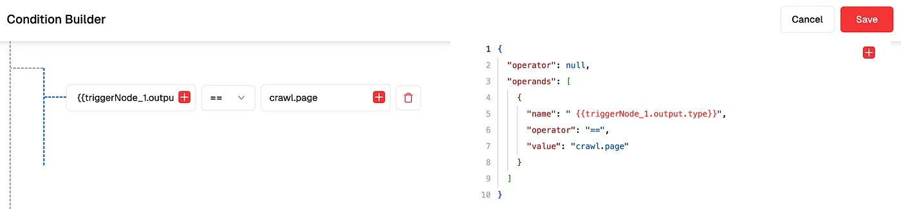
1. Parse the data before Vectorize the data by adding Logic Node
    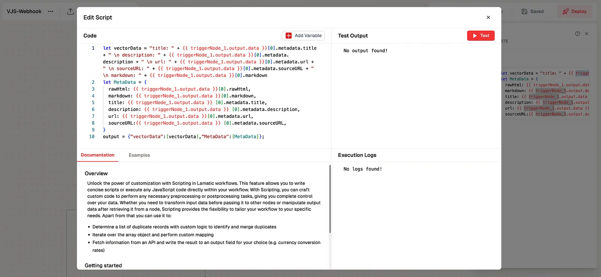
1. Add Vectorize Node, here you can pass the data to vectorized by selecting Embedding Model Name
    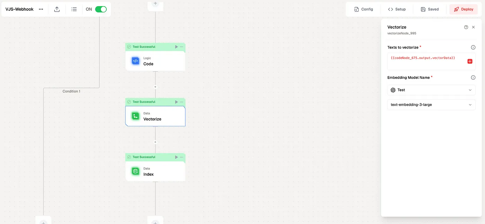
1. Add New Node for Indexing vectorized data, here we’ll select the vector database, vectors, metadata, and primary key JSON.
    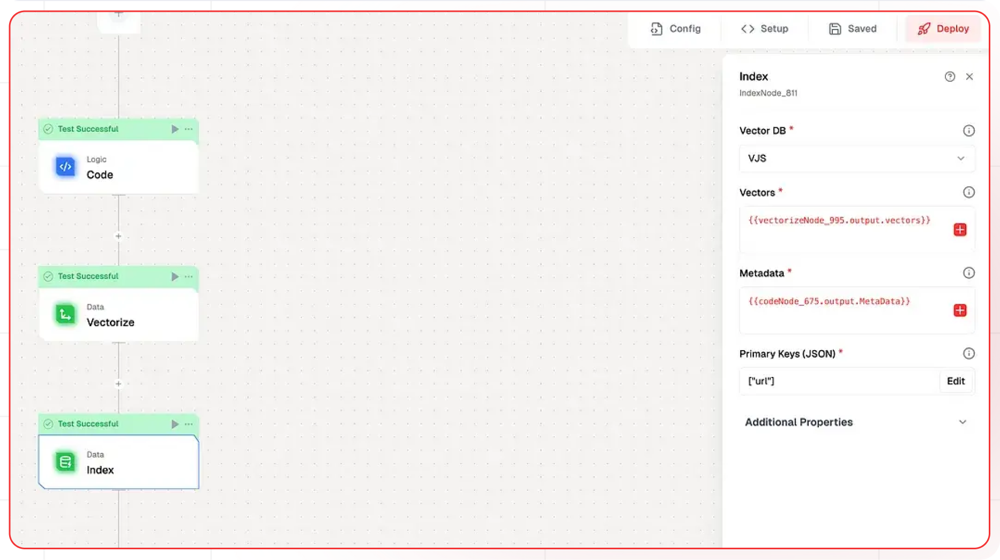
1. Save the flow and Publish
1. Select the Webhook in the Firecrawl Flow and Save
    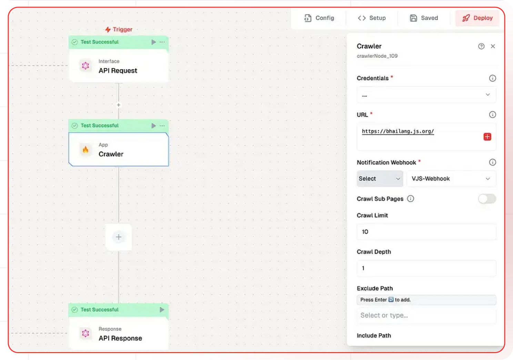

### 4. Building the Chatbot Flow
1. Create a new flow named “RAG Chatbot” or Select the Flow Template of RAG Chatbot
    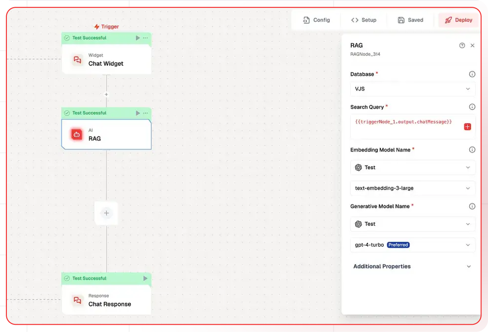
1. Add a “Chat Interface” node
1. Add RAG Node and Select the Database, Pass query, Select Respective LLM
    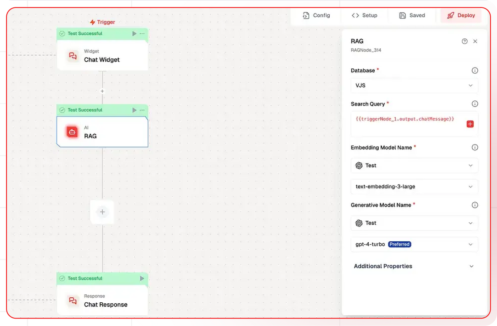

### 5. Testing Chatbot
1. Run the Firecrawl Flow, in which we’ll crawl the data from the given website
1. Check with Chatbot Flow for testing

### 6. Deployment and Integration
Once you’ve tested the chat widget, click the Deploy button to make it live. Here you pass the deployment message.
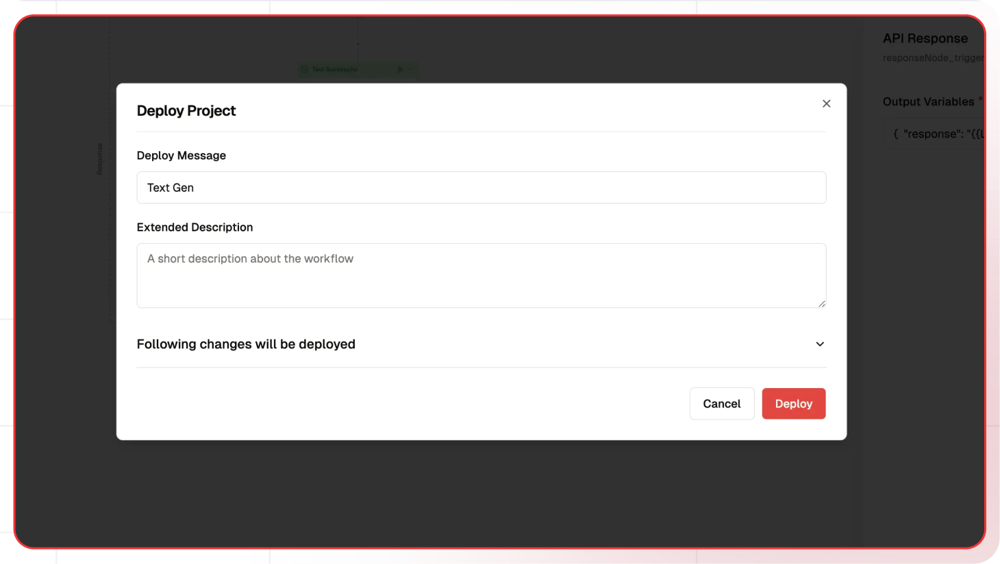

### 7. Integration
To integrate the chat widget into your website, simply click the Setup button to access the code, then paste it into your website.

Ensure that the allowed domains are specified before integrating this chat widget.
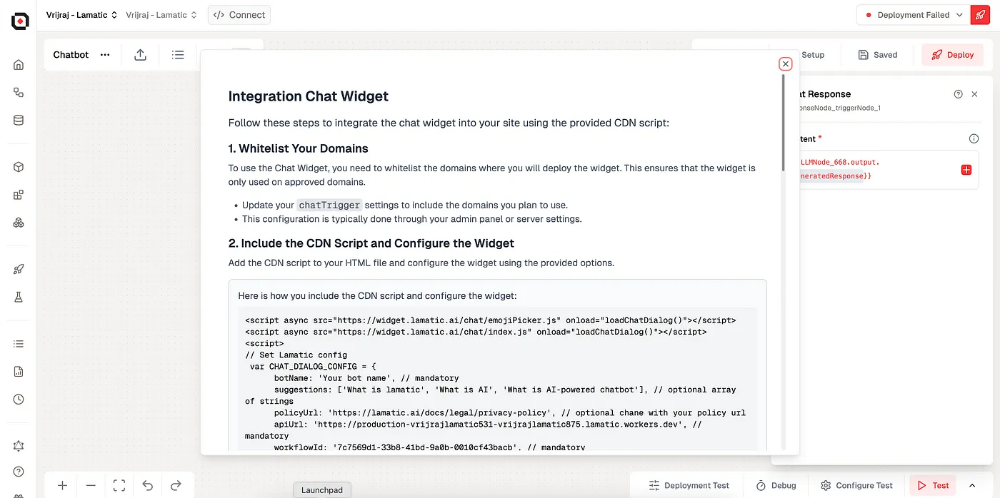


Congratulations! You've completed the tutorial and created your custom knowledge chatbot using Lamatic.ai!