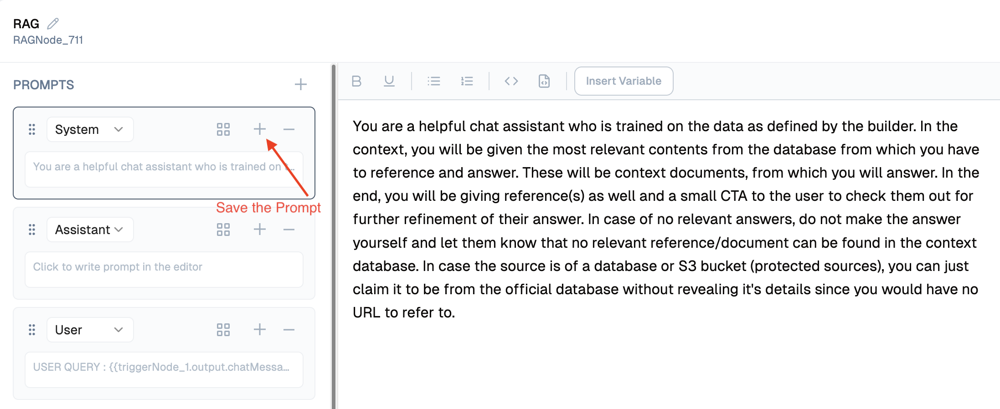

import { Accordion, AccordionItem } from "@nextui-org/react";
import SectionRows  from '@/components/SectionRows'
import { Callout } from 'nextra-theme-docs'
import {buttonVariants, Button} from '@/components/ui/button'

# Prompt Engineering with Lamatic

<div className="grid md:grid-cols-1 gap-2 mb-8">
  <div className="">
    <SectionRows 
      section="Difficulty Level" 
      chips={["Beginner"]} 
    />
    
    <SectionRows 
      section="Nodes" 
      chips={[
         "Generate Text",
         "RAG"
      ]} 
    />
    
    <SectionRows 
      section="Tags" 
      chips={[
        "Prompt"
      ]} 
    />
  </div>
</div>

In this guide, we’ll explore how to use Lamatic.ai's built-in Prompt Editor to create modular and testable prompts using multiple roles—System, User, and Assistant.

## What You’ll Learn

* Create prompt blocks using roles
* Inject variables into your prompts
* Test and iterate inside Lamatic Studio
* Apply version control strategies for scalable updates

## 1. Getting Started

1. Open any LLM-enabled flow inside **Lamatic.ai Studio**.
2. Drag a **Generate Text Node** or click into an existing one.
3. Click into to launch the editor.


## 2. Understanding Prompt Roles

You can define prompts under three distinct roles:

* **System**: Core behavior, tone, and assistant persona.
* **User**: Input coming from your app or user directly.
* **Assistant**: (Optional) Past assistant replies to retain tone continuity.

Switch roles using the dropdown in the prompt editor.

```handlebars
System: You are a helpful assistant trained on company knowledge.
User: {{triggerNode_1.output.chatMessage}}
```

## 3. Injecting Variables

You can use the top panel to insert dynamic variables, or simply type `{{` to open the variable selection menu.

```handlebars
{{topic}}
{{userName}}
```

Use these to personalize or parameterize prompts.

### Example:

```handlebars
System: Welcome {{userName}}, I’ll help you with {{topic}}.
```

## 4. Save the Prompt as Template

Click the + icon at the top left of each prompt type section to save it as a prompt template. This allows you to easily reuse it across other flows.


You can view all your saved prompts on the Prompts page in the Studio.

## 5. Testing & Debugging

Click **Test** on the LLM node to evaluate output.

* You’ll see the input rendered with variable values.
* The **Test Output** panel shows final model output.
* The **Raw Output** panel can help identify unexpected behavior or formatting issues.


## 6. Versioning Strategy

Each prompt can be versioned by naming conventions like:

```
help-desk-v1
help-desk-v1.1
help-desk-v2
```

Use “duplicate template” to fork and evolve prompts safely. Deprecated ones can be marked `-deprecated` to avoid accidental reuse.

## Summary

By using Lamatic's Prompt Editor:

* You modularize LLM behavior cleanly
* Keep system/user logic separated
* Enable reusability across flows
* Streamline debugging and controlled updates

