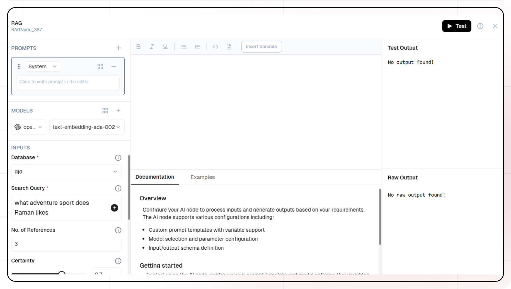
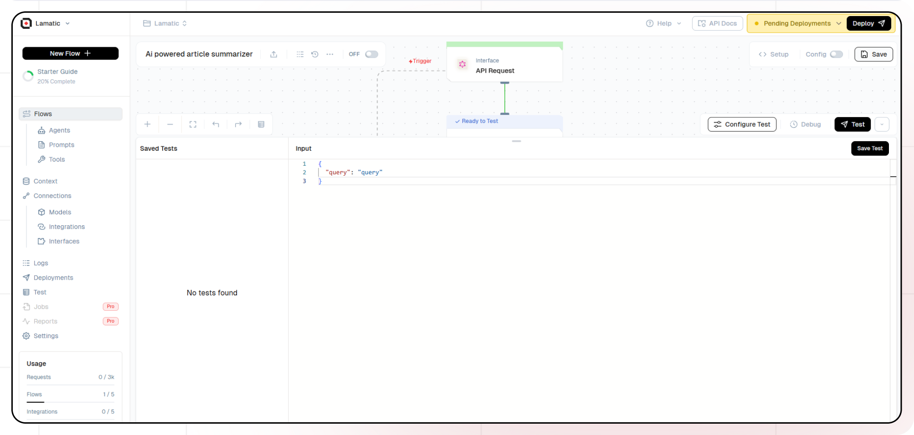

# RAG Implementation with Lamatic

This guide will help you build an AI-powered Retrieval-Augmented Generation (RAG) system using Lamatic. The workflow retrieves relevant information from a knowledge base, enhances AI responses with accurate context, and ensures more precise and informed outputs. By integrating retrieval with generative AI, this system enables efficient knowledge extraction and improves response quality, making it ideal for applications like document analysis, customer support, and research assistance.

## What You'll Build

A simple API that processes article URLs provided by users, extracts content using the Firecrawl scraper node, and generates a concise summary using an LLM node. This API enables seamless data extraction, making it easier to quickly understand and analyze lengthy articles for a wide range of applications.

## Getting Started


### 1. Project Setup

1. Sign up at [Lamatic.ai](https://lamatic.ai/) and log in.
1. Navigate to the Projects and click **New Project** or select your desired project.
1. You'll see different sections like Flows, Context, and Connections
   

### 2. Creating a New Flow

1. Navigate to Flows, select New Flow.
2. Click **Create from scratch** as starting point.
   

### 3. Setting Up Your API

1. Click "Choose a Trigger"
2. Select "API Request" under the interface options
   
3. Configure your API:
   - Add your Input Schema
   - Set "text" and "query" as parameter in input schema
   - Set response type to "Real-time"
     
   - Click on save


### 4. Chunking The Data

1. Click the + icon to add a new node
2. Select the Chunking node
   
3. Add the "text to chunk"
4. Add "number of characters" and "overlapping characters"

### 5. Process The Chunked Data

1. Click the + icon to add a new node
2. Choose "Code Node"
3. Set up your prompt:

   ```
   output=[{{chunkNode_175.output.chunks[0].pageContent}}]

   ```

### 6. Vectorize the Chunks

1. Click the + icon to add a new node
2. Choose "Vectorize Node"
3. Add the output from code node in "Texts to Vectorize as parameter" (The input should be an array of strings)
   

4. Configure the embedding model:
   - Select the Openai provider API key
   - Select text-embedding-3-small as the embedding model

### 7. Index the Vectors

1. Click the + icon to add a new node
2. Choose "Index Node"
3. Select the "Vector Database"
4. Select the "Vectors" to be indexed
5. Add the "Metadata" (The length of the Vectors and Metadata should be same)


6. Enter the "Primary key"

### 8. Setting Up The RAG Node

1. Click the + icon to add a new node
2. Choose "RAG Node"
3. Select the "Database" you want to use
4. Add the "Search Query"
   

5. Configure the embedding model:
   - Select the Openai provider API key
   - Select text-embedding-3-small as the embedding model
6. Configure the Generative model:
   - Select the Openai provider API key
   - Select gpt-4-turbo as the generative model

### 9. Configure The Response

1. Click the API response node
2. Add Output Variables by clicking the + icon
3. Select variable from your **RAG** Node

### 10. Test The Flow

1. Click on "API Request" trigger node
2. Click on Configure test
   
3. Fill sample value in "text" and "query" then click on test

### 11. Deployment

1. Click the Deploy button
   
2. Your API is now ready to be integrated into Node.js or Python applications
3. Your flow will run on Lamatic"s global edge network for fast, scalable performance

### 12. What"s Next?

- Experiment with different prompts
- Try other AI models
- Add more processing steps to your flow
- Integrate the API into your applications

### 13. Tips

- Save your tests for reuse across different scenarios
- Use consistent JSON structures for better maintainability
- Test thoroughly before deployment

Now you have a working AI-powered API! You can expand on this foundation to build more complex applications using Lamatic.ai"s features.
