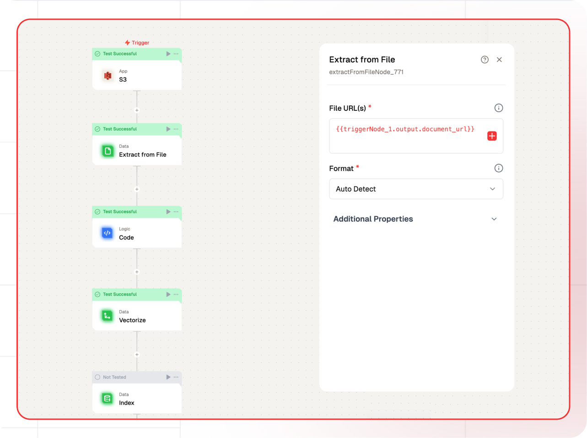
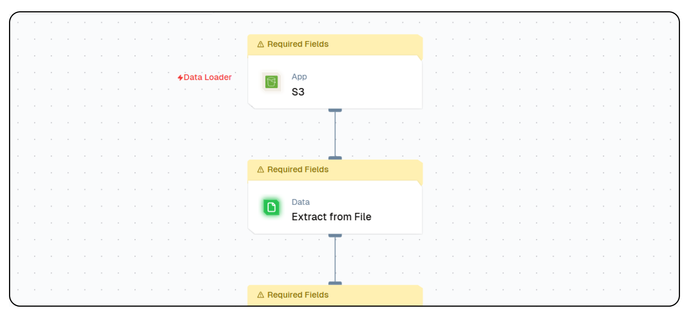
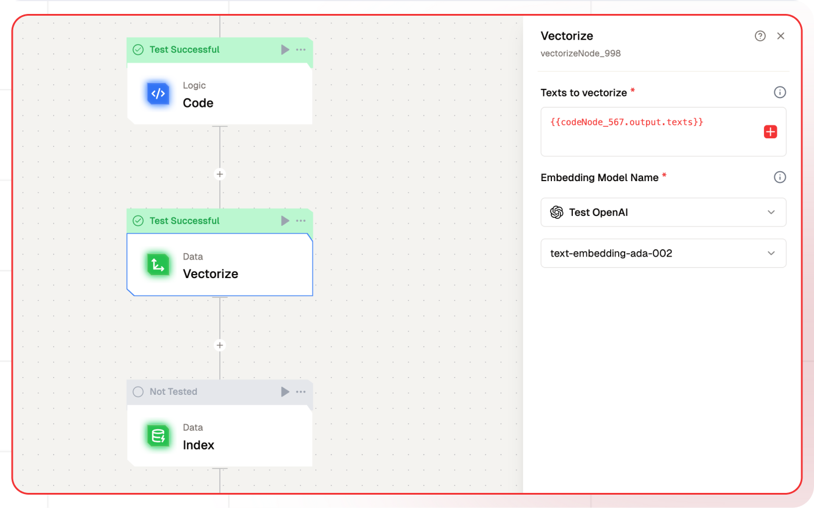
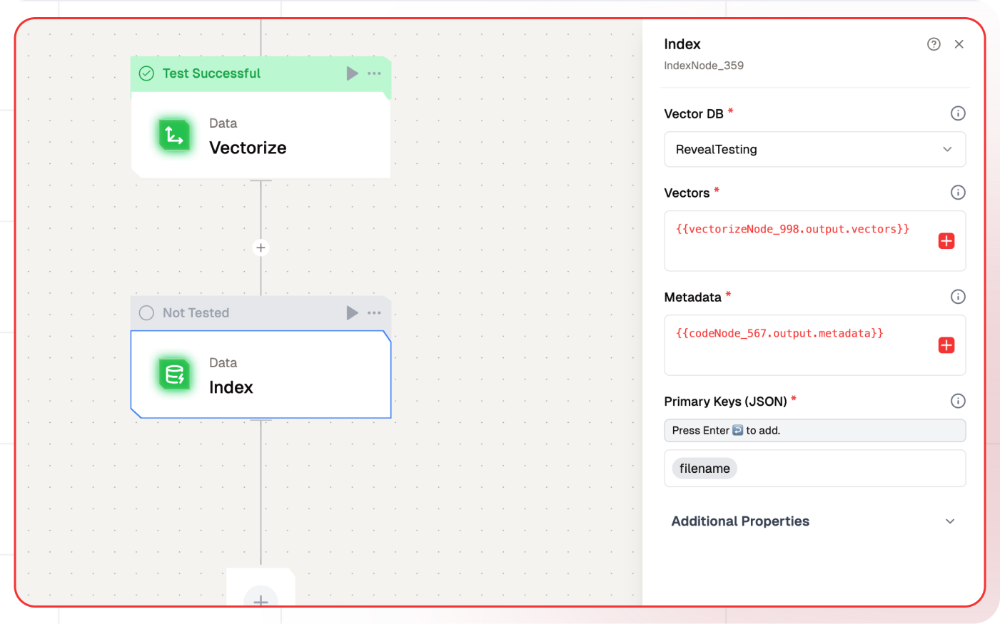
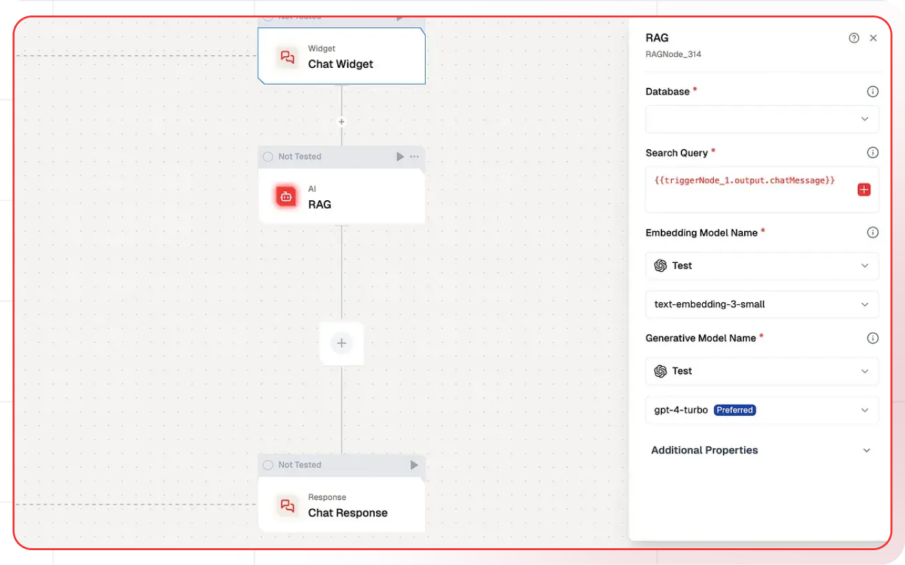

# RAG with AWS S3

Learn how to create an intelligent chatbot that can understand and respond to questions using documents from your Amazon S3 bucket. This tutorial leverages **Lamatic.ai** and **Retrieval-Augmented Generation (RAG)** technology.

---

## What You'll Build

- Utilize **Lamatic.ai Studio** for building workflows.
- Create a **Chat Widget** powered by LLMs.
- Implement **RAG** with AWS S3 for document-based knowledge retrieval.

---

## Workflow Overview

We'll implement the following steps:

1. **S3 Node**: Collect files from an S3 bucket.
2. **Extract from File Node**: Parse and extract content from files.
3. **Logic Node**: Transform the extracted data.
4. **Vectorize Node**: Convert data into vectors for AI processing.
5. **Index Node**: Manage and store vectorized data.

---

## Getting Started

### 1. Create an Account and New Workflow

1. Sign up at [Lamatic.ai](https://lamatic.ai/) and log in.
2. Navigate to Flows, select New Flow, and choose Create from Scratch as your starting point.
3. Click on new flow.
4. Choose **S3 Node** as the trigger. Refer to [S3 Node setup instructions](https://lamatic.ai/docs/integrations/aws-s3).

---

### 2. Extract Data from Files

The **Extract from File Node** processes and extracts content from various file formats.

1. Add the **Extract from File Node** to your flow.
2. Configure the node:
   - Click the **+** icon to add data.
   - Provide the `document_url` as the File URL(s).
   

---

### 3. Transform the Data

1. Use a **Logic Node** to extract chunked text:
   - Add the **Extract Chunked Text Node** and define transformation logic.

---

### 4. Vectorize the Data
Transform textual data into vectors for AI processing.

1. Add a **Vector Node** and configure it:
   - Click the **+** icon to input text for vectorization.
   - Choose an embedding model, e.g., OpenAI’s `text-embedding-3-large`.

   

---

### 5. Store Vector Data in a Database

Organize and store vectorized data for efficient retrieval.

1. Add a **Index Node**
2. Configure the node:
   - Select the desired vector database.
   - Add vectors, metadata, and a primary key.
   
---

### 6. Test and Deploy Workflow

1. Test the flow using the **Test** button.
2. Deploy the flow to make it accessible for chatbot integration.  
   Logs can be monitored in the **Logs** section.

---

### 7. Build the Chatbot Using RAG

RAG (Retrieval-Augmented Generation) combines a knowledge base with language understanding to provide accurate, context-aware responses.

1. Create a new flow named **RAG Chatbot**, or use the [Document Chatbot Template](https://hub.lamatic.ai/templates/document-chatbot-widget).
2. Add a **Chat Interface Node**.
3. Add a **RAG Node**:
   - Select the vector database.
   - Pass the query and choose the respective LLM.
   

---

### 8. Test and Deploy Chatbot

1. Test the chatbot to ensure accurate responses.
2. Deploy the chatbot by clicking the **Deploy** button.
3. Integrate the chat widget into your website:
   - Click **Setup** to access the integration code.
   - Paste the code into your website.

---

## Congratulations!

You’ve successfully built an intelligent document-based chatbot using **AWS S3** and **RAG technology** with **Lamatic.ai**. 🎉
