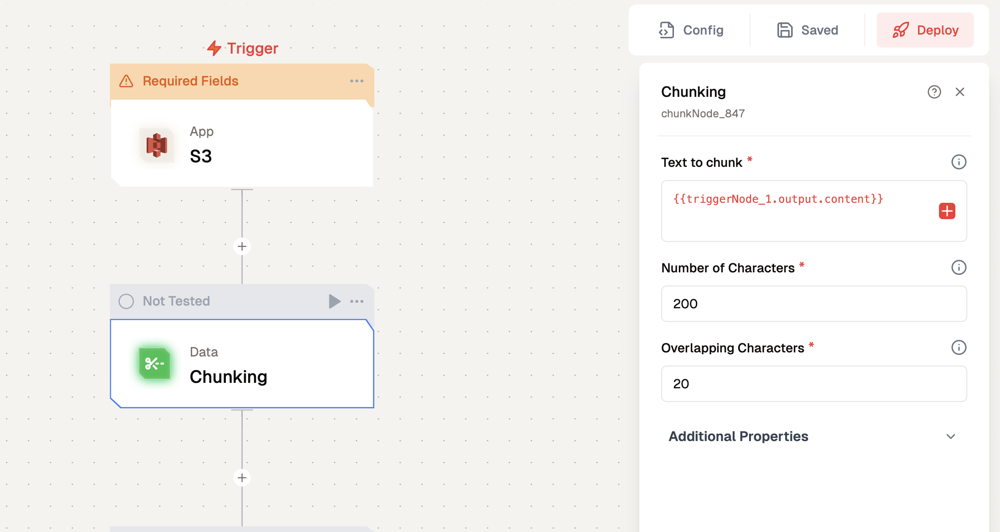
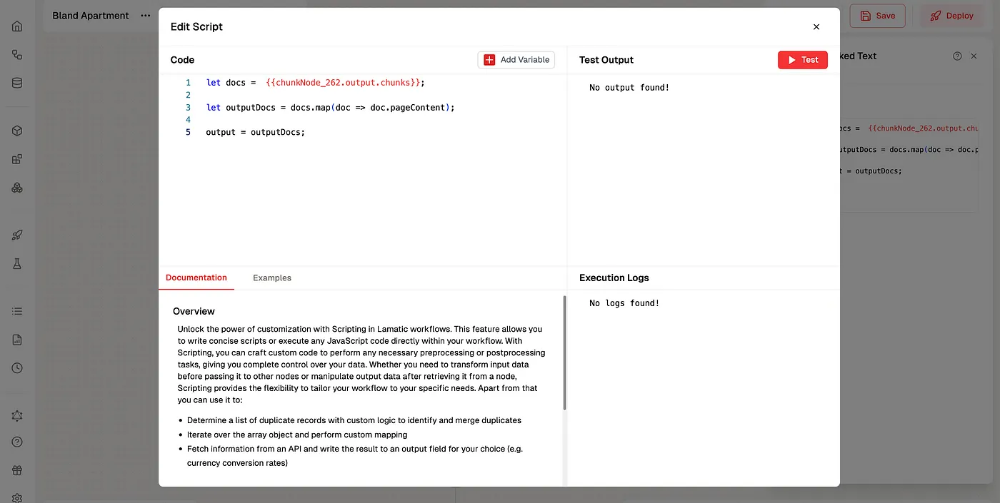
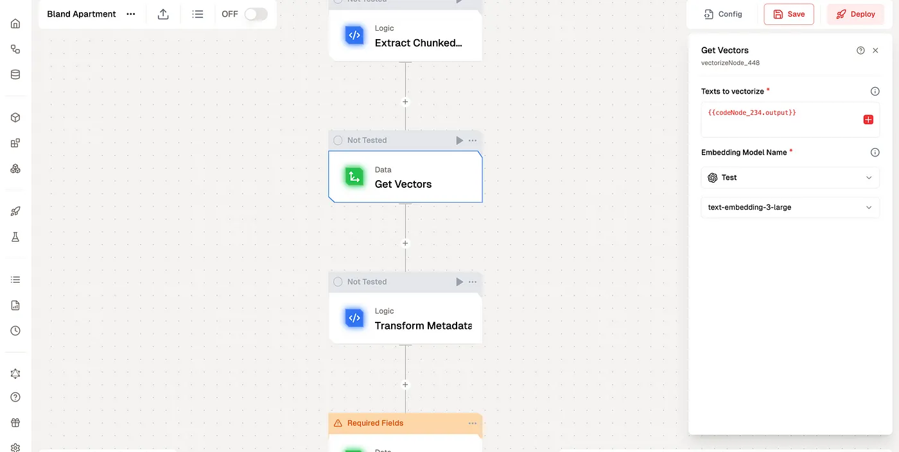
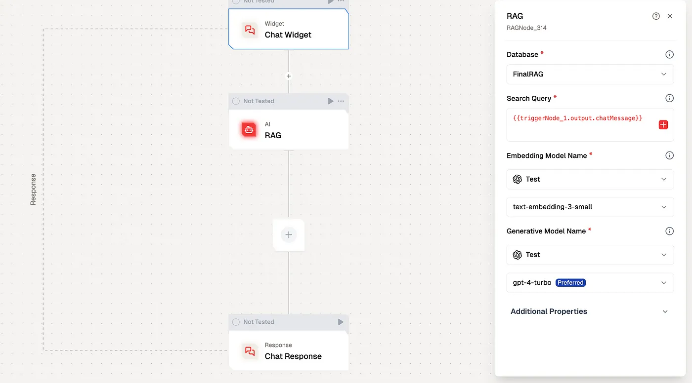

# RAG with AWS S3

In this tutorial, you'll learn how to build an intelligent chatbot that can understand and respond to questions based on your Amazon S3 bucket documents using Lamatic.ai and RAG technology.

## What you'll Build

- You'll utilize Lamatic.ai Studio.
- Build Chat Widget using LLM
- Implement RAG with Google Drive

## Getting Started

<Steps>
### 1. Account Creation and Create a New Flow
1. Visit [Lamatic.ai](https://lamatic.ai/) and sign in
1. Navigate to the dashboard and click **Create New Flow**
1. Choose **S3 Node** as the Trigger.
    1. Refer to the instructions for setting up the S3 Node [here](https://lamatic.ai/docs/integrations/aws-s3).

### 2. Data Chunking

Data chunking is a critical process that determines how effectively your chatbot can understand and retrieve information. Think of chunking as breaking down a book into logical chapters and paragraphs — it needs to be done thoughtfully to maintain context and meaning.

The chunking process involves sophisticated algorithms that analyze your documents and break them down into smaller, meaningful pieces. These chunks need to be large enough to maintain context but small enough to be specific and relevant when retrieved. Getting this balance right is crucial for your chatbot’s performance.

1. Add “Chunking” node.
1. Click the plus icon to select the data and provide the text you want to chunk.
   
1. Set your chunking parameters and adjust other default options under Additional Properties.
1. Add a new Logic Node to Extract Chunked Text and Click on the “Extract Chunked Text” node, where we will extract data from the Chunks by applying the specified logic.
   

### 3. Vector the Data

Vectorization is where we transform text into a format that AI can understand and process efficiently. This step is like creating a detailed map of your knowledge base that the AI can navigate quickly and accurately.

1. Add Vector Node and Click on the Get Vectors node.
   
1. Click the plus (+) icon to choose the data and input the text you want to vectorize.
1. Select the embedding model. For this example, we’ll use OpenAI’s text-embedding-3-large.

### 4. Store Vector Data in the Vector Database

The database storage step is where your vectorized knowledge becomes organized and readily accessible. This is similar to creating a highly efficient library catalog system, but instead of organizing books by author or subject, we’re organizing information by semantic meaning and relevance.

Vector databases are specifically designed to handle high-dimensional data and perform similarity searches quickly. This is essential for your chatbot to provide fast, accurate responses to queries.

1. Add Vector Node and Click on the node
1. Select the desired Vector Database
1. Add Vectors, Metadata, and a Primary Key by clicking the “+” icon

### 5. Test & Deployment Google Drive Node

Click the “Test” button to test the Node, then deploy your flow to make it accessible for chatbot integration. You can check the logs in the logs section.

### 6. Create a New Chatbot Flow to Implement RAG

Now it’s time to create the chatbot that will utilize your knowledge base through RAG technology.

This step is where we bring together all the previous components to create an intelligent chatbot that can understand and respond to queries using your knowledge base. RAG (Retrieval-Augmented Generation) is the key technology that allows your chatbot to combine its understanding of language with your specific knowledge base.

RAG works by first retrieving relevant information from your vectorized knowledge base, then using this information to generate accurate, contextual responses. This is similar to how a human expert might consult reference materials before providing a detailed answer.

1. Create a new flow named “RAG Chatbot” or Select the Flow Template of Document Chatbot ([Template](https://hub.lamatic.ai/templates/document-chatbot-widget))
1. Add a “Chat Interface” node
1. Add RAG Node and Select the Database, Pass query, Select Respective LLM
   

### 7. Test and Deploy Chatbot

Thorough testing ensures your chatbot provides accurate and helpful responses.

Once you’ve tested the chat widget, click the Deploy button to make it live. Here you pass the deployment message. To integrate the chat widget into your website, simply click the Setup button to access the code, then paste it into your website.

</Steps>

You've successfully built your own intelligent document chatbot!
