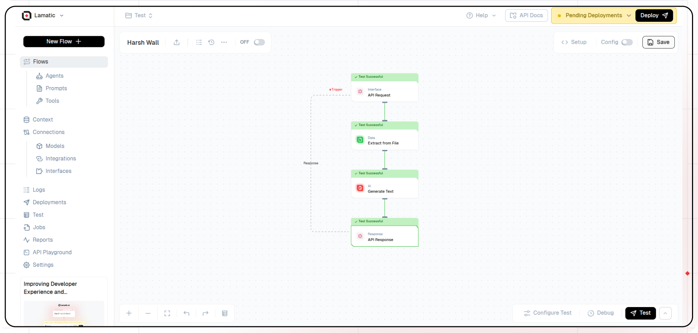
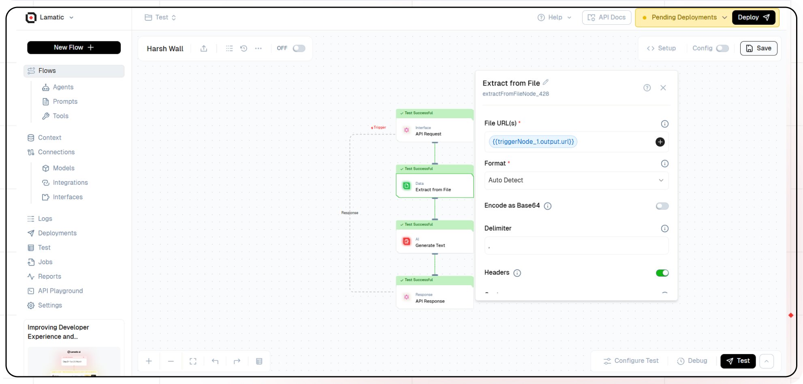
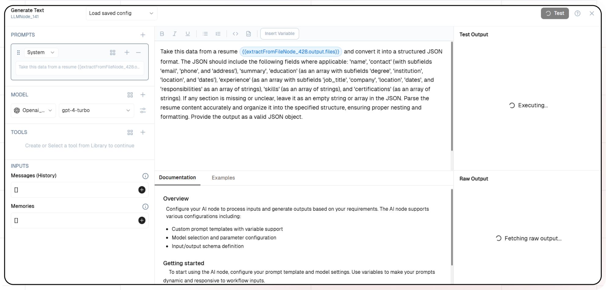
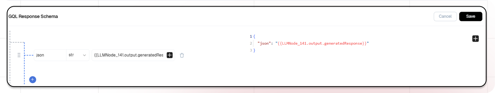
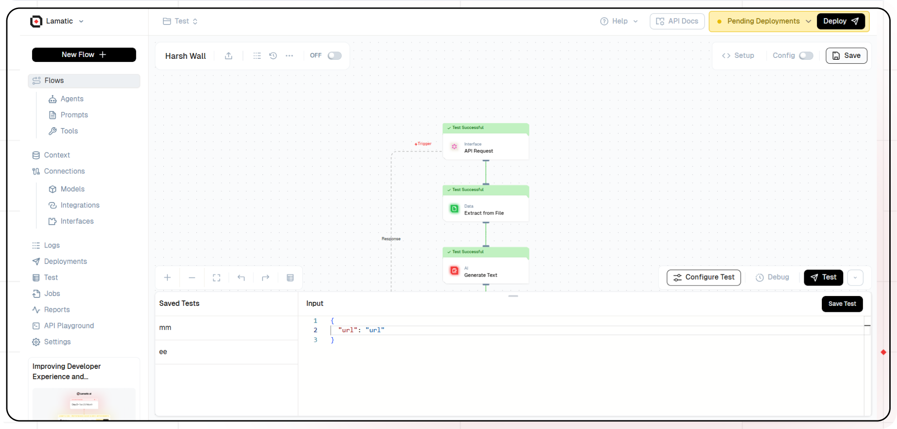

import { Accordion, AccordionItem } from "@nextui-org/react";
import SectionRows  from '@/components/SectionRows'
import { Callout } from 'nextra-theme-docs'
import {buttonVariants, Button} from '@/components/ui/button'

# AI powered Resume Parser


<div className="grid md:grid-cols-1 gap-2 mb-8">
  <div className="">
    <SectionRows 
      section="Difficulty Level" 
      chips={["Beginner"]} 
    />
    
    <SectionRows 
      section="Nodes" 
      chips={[
         "Extract File",
         "Text LLM"
      ]} 
    />
    
    <SectionRows 
      section="Tags" 
      chips={[
        "Support",
        "HR"
      ]} 
    />
  </div>
</div>

<div className="mt-4 mb-4">
  <Callout>
  Try out this flow yourself at Lamatic.ai. Sign up for free and start building your own AI workflows.
  <Button variant="destructive" className="mt-3" href="https://studio.lamatic.ai/_?templateSlug=resume-parser" size="sm" asChild>
    <a href="https://studio.lamatic.ai/_?templateSlug=resume-parser" target="_blank">Add to Lamatic</a>
  </Button>
</Callout>
</div>

This guide will help you build an AI-powered resume parsing system. The workflow takes a resume as input, extracts key details such as name, contact information, skills, experience, and education, and converts the data into a structured JSON format. This system automates resume processing, enabling efficient candidate analysis and seamless integration with recruitment workflows.

## What You'll Build

A Simple API that processes resumes, extracts relevant details, and generates structured JSON output

## Getting Started

### 1. Project Setup

1. Sign up at [Lamatic.ai](https://lamatic.ai/) and log in.
1. Navigate to the Projects and click **New Project** or select your desired project.
1. You'll see different sections like Flows, Context, and Connections
   

### 2. Creating a New Flow

1. Navigate to Flows, select New Flow.
2. Click **Create from scratch** as starting point.
   

### 3. Setting Up Your API

1. Click "Choose a Trigger"
2. Select "API Request" under the interface options
   
3. Configure your API:
   - Add your Input Schema
   - Set url as parameter in input schema
   - Set response type to "Real-time"
     
   - Click on save

### 3. Extract File Node
1. Add the "Extract File" node to your flow.
  
2. Configure the file extraction settings to take the url and type of file. If using a PDF, select 'Join Pages' to extract the text from all pages.
3. The file contents and details will be extracted and are to be passed to extract textual content from the file.

### 5. Adding AI Text Generation

1. Click the "+" icon to add a new node
2. Choose "Generate Text"
 
3. Configure the AI model:
   - Select your "Open AI" credentials
   - Choose "gpt-4-turbo" as your Model
4. Click on "+" under Prompts section.
5. Set up your prompt:
```
Take this data from a resume  and convert it into a structured JSON format. The JSON should include the following fields where applicable: 'name',
'contact' (with subfields 'email', 'phone', and 'address'), 'summary', 'education' (as an array with subfields 'degree', 'institution', 'location', and 'dates'), 
'experience' (as an array with subfields 'job_title', 'company', 'location', 'dates', and 'responsibilities' as an array of strings), 'skills' (as an array of strings), and 'certifications' (as an array of strings). 
If any section is missing or unclear, leave it as an empty string or array in the JSON. Parse the resume content accurately and organize it into the specified structure, ensuring proper nesting and formatting. Provide the output as a valid JSON object.
```

- You can add variables using the "insert Variable" button
  
### 5. Configuring the reponse

1. Click the API response node
   
2. Add Output Variables by clicking the + icon
3. Select variable from your Generate Text Node

### 7. Test the flow

1. Click on 'API Request' trigger node
2. Click on Configure test
   
3. Fill sample value in 'url' and click on test

### 8. Deployment

1. Click the Deploy button
   
2. Add the purpose and description of your project
3. Your API is now ready to be integrated into Node.js or Python applications
4. Your flow will run on Lamatic's global edge network for fast, scalable performance

### 9. What's Next?

- Experiment with different prompts
- Try other AI models
- Add more processing steps to your flow
- Integrate the API into your applications

### 10. Tips

- Save your tests for reuse across different scenarios
- Use consistent JSON structures for better maintainability
- Test thoroughly before deployment

Now you have a working AI-powered API! You can expand on this foundation to build more complex applications using Lamatic.ai's features.
