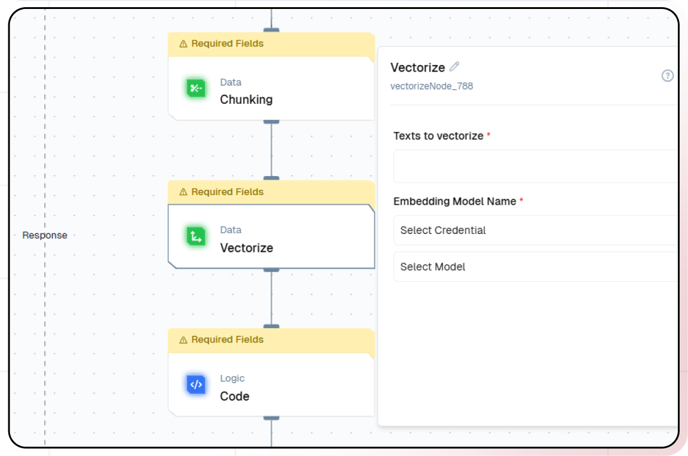

# Slack Internal Support Bot with Scraper

In this tutorial, you'll learn how to build a bot connected with your slack channel that can answer questions based on your documentation using Lamatic.ai and RAG technology.

## What you'll Build
- You'll utilize Lamatic.ai Studio.
- Build Slack Webhook using RAG LLM.
- Implement RAG with FireCrawl Scraper

## Getting Started

### 1. Account Creation and Create a New Flow
1. Sign up at [Lamatic.ai](https://lamatic.ai/) and log in.
1. Navigate to the Projects and click **New Project** or select your desired project.
1. You'll see different sections like Flows, Context, and Connections
1. Select the "Create from Scratch"
1. You will have to create 8 nodes, which are to be built and configured: API (Trigger Node), Scraper Node, Chunking Node, Extract Chunks (Code Node), Vectorise Node, Transform Metadata (Code Node), Index Node and API Response.

### 2. API Trigger Node
1. Modify the API schema to take the required input parameters, "url" and "filename".
1. Here, the filename is the main content that is given in the "url", so you can name it as per your requirement.

### 3. Scraper Node
1. Authorize Lamatic AI with your FireCrawl API at the "Scraper" Node by providing the required credentials.
1. Add the "url" passed from the API Trigger Node to the "URL to Scrape" setting and toggle the "Only Main Content" option on.
     
    

### 4. Data Chunking
Data chunking is a critical process that determines how effectively your chatbot can understand and retrieve information. Think of chunking as breaking down a book into logical chapters and paragraphs — it needs to be done thoughtfully to maintain context and meaning.
 
The chunking process involves sophisticated algorithms that analyze your documents and break them down into smaller, meaningful pieces. These chunks need to be large enough to maintain context but small enough to be specific and relevant when retrieved. Getting this balance right is crucial for your chatbot’s performance.
 

1. Navigate to the “Chunking” node.
1. Click the plus icon to select the data and provide the text you want to chunk.
    
1. Set your chunking parameters and adjust other default options under Additional Properties.
1. Click on the “Extract Chunks" node, where we will extract data from the Chunks by applying the specified logic.

### 5. Vector the Data
Vectorization is where we transform text into a format that AI can understand and process efficiently. This step is like creating a detailed map of your knowledge base that the AI can navigate quickly and accurately.

 

1. Click on the "Vectorize" node.
    
1. Click the plus (+) icon to choose the data and input the text you want to vectorize.
1. Select the embedding model. For this example, we’ll use OpenAI’s text-embedding-3-small.

### 6. Transform Metadata
Transforming metadata is like creating a detailed index for your knowledge base. This step ensures that your chatbot can quickly and accurately retrieve the information it needs to answer questions.
 

1. Click on the "Transform MetaData" node to transform the metadata of the extracted data, so as to make it more readable and understandable.

### 7. Store Vector Data in the Vector Database
The database storage step is where your vectorized knowledge becomes organized and readily accessible. This is similar to creating a highly efficient library catalog system, but instead of organizing books by author or subject, we’re organizing information by semantic meaning and relevance.
 

1. Click on the "Index" node

1. Select the desired Vector Database
1. Add Vectors, Metadata, and a Primary Key by clicking the “+” icon

### 8. Testing
Click the “Test” button to test the Node, 
 

Pass `url` and `filename` for the testing purpose.
1. `url`: Represents the URL of the document you want to extract data from.
1. `filename`: Serves as the name of the document you want to extract data from, this should be unique for each document/link.

For testing, you need to manually provide `url` and `filename` as dummy data. Once deployed, these values must be passed to your API trigger node from the external application.
 

### 9. Deployment

1. Click the Deploy button
   
2. Your API is now ready to be integrated into Node.js or Python applications
3. Your flow will run on Lamatic's global edge network for fast, scalable performance

Then deploy your flow to make it accessible for API endpoint. You can check the logs in the logs section.

### 10. Create a New Chatbot Flow to Implement RAG
Now it’s time to create the chatbot that will utilize your knowledge base through RAG technology.
 
This step is where we bring together all the previous components to create an intelligent chatbot that can understand and respond to queries using your knowledge base. RAG (Retrieval-Augmented Generation) is the key technology that allows your chatbot to combine its understanding of language with your specific knowledge base.

 
1. Create a new flow named “Slack Support Bot” or Select the Flow Template of Slack Ask Bot ([Template](https://hub.lamatic.ai/templates/slack-ask-bot))
1. Add a “Slack” node
1. Add RAG Node and Select the Database, Pass query, Select Respective LLM
    
1. Add a response "Slack" node to send the response back to the slack channel

### 11. Test and Deploy Flow
Thorough testing ensures your chatbot provides accurate and helpful responses. Once you’ve tested the flow with your slack channel, click the Deploy button to make it live. Here you pass the deployment message.

You've successfully built your own intelligent document slack bot!