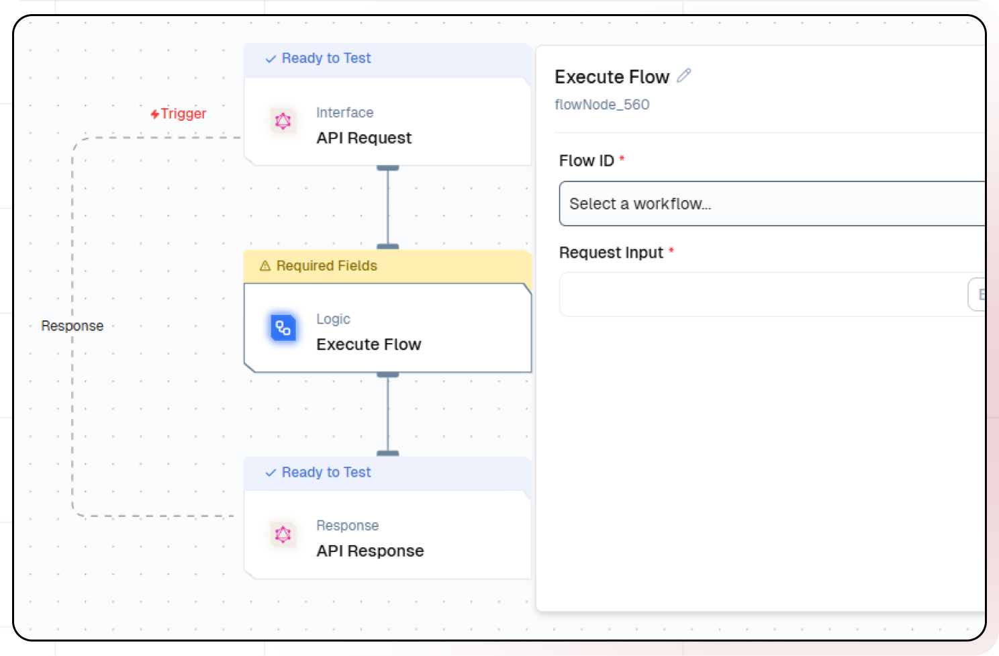

# Streamlining Workflow Design with Execute Flow

In this tutorial, you'll explore how to design modular and scalable workflows using the **Execute Flow** feature in Lamatic.ai. This feature empowers you to create interconnected, reusable workflows for enhanced efficiency and collaboration.

## What You'll Build
- Modular workflows with reusable components.
- Scalable solutions for complex processes.
- Efficient workflows for customer support, data pipelines, and compliance tasks.

## Getting Started

<Steps>

### 1. Account Creation and Initial Setup
1. Visit [Lamatic.ai](https://lamatic.ai/) and create an account or sign in.
1. Navigate to the **Dashboard** and click **"Create New Flow"**.
1. Explore the sections like **Flows**, **Data**, and **Models** to familiarize yourself with the workspace.

### 2. Creating Base Flows
1. Identify the core tasks or processes you want to modularize (e.g., data validation, ticket routing).
1. Create individual flows for these tasks:
   - For example, design a flow for **Greeting Users** in a chatbot.
1. Save these as reusable components.

### 3. Using Execute Flow in a Primary Workflow
1. Open or create your primary workflow.
1. Select **Execute Flow** node into your workflow canvas.
    
1. Configure the **Execute Flow** node:
   - Select the reusable flow you want to include.
   
   - Pass any required parameters to customize its execution.

### 4. Testing and Deployment
1. Test each reusable flow independently to ensure proper functionality.
2. Integrate the flows using **Execute Flow** and test the complete workflow.
3. Deploy the workflow:
   - Use the **Logs** section to monitor execution and resolve any issues.

</Steps>

## Practical Implementation Examples

#### Example 1: Customer Support Automation
- **Flows to Create**:
  1. Greeting Users
  2. Collecting Ticket Information
  3. Routing to Agents
- **Integration**:
  Use the **Execute Flow** node to call these flows in sequence, creating a seamless support experience.

#### Example 2: Data Processing Pipelines
- **Flows to Create**:
  1. Data Validation
  2. Data Transformation
  3. Reporting
- **Integration**:
  Combine these flows using the **Execute Flow** node for sequential or parallel execution.

#### Example 3: Compliance and Risk Management
- **Flows to Create**:
  1. Document Verification
  2. Risk Assessment
- **Integration**:
  Reuse these flows in multiple compliance-related workflows.

## Benefits of Execute Flow

### 1. Modularity and Reusability
- Break down complex workflows into reusable components.
- Eliminate redundancy by consolidating similar tasks.

### 2. Enhanced Workflow Scalability
- Build upon existing flows to adapt to growing operational needs.

### 3. Simplified Maintenance
- Centralize common processes for easier updates and consistency.

### 4. Improved Collaboration
- Share standardized components across teams for streamlined development.

## Conclusion
The **Execute Flow** feature in Lamatic.ai revolutionizes workflow design by promoting modularity, scalability, and efficiency. Whether you're automating customer interactions, managing data pipelines, or ensuring compliance, this feature simplifies complex processes and boosts productivity.

Start building smarter workflows today with Lamatic.ai!
