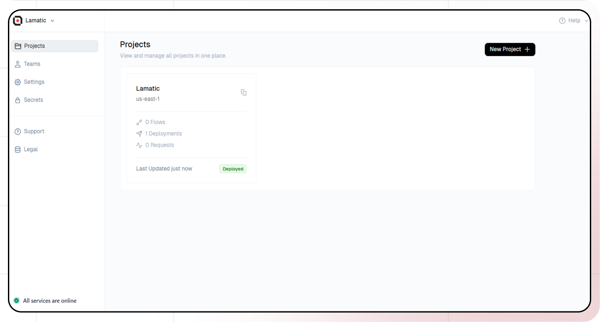
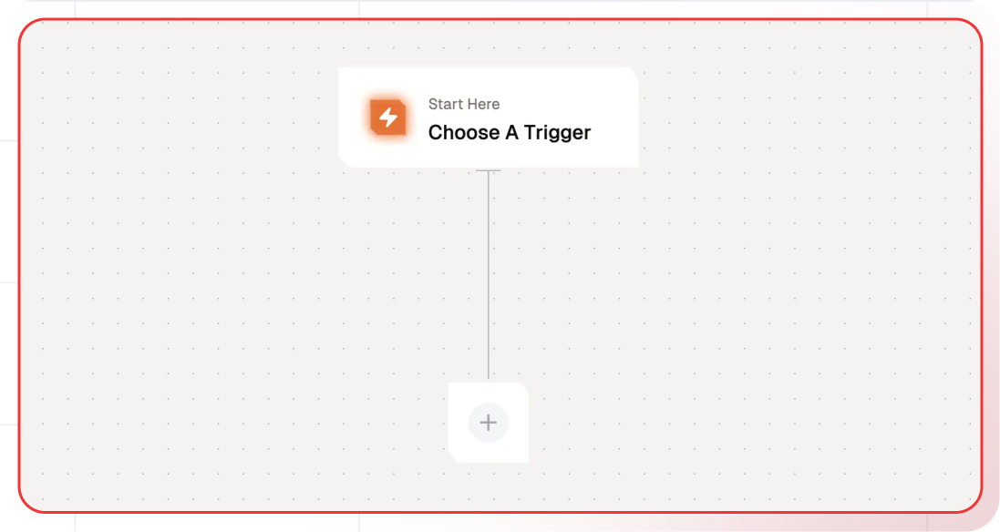
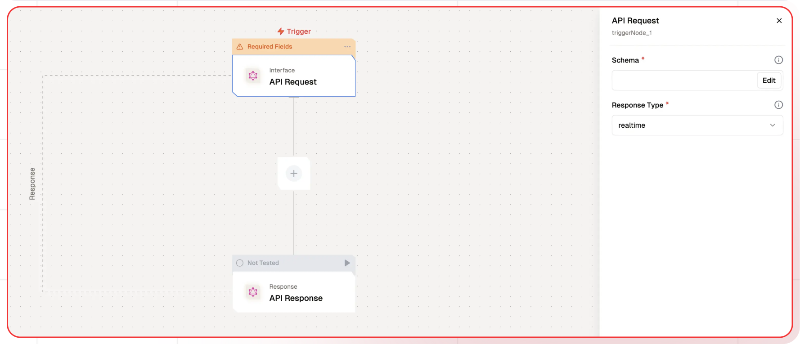
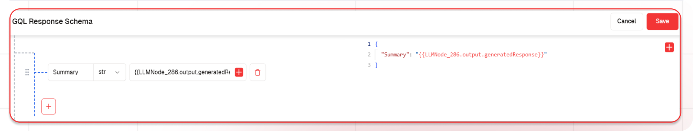
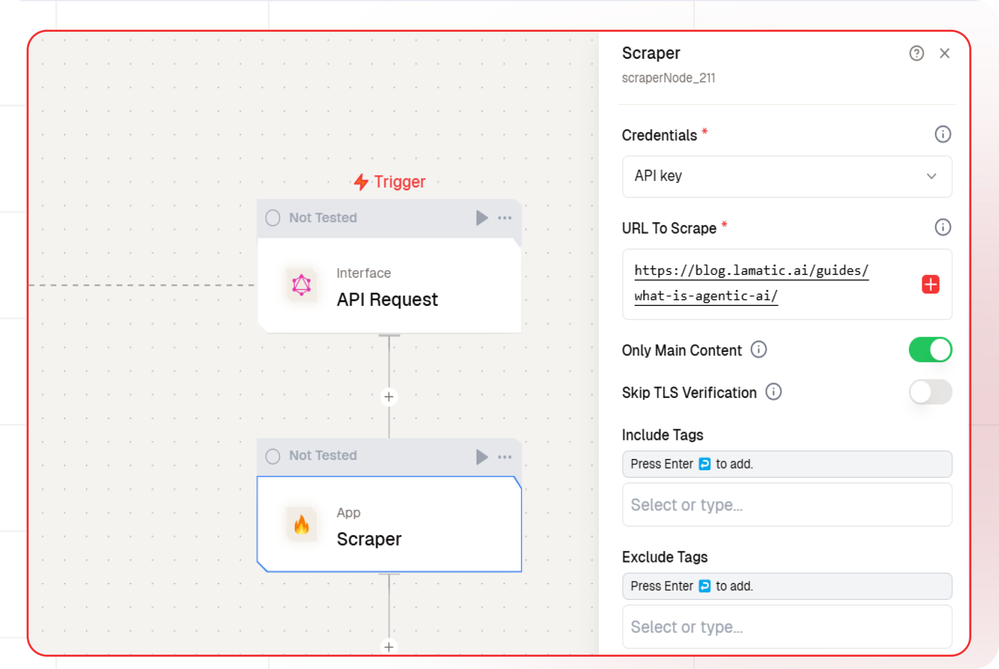
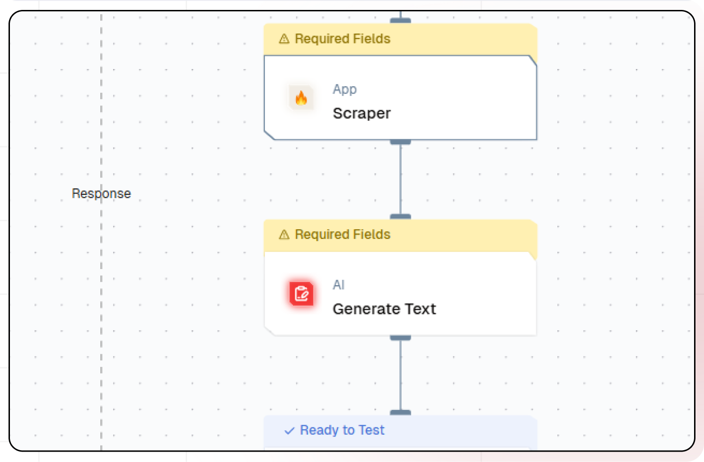
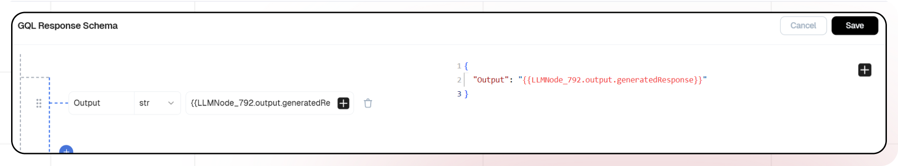
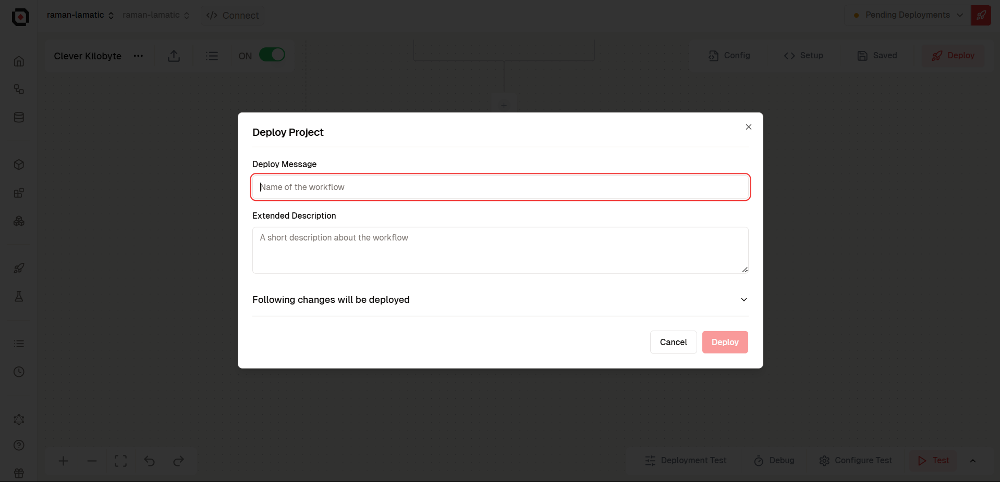

import { Accordion, AccordionItem } from "@nextui-org/react";
import SectionRows  from '@/components/SectionRows'
import { Callout } from 'nextra-theme-docs'
import {buttonVariants, Button} from '@/components/ui/button'

# Web Scraping and Q&A System With AI

<div className="grid md:grid-cols-1 gap-2 mb-8">
  <div className="">
    <SectionRows 
      section="Difficulty Level" 
      chips={["Beginner"]} 
    />
    
    <SectionRows 
      section="Nodes" 
      chips={[
         "Scraper",
         "Text LLM",
      ]} 
    />
    
    <SectionRows 
      section="Tags" 
      chips={[
        "Support"
      ]} 
    />
  </div>
</div>

<div className="mt-4 mb-4">
  <Callout>
  Try out this flow yourself at Lamatic.ai. Sign up for free and start building your own AI workflows.
  <Button variant="destructive" className="mt-3" href="https://studio.lamatic.ai/_?templateSlug=webpage-qa" size="sm" asChild>
    <a href="https://studio.lamatic.ai/_?templateSlug=webpage-qa" target="_blank">Add to Lamatic</a>
  </Button>
</Callout>
</div>

This guide will help you build an AI-powered system that scrapes data from a website, processes it with AI, and allows users to ask questions based on the extracted information

## What You'll Build

A simple API that scrapes data from a website, processes it with AI, and enables users to ask questions based on the extracted information. When users input a query, the system retrieves relevant data from the scraped content and generates accurate, AI-driven responses, ensuring efficient and insightful information retrieval.

## Getting Started

### 1. Project Setup

1. Sign up at [Lamatic.ai](https://lamatic.ai/) and log in.
1. Navigate to the Projects and click **New Project** or select your desired project.
1. You'll see different sections like Flows, Context, and Connections
   

### 2. Creating a New Flow

1. Navigate to Flows, select New Flow.
2. Click **Create from scratch** as starting point.
   

### 3. Setting Up Your API

1. Click "Choose a Trigger"
2. Select "API Request" under the interface options
   
3. Configure your API:
   - Add your Input Schema
   - Set url as parameter in input schema
   - Set response type to "Real-time"
     
   - Click on save

### 4. Scraping the data using Firecrawl

1. Click the Scraper node
   
2. Select the credentials
3. Add url as parameter

### 5. Adding AI Text Generation

1. Click the + icon to add a new node
2. Choose "Text LLM"
   
3. Configure the AI model:
   - Select your "Open AI" credentials
   - Choose "gpt-4o-mini" as your Model
4. Under prompts section click the + icon to add prompt
5. Set up your prompt:

   ```
   Using the markdown content from {{scraperNode_211.output.markdown}},
   answer the following question: {{triggerNode_1.output.question}}.

   ```

- You can add variables using the "Add Variable" button


### 6. Configuring the reponse

1. Click the API response node
   
2. Add Output Variables by clicking the + icon
3. Select variable from your Text LLM Node

### 7. Test the flow

1. Click on 'API Request' trigger node
2. Click on Configure test
3. Fill sample value in 'url' and click on test

### 8. Deployment

1. Click the Deploy button
   
2. Your API is now ready to be integrated into Node.js or Python applications
3. Your flow will run on Lamatic's global edge network for fast, scalable performance

### 9. What's Next?

- Experiment with different prompts
- Try other AI models
- Add more processing steps to your flow
- Integrate the API into your applications

### 10. Tips

- Save your tests for reuse across different scenarios
- Use consistent JSON structures for better maintainability
- Test thoroughly before deployment

Now you have a working AI-powered API! You can expand on this foundation to build more complex applications using Lamatic.ai's features.
