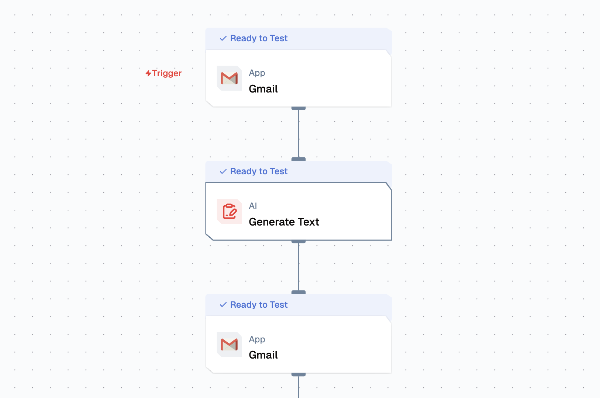

import { IntegrationOverviw } from "@/components/IntegrationOverviw"
import { NodeTypeInfo } from "@/components/NodeTypeInfo"

# Gmail Integration

<IntegrationOverviw slug="gmail" type="apps-data-sources" />

## Overview

The Gmail integration lets a flow operate on a Gmail mailbox: send new emails, save drafts, fetch messages and threads, manage labels, and reply within existing conversations. Authentication is handled by Lamatic via Google OAuth, so credentials never live in the flow itself.



## Features

### Key Functionalities

- **Send Email**: Compose and send a new email to one or more recipients.
- **Create Email Draft**: Save a draft in Gmail without sending.
- **Fetch Emails**: Retrieve emails matching a Gmail search query.
- **List Labels**: Return every label on the mailbox (system and custom).
- **Fetch Message by Thread ID**: Pull the full message contents of a specific thread.
- **Modify Thread Labels**: Add or remove labels on an existing thread.
- **List Threads**: Retrieve threads matching a Gmail search query.
- **Reply to Thread**: Send a reply inside an existing email thread.

### Benefits

- **OAuth-backed**: Credentials are stored once in Lamatic; flows reference the connection instead of holding passwords.
- **Full mailbox surface**: Read, write, draft, reply, and label operations are available from a single node.
- **Thread-aware**: Reply and label actions operate on Gmail threads, preserving conversation context.
- **Search-powered fetch**: Fetch and List actions accept standard Gmail search queries (`from:`, `to:`, `is:unread`, etc.).

## Prerequisites

Before setting up the Gmail integration, make sure you have:

- **A Google account** with Gmail enabled.
- **Permission to grant access** to the mailbox you want Lamatic to operate on.
- **Standard Gmail send/read quotas** that fit your expected flow volume.

## Setup

### Step 1: Connect your Gmail account

1. Go to **Connections** in your Lamatic project.
2. Add a new **Gmail** credential.
3. Lamatic redirects you to Google's OAuth consent screen. Grant the requested scopes.
4. After consent, you return to Lamatic and the credential is ready to use.

### Step 2: Add the Gmail node to your flow

1. Open the flow you want to add Gmail to.
2. Add the **Gmail** node.
3. Select the credential you connected in Step 1.
4. Pick the action you need from the **Action** dropdown.
5. Fill in the parameters for that action.

### Step 3: Testing

Use the flow's Test panel to run the node against your connected mailbox. For destructive actions (Send Email, Modify Thread Labels), use a test recipient or label first to confirm behaviour before deploying.

## Low-Code Example

A `GMAIL_SEND_EMAIL` configuration. Swap the `action` value and the relevant fields to use a different operation.

```yaml
nodes:
  - nodeId: gmailNode_1
    nodeType: gmailNode
    nodeName: Gmail
    values:
      credentials: support-gmail
      action: GMAIL_SEND_EMAIL
      recipient_email: '{{triggerNode_1.output.email}}'
      cc: ''
      bcc: ''
      subject: 'Welcome to Lamatic'
      body: 'Hi {{triggerNode_1.output.name}}, thanks for signing up.'
      is_html: false
      attachment_url: ''
      attachment_name: ''
      attachment_mimetype: ''
      max_results: 10
      from_user: ''
      to_user: ''
      query: ''
      fetch_emails_page_token: ''
      message_id: ''
      format: full
      thread_id: ''
      page_token: ''
      add_label_ids: ''
      remove_label_ids: ''
      list_threads_user_id: me
      list_threads_max_results: 10
      list_threads_page_token: ''
      list_threads_query: ''
      reply_thread_id: ''
      reply_recipient_email: ''
      reply_cc: ''
      reply_bcc: ''
      reply_extra_recipients: ''
      reply_message_body: ''
      reply_is_html: false
      reply_attachment_url: ''
      reply_attachment_name: ''
      reply_attachment_mimetype: ''
    needs:
      - triggerNode_1
```

## Tutorials

Flows that use the Gmail node end-to-end:

- [Gmail AI Summarizer](/guides/tutorials/gmail-ai-summarizer)

## Troubleshooting

### Common Issues

| **Problem**                          | **Solution**                                                                            |
| ------------------------------------ | --------------------------------------------------------------------------------------- |
| **Authentication / OAuth error**     | Reconnect the credential from **Connections** and re-authorize the requested scopes.    |
| **Thread ID not found**              | Ensure the thread exists in the connected account and the ID is fully qualified.        |
| **Email not delivered**              | Check Gmail's Sent folder. If absent, verify recipient address and sending quotas.      |
| **Fetch returns nothing**            | Loosen the query and confirm the label IDs match what `List Labels` returns.            |
| **HTML body renders as text**        | Enable the `Is HTML` toggle on the node.                                                |
| **Label modification rejected**      | Use the label ID (e.g. `Label_1234`), not the display name, when adding or removing.    |
| **Rate limit / quota exceeded**      | Reduce send volume or spread the workload over time.                                    |

### Debugging

- Use a test thread or label before running destructive actions on production data.
- Run `List Labels` first to confirm credential connectivity and to capture label IDs.
- Check the node's logs in the flow's Logs panel for the request and response payloads.
- For Send Email failures, send a test to an address you control to confirm end-to-end delivery.
- For OAuth scope errors, disconnect and reconnect the Gmail credential.
