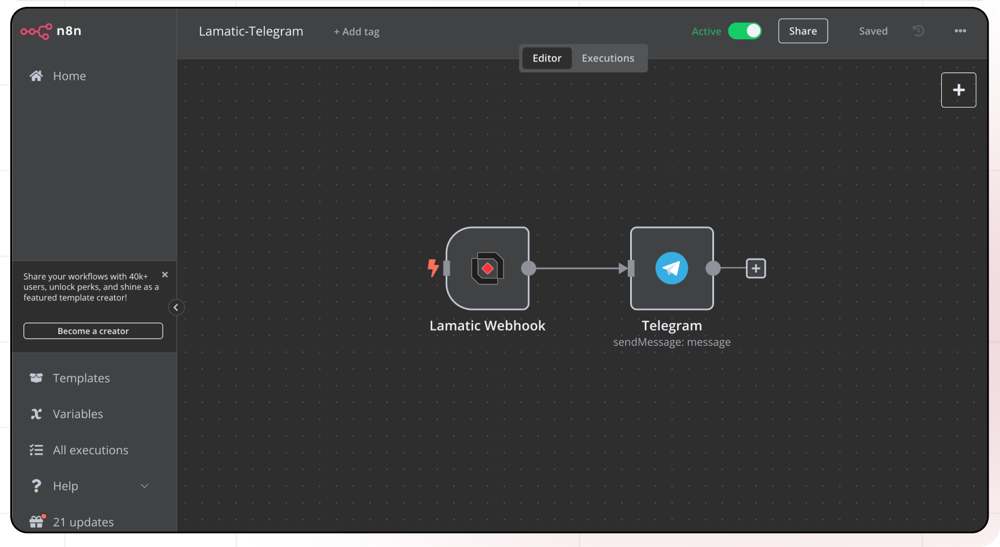
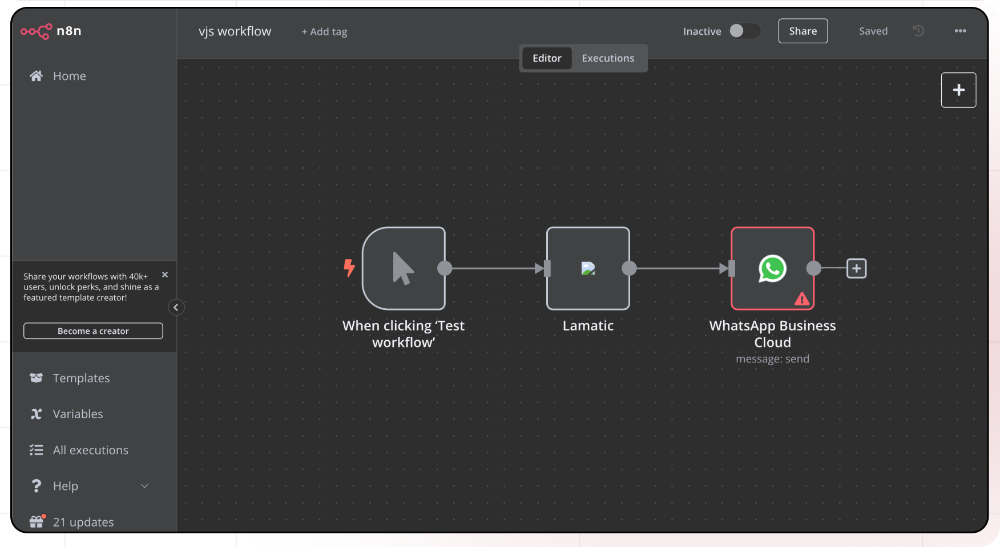

import { IntegrationOverviw } from "@/components/IntegrationOverviw"

# N8N Integration

<IntegrationOverviw slug="n8n" type="apps-data-sources" />

## Overview

The N8N integration in Lamatic.ai enables bidirectional integration between Lamatic and N8N platforms. This integration supports both triggering N8N flows from Lamatic and executing Lamatic flows from N8N, providing flexible automation capabilities for complex workflows.

<Callout type="info">
This integration combines N8N's powerful workflow automation with Lamatic's Gen AI capabilities, enabling sophisticated cross-platform automation scenarios.
</Callout>

## Features

### ✅ Key Functionalities

- **Bidirectional Integration**: Supports both N8N to Lamatic and Lamatic to N8N flow execution
- **Easy Configuration**: Simple dropdown-based workflow selection and credential management
- **Webhook Support**: Built-in webhook handling for seamless real-time communication
- **Flexible Triggers**: Multiple trigger options for different automation scenarios
- **Real-time Execution**: Instant flow execution with webhook-based communication

### ✅ Benefits

- Combines N8N's workflow automation with Lamatic's Gen AI capabilities
- Maintains existing N8N flows while adding AI functionality
- Enables highly configurable cross-platform automation
- Provides seamless integration between two powerful automation platforms
- Supports complex workflow orchestration across multiple systems

## Prerequisites

Before setting up the N8N integration, ensure you have:

- **N8N Setup**: Choose your preferred deployment option:
  - **N8N Cloud**: Hosted version with associated pricing plans
  - **Community Edition**: Self-hosted installation on your own server
- **N8N Lamatic Module**: Community node installed in your N8N instance
- **API Access**: Valid N8N API key for authentication
- **Network Access**: Proper network connectivity between Lamatic and N8N instances
- **Webhook Configuration**: Understanding of webhook setup and management

<Callout type="warning">  
If the connection fails, whitelist the following IPs: [https://www.cloudflare.com/ips/](https://www.cloudflare.com/ips/)
</Callout>

## Setup

### Step 1: Set Up N8N

1. **Choose Deployment Option**:
   - **Cloud**: Sign up at [n8n.cloud](https://n8n.cloud)
   - **Self-hosted**: Follow [installation guide](https://docs.n8n.io/hosting/)

2. **Install Lamatic Module**:
   - Navigate to **Settings > Community Nodes** in N8N interface
   - Click **Install** and enter `n8n-nodes-lamatic-ai`
   - Restart N8N to activate the module

<Callout type="warning">
Ensure you have proper permissions to install community nodes in your N8N instance.
</Callout>

### Step 2: Configure N8N API Access

1. **Generate API Key**:
   - Go to **Settings > API** in N8N interface
   - Copy the generated API key securely
   - Note your N8N host URL

2. **Test Connection**:
   - Verify API key works with N8N instance
   - Ensure proper network connectivity

### Step 3: Set Up Lamatic Integration

1. **Add N8N Node**: Drag the N8N node to your Lamatic flow
2. **Configure Credentials**: Add new credentials with N8N host URL and API key
3. **Select Integration Type**: Choose between N8N to Lamatic or Lamatic to N8N

## Configuration Reference

### Credential Configuration

| **Parameter**       | **Description**                                     | **Required** | **Example**           |
| ------------------- | --------------------------------------------------- | ------------ | --------------------- |
| **Credential Name** | Identifier for the credential set                   | ✅           | `my-n8n-creds`        |
| **Host URL**        | N8N instance URL (with protocol)                    | ✅           | `https://n8n.example.com` |
| **API Key**         | N8N authentication key                              | ✅           | `your-api-key`        |

### Trigger Node Configuration (N8N > Lamatic)

| **Parameter**       | **Description**                                     | **Required** | **Example**           |
| ------------------- | --------------------------------------------------- | ------------ | --------------------- |
| **Credentials**     | Selected N8N credentials                            | ✅           | `my-n8n-creds`        |
| **Workflow ID**     | N8N workflow identifier                             | ✅           | `workflow-123`        |
| **Advanced Schema** | Custom input schema for workflow data               | ❌           | `{}`                  |

### Action Node Configuration (Lamatic > N8N)

| **Parameter**       | **Description**                                     | **Required** | **Example**           |
| ------------------- | --------------------------------------------------- | ------------ | --------------------- |
| **Credentials**     | Selected N8N credentials                            | ✅           | `my-n8n-creds`        |
| **Workflow ID**     | N8N workflow identifier                             | ✅           | `workflow-123`        |
| **Webhook Path**    | Auto-generated webhook path (non-configurable)      | ✅           | `auto-generated-path` |

## Integration Scenarios

### Scenario 1: Trigger Lamatic from N8N



**Setup Process**:
1. **N8N Side**:
   - Create new workflow in N8N
   - Add Lamatic node to workflow
   - Configure with Lamatic project URL and API key
   - Define workflow input in JSON format
   - Specify Lamatic workflow ID

2. **Lamatic Side**:
   - Use N8N as trigger node
   - Define input schema for incoming data
   - Configure credentials with N8N host URL and API key

### Scenario 2: Trigger N8N from Lamatic



**Setup Process**:
1. **N8N Side**:
   - Create new workflow in N8N
   - Add webhook trigger node
   - Define webhook path for Lamatic communication
   - Configure workflow to handle incoming data

2. **Lamatic Side**:
   - Use API node as trigger
   - Add N8N node to flow
   - Select webhook created in N8N
   - Configure workflow execution parameters

## Low-Code Examples

### Trigger Lamatic from N8N

```yaml
nodes:
  - nodeId: triggerNode_1
    nodeType: n8nTriggerNode
    nodeName: N8N Trigger
    values:
      advance_schema: '{}'
      credentials: your credential name
      workflowId: your n8n workflow id which is linked to this node
```

### Trigger N8N from Lamatic

```yaml
nodes:
  - nodeId: n8nNode_716
    nodeType: n8nNode
    nodeName: N8N
    values:
      credentials: your credential name
      workflowId: your n8n workflow id which is linked to this node
      webhookPath: Auto Fetched Non Configurable Webhook Path
    needs:
      - triggerNode_1
```

## Output Schema

### N8N to Lamatic Trigger Output

When N8N triggers a Lamatic flow, the output contains:

```json
{
  "success": true,
  "workflowId": "workflow-123",
  "data": {
    "input": "Data from N8N workflow",
    "metadata": {
      "source": "n8n",
      "timestamp": "2024-01-01T00:00:00Z"
    }
  }
}
```

## Troubleshooting

### Common Issues

| **Problem**                | **Solution**                                                                                |
|---------------------------|--------------------------------------------------------------------------------------------|
| **Connection Failure**     | Verify N8N Host URL and API credentials are correct                                        |
| **Webhook Issues**         | Check if webhooks are properly configured and accessible                                   |
| **Workflow Not Found**     | Ensure workflow IDs are correct and workflows are active                                   |
| **Response Timeout**       | Verify network connectivity and increase timeout settings if needed                        |
| **Authentication Errors**  | Confirm API key permissions and validity                                                   |
| **Module Not Found**       | Ensure N8N Lamatic module is properly installed and N8N is restarted                      |
| **Schema Mismatch**        | Verify input/output schemas match between N8N and Lamatic workflows                        |

### Debugging Tips

- Check Lamatic Flow logs for detailed error messages
- Verify N8N workflow status and trigger configurations
- Test webhook endpoints for accessibility and proper response
- Confirm credential permissions and API access rights
- Monitor network connectivity between Lamatic and N8N instances
- Review N8N execution logs for workflow-specific issues
- Test with simple workflows before implementing complex integrations
- [N8N Documentation](https://docs.n8n.io/)
- [N8N Community Nodes](https://n8n.io/integrations)
- If the connection fails, whitelist the following IPs: [https://www.cloudflare.com/ips/](https://www.cloudflare.com/ips/)