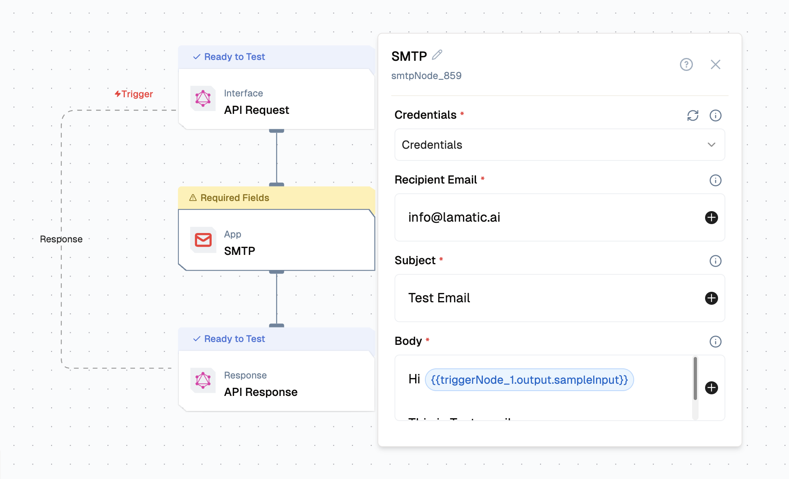

import { IntegrationOverviw } from "@/components/IntegrationOverviw"
import { NodeTypeInfo } from "@/components/NodeTypeInfo"

# SMTP Integration

<IntegrationOverviw slug="smtp" type="apps-data-sources" />

## Overview

The SMTP integration lets a flow send email through any SMTP server. Once you connect a credential (host, port, username, password), the SMTP node sends plain-text or HTML messages with optional CC and BCC recipients. Use it for transactional notifications, alerts triggered by flow logic, summary reports, or any workflow that ends with an email being delivered.



## Features

### Key Functionalities

- **Action: Send Email**: Sends an email to one recipient with optional CC and BCC lists.
- **Plain text or HTML body**: Toggle the `Is HTML` switch to send rich-formatted email instead of plain text.
- **Templated fields**: Recipient, subject, and body all support variables from previous nodes (e.g. `{{triggerNode_1.output.email}}`).
- **Works with any SMTP provider**: Gmail, Outlook 365, Amazon SES, SendGrid, Mailgun, your own mail server, anything that speaks SMTP.

### Benefits

- **Provider-agnostic**: Swap providers by changing the credential, not the flow.
- **Standard authentication**: Standard SMTP auth with TLS/SSL support; no per-vendor SDK lock-in.
- **Multi-recipient delivery**: CC and BCC accept multiple values without extra nodes.
- **Dynamic content**: Compose subject and body from upstream node outputs to personalize each email.

## Prerequisites

Before setting up the SMTP integration, make sure you have:

- **An SMTP server**: A reachable SMTP host you control or have credentials for.
- **Authentication credentials**: A username and password (or app password) the server accepts.
- **Port and encryption settings**: Usually port `587` with STARTTLS, or `465` with SSL. Check your provider's docs.
- **A verified sender address** if your provider requires it (e.g. Amazon SES sandbox, Gmail with app passwords).

## Setup

### Step 1: Gather your SMTP details

From your email provider, collect:

1. **SMTP host** (e.g. `smtp.gmail.com`, `email-smtp.us-east-1.amazonaws.com`)
2. **Port** (commonly `587` for TLS, `465` for SSL, `25` for unencrypted)
3. **Username** (often your email address)
4. **Password** (or an app-specific password if your provider requires it for SMTP)

### Step 2: Add the SMTP credential in Lamatic

1. Go to **Connections** in your Lamatic project.
2. Add a new **SMTP** credential.
3. Fill in the host, port, username, password, and from address you collected above.
4. Save the credential.

### Step 3: Add the SMTP node to your flow

1. Open the flow you want to send email from.
2. Add the **SMTP** node downstream of the data source that supplies the email content.
3. Select the credential you created in Step 2.
4. Fill in the recipient, subject, and body fields, referencing upstream variables where needed.

### Step 4: Testing

Use the flow's Test panel to send a real email to a recipient you control. Confirm the message arrives and that any templated variables resolved correctly. After deployment, the same configuration runs against the live trigger payload.

## Configuration Reference

### Credential Configuration

| **Parameter**       | **Description**                                                            | **Required** | **Example**                              |
| ------------------- | -------------------------------------------------------------------------- | ------------ | ---------------------------------------- |
| **Credential Name** | Display name for this SMTP credential                                      | Yes          | `gmail-smtp`                             |
| **Sender Email**    | Email address shown as the sender on outgoing messages                     | Yes          | `sender@example.com`                     |
| **Sender Name**     | Display name shown alongside the sender address                            | Yes          | `John Smith`                             |
| **SMTP Host**       | SMTP server hostname                                                       | Yes          | `smtp.gmail.com`                         |
| **SMTP Port**       | SMTP server port                                                           | Yes          | `587`                                    |
| **Username**        | Username for SMTP authentication                                           | Yes          | `username@example.com`                   |
| **Password**        | Password or app-specific password                                          | Yes          | `xxxxxxxxxxxxxxxx`                       |

### Send Email Action

| **Parameter**        | **Description**                                                  | **Required** | **Example**                                              |
| -------------------- | ---------------------------------------------------------------- | ------------ | -------------------------------------------------------- |
| **Credentials**      | SMTP credential to use for sending                               | Yes          | `gmail-smtp`                                             |
| **Recipient Email**  | Address to send the email to (the `To` header)                   | Yes          | `{{triggerNode_1.output.email}}`                         |
| **Subject**          | Email subject line                                               | Yes          | `Your report is ready`                                   |
| **Body**             | Email body (plain text or HTML depending on the toggle)          | Yes          | `Hi {{triggerNode_1.output.name}}, your report is ready.`|
| **CC**               | Additional recipients copied on the email                        | No           | `manager@example.com`                                    |
| **BCC**              | Additional blind-copy recipients                                 | No           | `audit@example.com`                                      |
| **Is HTML**          | Render the body as HTML instead of plain text                    | No           | `true`                                                   |

### Low-Code Example

```yaml
nodes:
  - nodeId: smtpNode_1
    nodeType: smtpNode
    nodeName: SMTP
    values:
      credentials: gmail-smtp
      to: '{{triggerNode_1.output.email}}'
      subject: 'Your report is ready'
      body: 'Hi {{triggerNode_1.output.name}}, your report is ready.'
      cc:
        - manager@example.com
      bcc: []
      isHtml: false
    modes: {}
    needs:
      - triggerNode_1
```

## Troubleshooting

### Common Issues

| **Problem**                    | **Solution**                                                                                |
| ------------------------------ | ------------------------------------------------------------------------------------------- |
| **Authentication failed**      | Verify username and password. For Gmail/Outlook, generate an app-specific password.         |
| **Connection timed out**       | Check host and port. Confirm outbound traffic on that port is allowed.                      |
| **TLS / SSL handshake error**  | Switch the SMTP port between `587` (STARTTLS) and `465` (SSL), or try `25` if your provider supports unencrypted SMTP. |
| **Sender address not allowed** | Confirm the `From` address is verified with your provider (especially SES, SendGrid).       |
| **Recipient rejected**         | Validate the recipient address format and check the provider's deliverability rules.        |
| **HTML body renders as text**  | Enable the `Is HTML` toggle on the node.                                                    |
| **Variables not resolving**    | Confirm the upstream node ID and field name are correct in your `{{...}}` reference.        |

### Debugging

- Send a test email to an address you own to confirm end-to-end delivery.
- Check spam or junk folders if a test message does not arrive.
- Inspect the flow logs for the SMTP node's request and response payloads.
- Verify the SMTP credential by sending a test from a standalone client with the same host, port, and password.
- For providers with sending limits (e.g. SES sandbox), confirm the recipient is verified.
