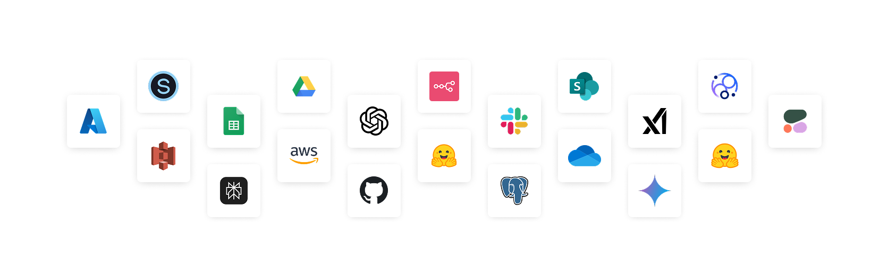

# Integrations

Lamatic offers a powerful integration layer that makes it easy to build, embed, and manage GenAI-powered flows.
You can connect various apps, data sources and other nodes inside flows to achieve your desired flow.

## Available Functions

Each apps functionality is broken down into 3 different functions. These various ways you can connect those apps and perform a desired action.

| **Function**     | **Description**                                                                                                                                         | **Example**                                                                                   |
|------------------|---------------------------------------------------------------------------------------------------------------------------------------------------------|-----------------------------------------------------------------------------------------------|
| **Sync Trigger** | Fetch data from the app at regular intervals or based on events. Each record is processed individually by the flow.                                    | Fetch new records from a Google Sheet every five minutes and run a flow on each record.       |
| **Event Trigger**| Trigger a flow based on a specific event occurring within the app.                                                                                      | Trigger a flow when a new record is added to a Google Sheet.                                 |
| **Action**       | Perform an action within the app.                                                                                                                       | Add a new record to a Google Sheet.                                                           |

## Adding a new integrations

1. Drag an integration node into your flow.  
2. Click **Add new Credentials**.  
3. Follow the setup instructions.  
4. Select the newly added credentials in your node.

