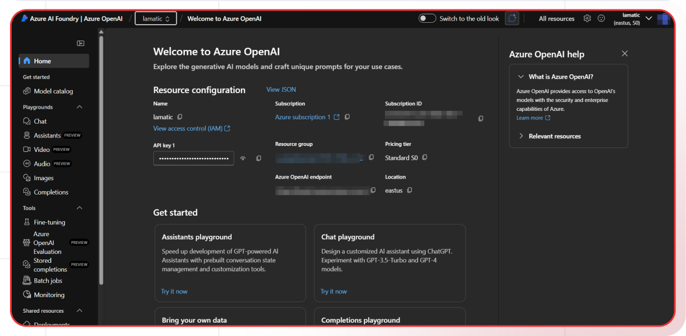
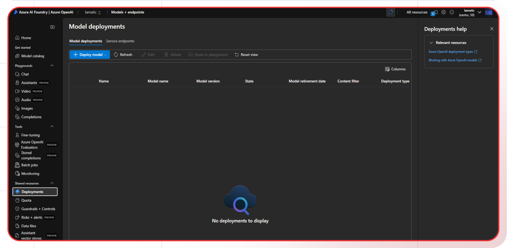
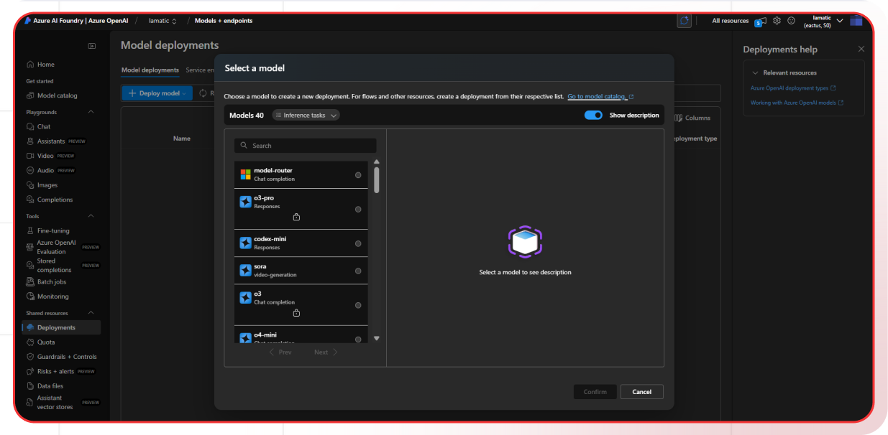
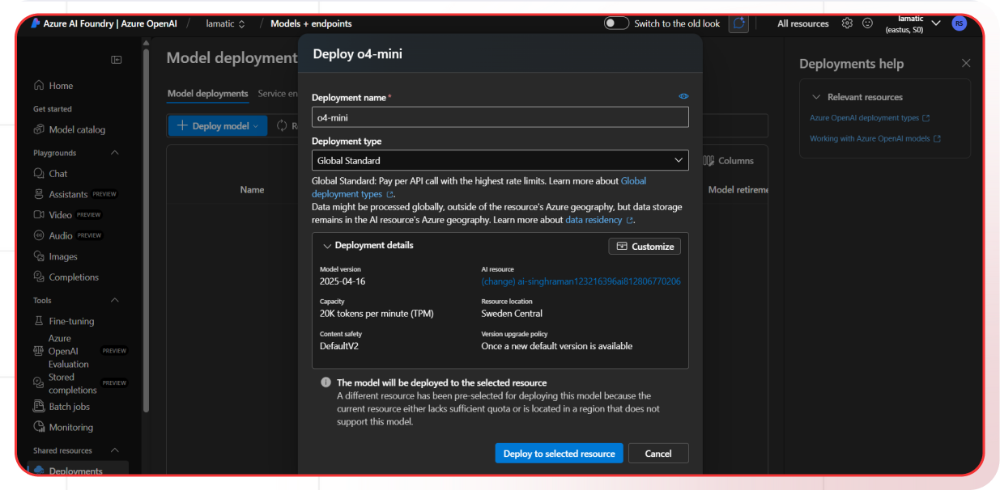

[Azure OpenAI Studio]: https://oai.azure.com/
[Azure Portal]: https://portal.azure.com/?microsoft%5Fazure%5Fmarketplace%5FItemHideKey=microsoft%5Fopenai%5Ftip#create/Microsoft.CognitiveServicesOpenAI
[Azure OpenAI Access Form]: https://learn.microsoft.com/en-gb/legal/cognitive-services/openai/limited-access
[Azure OpenAI Guide]: https://learn.microsoft.com/en-us/azure/ai-services/openai/how-to/create-resource?pivots=web-portal
[Azure OpenAI Pricing]: https://azure.microsoft.com/en-us/pricing/details/cognitive-services/openai-service/
[Azure OpenAI Models]: https://learn.microsoft.com/en-us/azure/ai-services/openai/concepts/models

[Lamatic.ai Studio]: https://studio.lamatic.ai
[Lamatic support]: https://lamatic.ai/docs/slack

import { IntegrationOverviw } from "@/components/IntegrationOverviw"

# Azure OpenAI
<IntegrationOverviw slug="azure-openai" type="models" />

Azure OpenAI Service provides REST API access to OpenAI's powerful language models including GPT-4, GPT-3.5-turbo, DALL-E, and Whisper. These models can be easily adapted to your specific task with enterprise-grade security, compliance, and regional availability. With Lamatic, you can seamlessly integrate with Azure OpenAI models and take advantage of features like observability, prompt management, fallbacks, and more.

<Callout type="info">Provider Slug: `azure-openai`</Callout>

## Setup


### Step 1: Request Access to Azure OpenAI
Azure OpenAI requires approval for access. Fill out the [Azure OpenAI Access Form][Azure OpenAI Access Form] to request access to the service.

### Step 2: Create Azure OpenAI Resource
1. Go to the [Azure Portal][Azure Portal]
2. Click **"Create a resource"**
3. Search for **"Azure OpenAI"**
4. Click **"Create"**
5. Fill in the required information:
   - **Subscription**: Select your Azure subscription
   - **Resource Group**: Create new or select existing
   - **Region**: Choose a supported region
   - **Name**: Enter a unique name for your resource
   - **Pricing Tier**: Select Standard S0
6. Click **"Review + Create"** then **"Create"**

### Step 3: Deploy a Model
1. Navigate to [Azure OpenAI Studio][Azure OpenAI Studio]
2. Select your resource

3. Go to **"Deployments"** in the left menu

4. Click **"Deploy model"**
5. Select a model from the available models (e.g., GPT-4, GPT-3.5-turbo)

6. Input **"Deployment name"** select **"Deployment type"**
7. Review Deployment details

8. Click **"Deploy to selected resource"**


### Step 4: Get API Credentials
1. In Azure OpenAI Studio, go to **"Chat"** playground
2. Click **"View Code"** 
3. Copy the **API Key** and **Endpoint**

Alternatively, in the Azure Portal:
1. Navigate to your Azure OpenAI resource
2. Go to **"Keys and Endpoint"** in the left menu
3. Copy **Key 1** or **Key 2** and the **Endpoint**

### Step 5: Configure in Lamatic
1. Open your [Lamatic.ai Studio]
2. Navigate to **Models** section
3. Select **Azure OpenAI** from the provider list
4. Provide the following credentials:
   - Azure API Key
   - Azure Endpoint
   - Deployment Name
   - Azure API Version
5. Save your changes

## Key Features

- **Enterprise Security**: Data residency, private networking, and compliance certifications
- **Scalability**: Managed infrastructure with guaranteed availability and performance
- **Content Filtering**: Built-in responsible AI content filtering and safety features
- **Regional Availability**: Deploy models in your preferred Azure regions
- **Cost Effective**: Pay-per-use pricing with enterprise discounts
- **Developer Friendly**: Comprehensive API and documentation
- **Compliance Ready**: Meets enterprise compliance and security requirements
- **Model Variety**: Access to GPT-4, GPT-3.5-turbo, DALL-E, and Whisper models

## Available Models

Azure OpenAI provides access to the same models as OpenAI with enterprise benefits:

- **GPT-4 Models**: Advanced language models for complex reasoning and creative tasks
- **GPT-3.5-turbo**: Fast and efficient model for most applications
- **DALL-E Models**: Image generation models for creating images from text
- **Whisper Models**: Speech recognition and transcription models
- **Embedding Models**: Text embedding models for semantic search and RAG

Check the [Azure OpenAI Models][Azure OpenAI Models] documentation for region-specific availability and model specifications.

## Configuration Options

- **Azure API Key**: Your Azure OpenAI API key for authentication
- **Azure Endpoint**: The full endpoint URL for your Azure OpenAI resource
- **Deployment Name**: The name you assigned when deploying the model
- **Azure API Version**: The API version to use (e.g., 2024-06-01)
- **Model Selection**: Choose from available Azure OpenAI models
- **Custom Parameters**: Configure temperature, max_tokens, and other generation parameters
- **Content Filtering**: Configure safety and content filtering settings

## Required Information

### Azure API Key
Found in the **"Keys and Endpoint"** section of your Azure OpenAI resource.

### Azure Endpoint
The full endpoint URL for your Azure OpenAI resource:
```
https://[YourResourceName].openai.azure.com/
```

### Deployment Name
The name you assigned when deploying the model (e.g., "gpt-4-chat", "gpt-35-turbo").

### Azure API Version
The API version to use. Common versions:
- `2024-06-01`
- `2024-02-15-preview`
- `2023-12-01-preview`

## Example Configuration
```bash
Azure API Key: your-azure-openai-api-key-here
Azure Endpoint: https://my-openai-resource.openai.azure.com/
Deployment Name: gpt-4-chat
Azure API Version: 2024-06-01
```

## Best Practices

- **API Key Security**: Keep your Azure API keys secure and never share them publicly
- **Access Management**: Use Azure managed identities for enhanced security
- **Rate Limiting**: Be aware of Azure OpenAI's rate limits and implement appropriate throttling
- **Model Selection**: Choose the appropriate model based on your use case and region availability
- **Error Handling**: Implement proper error handling for API failures and rate limits
- **Cost Optimization**: Monitor your usage and optimize prompts to reduce costs
- **Content Safety**: Configure appropriate content filtering for your use case
- **Regional Deployment**: Choose regions closest to your users for better performance

## Troubleshooting

**Access Denied:**
- Verify your Azure OpenAI access has been approved
- Check if your API key is correct and hasn't expired
- Ensure your Azure subscription is active and has sufficient credits

**Model Not Available:**
- Check if the model is available in your selected region
- Verify your deployment was created successfully
- Contact Azure support for model availability issues

**Rate Limit Exceeded:**
- Implement exponential backoff in your requests
- Consider upgrading your Azure plan for higher limits
- Monitor your usage in the Azure portal

**Authentication Errors:**
- Ensure your API key is properly formatted
- Check if your Azure account is active and verified
- Verify you're using the correct endpoint URL

**Deployment Issues:**
- Verify your deployment name is correct
- Check if the deployment is in "Succeeded" state
- Ensure proper permissions for the deployment

## Important Notes

- Keep your API keys secure and never share them publicly
- Azure OpenAI requires access approval - apply early
- Different regions have different model availability
- Monitor your usage to avoid unexpected charges
- Content filtering is enabled by default but can be customized
- Test your integration after adding each key
- Consider using managed identities for enhanced security
- Review [Azure OpenAI pricing][Azure OpenAI Pricing] before deployment
- Model availability varies by region - check the [Azure OpenAI models documentation][Azure OpenAI Models]

## Additional Resources

- [Azure OpenAI Documentation][Azure OpenAI Guide]
- [Model Documentation][Azure OpenAI Models]
- [Pricing Information][Azure OpenAI Pricing]
- [Azure Support](https://azure.microsoft.com/en-us/support/)

Need help? Contact [Lamatic support]