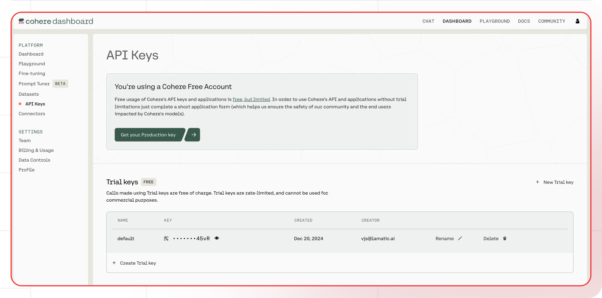

[Cohere Dashboard]: https://dashboard.cohere.com/
[Cohere API Docs]: https://docs.cohere.com/
[Cohere Models]: https://docs.cohere.com/docs/models

[Lamatic.ai Studio]: https://studio.lamatic.ai
[Lamatic support]: https://lamatic.ai/docs/slack

import { IntegrationOverviw } from "@/components/IntegrationOverviw"

# Cohere
<IntegrationOverviw slug="cohere" type="models" />

Cohere is an artificial intelligence company that specializes in natural language processing (NLP) and large language models (LLMs). Their primary focus is providing developers and businesses with tools to build AI-powered applications through their API platform.

<Callout type="info">Provider Slug: `cohere`</Callout>

## Setup

### Step 1: Create Cohere Account
1. Visit the [Cohere Dashboard][Cohere Dashboard]
2. Sign up for a new account or log in to your existing account
3. Complete the account verification process

### Step 2: Generate API Key
1. Navigate to the **API Keys** section in your Cohere dashboard
    
2. Click **Generate New Key**
3. Give your API key a descriptive name
4. Copy the generated API key (you won't be able to see it again)

### Step 3: Configure in Lamatic
1. Open your [Lamatic.ai Studio]
2. Navigate to **Models** section
3. Select **Cohere** from the provider list
4. Paste your API key in the designated field
5. Save your changes

## Key Features

- **Advanced Language Models**: Access to state-of-the-art language models like Command, Command-R, and Command-R+
- **Multilingual Support**: Models trained on multiple languages for global applications
- **RAG Optimization**: Specialized models for retrieval-augmented generation
- **Enterprise Ready**: Production-grade API with high reliability and performance
- **Cost Effective**: Competitive pricing with flexible usage plans

## Available Models

Cohere offers several model families:

- **Command Models**: General-purpose models for text generation and completion
- **Command-R Models**: Enhanced reasoning and instruction-following capabilities
- **Embed Models**: High-quality text embeddings for semantic search and RAG
- **Rerank Models**: Specialized models for document ranking and retrieval

Check the [Cohere Models][Cohere Models] documentation for the latest model offerings and specifications.

## Configuration Options

- **API Key**: Your Cohere API key for authentication
- **Model Selection**: Choose from available Cohere models
- **Custom Parameters**: Configure temperature, top_p, max_tokens, and other generation parameters
- **Streaming**: Enable real-time text generation streaming

## Best Practices

- **API Key Security**: Keep your API keys secure and never share them publicly
- **Rate Limiting**: Be aware of Cohere's rate limits and implement appropriate throttling
- **Model Selection**: Choose the appropriate model size based on your use case and budget
- **Error Handling**: Implement proper error handling for API failures and rate limits
- **Cost Optimization**: Monitor your usage and optimize prompts to reduce token consumption

## Troubleshooting

**Invalid API Key:**
- Verify your API key is correct and hasn't expired
- Check if your account has sufficient credits
- Ensure the API key has the necessary permissions

**Rate Limit Exceeded:**
- Implement exponential backoff in your requests
- Consider upgrading your Cohere plan for higher limits
- Monitor your usage in the Cohere dashboard

**Model Not Available:**
- Check if the model is available in your region
- Verify your account has access to the specific model
- Contact Cohere support for model availability issues

**Authentication Errors:**
- Ensure your API key is properly formatted
- Check if your account is active and verified
- Verify you're using the correct API endpoint

## Important Notes

- Keep your API keys secure and never share them
- Regularly rotate your API keys for enhanced security
- Monitor your usage and costs in the Cohere dashboard
- Test your integration after adding each key
- Some models may require additional setup or approval

## Additional Resources

- [Cohere API Documentation][Cohere API Docs]
- [Model Documentation][Cohere Models]
- [Cohere Community](https://community.cohere.com/)

Need help? Contact [Lamatic support]