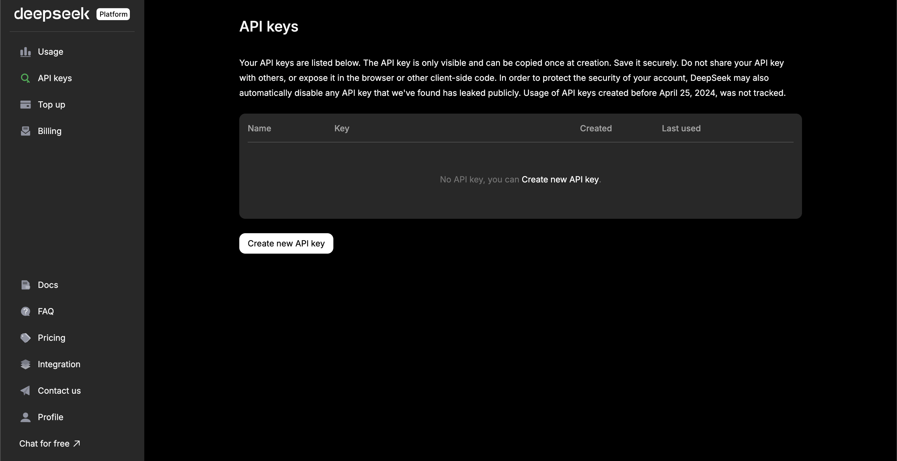

[DeepSeek Platform]: https://platform.deepseek.com
[DeepSeek docs]: https://platform.deepseek.com/docs
[DeepSeek pricing]: https://platform.deepseek.com/pricing
[DeepSeek models]: https://platform.deepseek.com/models

[Lamatic.ai Studio]: https://studio.lamatic.ai
[Lamatic support]: https://lamatic.ai/docs/slack

import { IntegrationOverviw } from "@/components/IntegrationOverviw"

# DeepSeek

<IntegrationOverviw slug="deepseek" type="models" />

DeepSeek is a leading AI research company that develops advanced large language models. Their models are known for their strong reasoning capabilities, code generation skills, and multilingual support, making them ideal for various AI applications.

<Callout type="info">Provider Slug: `deepseek`</Callout>

<video controls loop width="100%" autoplay muted controlslist="nodownload" className="mt-4">
    <source src="/public/videos/models/deepseek.mp4" type="video/mp4" />
    Your browser does not support the video tag.
</video>

## Setup

### Step 1: Create DeepSeek Platform Account
1. Visit the [DeepSeek Platform]
2. Sign up for a new account or log in to your existing account
3. Complete the account verification process

### Step 2: Generate API Key
1. Navigate to the **API Keys** section in your DeepSeek Platform
2. Click **Create API Key**
3. Give your API key a descriptive name
4. Copy the generated API key (you won't be able to see it again)

*DeepSeek Platform API Key Generation Screen*

### Step 3: Configure in Lamatic
1. Open your [Lamatic.ai Studio]
2. Navigate to **Models** section
3. Select **DeepSeek** from the provider list
4. Paste your API key in the designated field
5. Save your changes

## Key Features

- **Advanced Reasoning**: Strong logical reasoning and problem-solving capabilities
- **Code Generation**: Excellent code generation and programming assistance
- **Multilingual Support**: Support for multiple languages and cross-language understanding
- **High Performance**: State-of-the-art model performance across various tasks
- **Cost Effective**: Competitive pricing with flexible usage plans
- **Developer Friendly**: Comprehensive API and documentation
- **Enterprise Ready**: Production-grade infrastructure with high reliability
- **Safety Focused**: Built with safety and responsible AI principles

## Available Models

DeepSeek offers several model variants:

- **DeepSeek Chat**: Advanced conversational model for complex reasoning and creative tasks
- **DeepSeek Coder**: Specialized model for code generation and programming tasks
- **DeepSeek Math**: Mathematical reasoning and problem-solving model
- **DeepSeek V2.5**: Latest generation model with enhanced capabilities
- **Embedding Models**: Text embedding models for semantic search and RAG

Check the [DeepSeek Models][DeepSeek models] documentation for the latest model specifications and capabilities.

## Configuration Options

- **API Key**: Your DeepSeek API key for authentication
- **Model Selection**: Choose from available DeepSeek models
- **Custom Parameters**: Configure temperature, max_tokens, top_p, and other generation parameters
- **Streaming**: Enable real-time text generation streaming
- **Code Generation**: Configure specialized code generation settings
- **Safety Settings**: Configure content safety and filtering options

## Best Practices

- **API Key Security**: Keep your API keys secure and never share them publicly
- **Rate Limiting**: Be aware of DeepSeek's rate limits and implement appropriate throttling
- **Model Selection**: Choose the appropriate model based on your use case:
  - Use Chat for general conversation and reasoning tasks
  - Use Coder for programming and code generation tasks
  - Use Math for mathematical problem-solving
  - Use V2.5 for the most advanced capabilities
- **Error Handling**: Implement proper error handling for API failures and rate limits
- **Cost Optimization**: Monitor your usage and optimize prompts to reduce token consumption
- **Code Generation**: Provide clear context and requirements for better code generation
- **Safety Configuration**: Configure appropriate safety settings for your use case

## Troubleshooting

**Invalid API Key:**
- Verify your API key is correct and hasn't expired
- Check if your account has sufficient credits
- Ensure the API key has the necessary permissions

**Rate Limit Exceeded:**
- Implement exponential backoff in your requests
- Consider upgrading your DeepSeek plan for higher limits
- Monitor your usage in the DeepSeek Platform

**Model Not Available:**
- Check if the model is available in your region
- Verify your account has access to the specific model
- Contact DeepSeek support for model availability issues

**Authentication Errors:**
- Ensure your API key is properly formatted
- Check if your account is active and verified
- Verify you're using the correct API endpoint

**Code Generation Issues:**
- Provide clear and specific requirements
- Include relevant context and examples
- Specify programming language and framework requirements

**Content Safety Violations:**
- Review DeepSeek's content safety guidelines
- Modify inputs to comply with safety standards
- Configure safety settings appropriately

## Important Notes

- Keep your API keys secure and never share them
- Check provider's pricing before generating API keys: [DeepSeek pricing][DeepSeek pricing]
- Regularly rotate your API keys for enhanced security
- Monitor your usage and costs in the DeepSeek Platform
- Test your integration after adding each key
- Some models may require additional setup or approval
- Be aware of DeepSeek's content safety and usage policies
- Consider specialized models for specific use cases (coding, math, etc.)
- Respect DeepSeek's responsible AI principles

## Additional Resources

- [DeepSeek API Documentation][DeepSeek docs]
- [Model Documentation][DeepSeek models]
- [Pricing Information][DeepSeek pricing]
- [DeepSeek Community](https://platform.deepseek.com/community)

Need help? Contact [Lamatic support]

