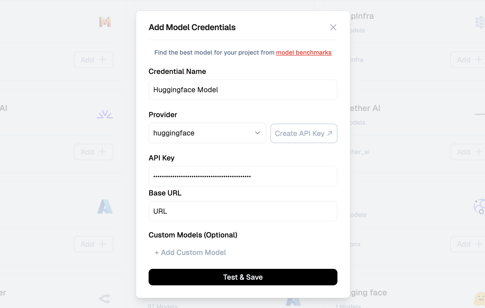

[Hugging Face Hub]: https://huggingface.co/
[Hugging Face Access Tokens]: https://huggingface.co/settings/tokens
[Hugging Face Inference Endpoints]: https://huggingface.co/inference-endpoints
[Hugging Face Docs]: https://huggingface.co/docs
[Lamatic.ai Studio]: https://studio.lamatic.ai
[Lamatic Support]: https://help.lamatic.ai/en/
[Custom Model Integration]: https://lamatic.ai/docs/models/custom-model-integration

import { IntegrationOverviw } from "@/components/IntegrationOverviw"

# HuggingFace

<IntegrationOverviw slug="huggingface" type="models" />

Hugging Face is a leading platform for building, hosting, and deploying state-of-the-art machine learning models. With its extensive model hub and flexible deployment options, Hugging Face allows you to use both public models and your own self-hosted endpoints. Lamatic.ai Studio enables seamless integration of these models, whether you use a managed public endpoint or a private, self-hosted endpoint for custom or fine-tuned models.
> **Lamatic.ai Studio supports both public (open-source) and private (self-hosted/dedicated) Hugging Face models.**  

> You can integrate popular models from the Hugging Face Hub or connect your own secure, fine-tuned endpoints for production use.

<Callout type="info">Provider Slug: `huggingface`</Callout>

## Setup

### Step 1: Create a Hugging Face Account
1. Go to the [Hugging Face Hub] and sign up or log in.
2. Complete account verification if prompted.

### Step 2: Prepare Your Model Endpoint

#### Option A: Public Model Endpoint
1. Browse the [Hugging Face Hub] and find the open source model you wish to use.
2. Click the **Use this model** dropdown, then under the **Inference** section, click **Inference Providers**.
3. Select the inference provider you want to use.
4. Copy the model name.

5. The public inference API endpoint is:  
   `https://router.huggingface.co`

#### Option B: Self-Hosted (Dedicated) Inference Endpoint
1. Go to [Hugging Face Inference Endpoints].

2. Create a new endpoint for your private or fine-tuned model.
3. Once deployed, copy the **Base URL** of your endpoint (e.g., `https://your-namespace.hf.space/proxy/your-endpoint`).

### Step 3: Generate Access Token
1. Visit [Hugging Face Access Tokens].
2. Create a new token with `read` or `inference` permissions.
3. Copy your access token (you will need it for Lamatic.ai Studio).

### Step 4: Configure in Lamatic.ai Studio

1. Open [Lamatic.ai Studio].
2. Navigate to the **Models** section.
3. Select **HuggingFace** from the provider list.
4. Enter the following depending on your setup:
    - **Public model:**  
      - Paste the public inference API URL and the model name.
      - Paste your Hugging Face access token.
    - **Self-hosted endpoint:**  
      - Paste your dedicated endpoint Base URL.
      - Paste your Hugging Face access token.
5. Save your configuration.

*Hugging Face Model Configuration in Lamatic.ai Studio*

## Key Features

- **Custom & Fine-Tuned Models:**  
  Connect your own models or use domain-specific fine-tuned endpoints.
- **Public Model Access:**  
  Quickly integrate popular open-source models from the Hugging Face Hub.
- **Self-Hosted Endpoints:**  
  Use private, scalable endpoints for production workloads and enhanced security.
- **Seamless Integration:**  
  Easily manage models from both public and private endpoints in Lamatic workflows.
- **Secure Authentication:**  
  All access is managed via Hugging Face tokens.
- **Provider-Level Customization:**  
  Override default behaviors per model or endpoint as needed.

For advanced options, see [Custom Model Integration].

## Available Configuration Options

- **Model URL or Name:** The public model name, public API endpoint URL, or self-hosted endpoint Base URL
- **Access Token:** Your Hugging Face access token (required for both public and private endpoints)

## Best Practices

- **Credential Security:** Keep your access tokens private and never share them.
- **Token Rotation:** Regularly rotate your Hugging Face tokens.
- **Testing:** Test model responses after integration.
- **Production:** Use self-hosted, dedicated endpoints for critical or production workloads.
- **Monitoring:** Monitor rate limits and usage from your Hugging Face account.

## Troubleshooting

**Invalid Token:**  
- Ensure your access token is correct and has the required permissions.
- Confirm your Hugging Face account is active.

**Access Denied:**  
- Check your token’s permissions and endpoint/model visibility.
- Make sure you have access to the deployed endpoint if using self-hosted.

**Model or Endpoint Not Found:**  
- Double-check the model name or endpoint URL.
- Confirm you have access to the model or endpoint.

**Rate Limit Exceeded:**  
- Wait before retrying requests.
- Upgrade your Hugging Face plan if necessary.

**Integration Errors:**  
- Confirm Lamatic.ai Studio configuration matches your Hugging Face setup.
- Consult [Hugging Face Docs] and [Lamatic Support] for troubleshooting.

## Additional Resources

- [Hugging Face Documentation][Hugging Face Docs]
- [Model Hub][Hugging Face Hub]
- [Access Tokens][Hugging Face Access Tokens]
- [Custom Model Integration]
- [Lamatic Support]

Need help? Contact [Lamatic Support].