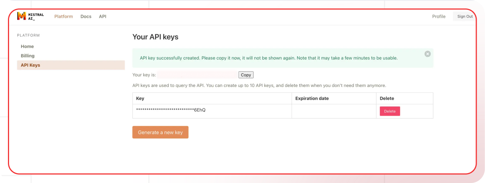

[Mistral platform]: https://console.mistral.ai
[Mistral keys]: https://console.mistral.ai/api-keys/
[Mistral docs]: https://docs.mistral.ai
[Mistral pricing]: https://mistral.ai/pricing
[Mistral models]: https://docs.mistral.ai/models

[Lamatic.ai Studio]: https://studio.lamatic.ai
[Lamatic support]: https://lamatic.ai/docs/slack

import { IntegrationOverviw } from "@/components/IntegrationOverviw"

# Mistral AI

<IntegrationOverviw slug="mistral-ai" type="models" />

Mistral AI provides a comprehensive suite of AI products and services. Their core offerings include several powerful language models in the Mistral series, starting with Mistral 7B, their foundational open-source model that made headlines for its efficient performance.

<Callout type="info">Provider Slug: `mistral`</Callout>

## Setup

### Step 1: Create Mistral AI Account
1. Visit the [Mistral platform][Mistral platform]
2. Sign up for a new account or log in to your existing account
3. Complete the account verification process

### Step 2: Generate API Key
1. Navigate to the [API Keys section][Mistral keys] in your Mistral console
2. Click **Generate New Key**
3. Give your API key a descriptive name
4. Copy the generated API key (you won't be able to see it again)

*Mistral AI Platform API Key Generation Screen*

### Step 3: Configure in Lamatic
1. Open your [Lamatic.ai Studio]
2. Navigate to **Models** section
3. Select **mistral** from the provider list
4. Paste your API key in the designated field
5. Save your changes

## Key Features

- **Efficient Models**: High-performance models with excellent performance-to-size ratios
- **Open Source Foundation**: Strong commitment to open-source AI development
- **Advanced Reasoning**: Models excel at complex reasoning and problem-solving tasks
- **Multilingual Support**: Models trained on multiple languages for global applications
- **Cost Effective**: Competitive pricing with flexible usage plans
- **Developer Friendly**: Comprehensive API and documentation
- **Enterprise Ready**: Production-grade infrastructure with high reliability

## Available Models

Mistral AI offers several model variants:

- **Mistral 7B**: Efficient foundational model for general tasks
- **Mistral Large**: High-performance model for complex reasoning
- **Mistral Medium**: Balanced performance for various applications
- **Mistral Small**: Fast and efficient model for everyday tasks
- **Mixtral Models**: Mixture of experts models for enhanced performance

Check the [Mistral Models][Mistral models] documentation for the latest model specifications and capabilities.

## Configuration Options

- **API Key**: Your Mistral AI API key for authentication
- **Model Selection**: Choose from available Mistral models
- **Custom Parameters**: Configure temperature, max_tokens, top_p, and other generation parameters
- **Streaming**: Enable real-time text generation streaming
- **System Prompts**: Define behavior and constraints for the model

## Best Practices

- **API Key Security**: Keep your API keys secure and never share them publicly
- **Rate Limiting**: Be aware of Mistral AI's rate limits and implement appropriate throttling
- **Model Selection**: Choose the appropriate model based on your use case:
  - Use Small for speed-critical applications
  - Use Medium for balanced performance
  - Use Large for complex reasoning tasks
- **Error Handling**: Implement proper error handling for API failures and rate limits
- **Cost Optimization**: Monitor your usage and optimize prompts to reduce token consumption
- **Performance Monitoring**: Track model performance and latency for your specific use cases

## Troubleshooting

**Invalid API Key:**
- Verify your API key is correct and hasn't expired
- Check if your account has sufficient credits
- Ensure the API key has the necessary permissions

**Rate Limit Exceeded:**
- Implement exponential backoff in your requests
- Consider upgrading your Mistral AI plan for higher limits
- Monitor your usage in the Mistral console

**Model Not Available:**
- Check if the model is available in your region
- Verify your account has access to the specific model
- Contact Mistral AI support for model availability issues

**Authentication Errors:**
- Ensure your API key is properly formatted
- Check if your account is active and verified
- Verify you're using the correct API endpoint

**Performance Issues:**
- Check if the model is currently under high load
- Consider using a different model or region
- Monitor Mistral AI's status page for any service issues

## Important Notes

- Keep your API keys secure and never share them
- Check provider's pricing before generating API keys: [Mistral pricing][Mistral pricing]
- Regularly rotate your API keys for enhanced security
- Monitor your usage and costs in the Mistral console
- Test your integration after adding each key
- Some models may require additional setup or approval
- Be aware of Mistral AI's terms of service and usage policies

## Additional Resources

- [Mistral AI API Documentation][Mistral docs]
- [Model Documentation][Mistral models]
- [Pricing Information][Mistral pricing]
- [Mistral AI Community](https://discord.gg/mistralai)

Need help? Contact [Lamatic support]