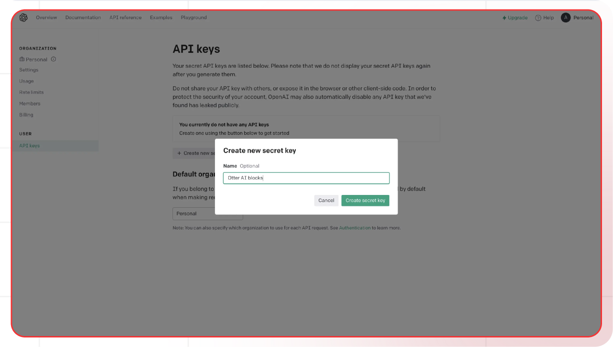

[OpenAI API]: https://platform.openai.com/api-keys
[OpenAI signup]: https://platform.openai.com/signup
[OpenAI docs]: https://platform.openai.com/docs
[OpenAI pricing]: https://openai.com/pricing
[OpenAI models]: https://platform.openai.com/docs/models

[Lamatic.ai Studio]: https://studio.lamatic.ai
[Lamatic support]: https://lamatic.ai/docs/slack

import { IntegrationOverviw } from "@/components/IntegrationOverviw"

# OpenAI

<IntegrationOverviw slug="open-ai" type="models" />

OpenAI provides several key products and services that have become widely used in various industries. Their flagship offerings include GPT models, DALL-E for image generation, and Whisper for speech recognition.

<Callout type="info">Provider Slug: `openai`</Callout>

## Setup

### Step 1: Create OpenAI Account
1. Visit the [OpenAI API][OpenAI API]
2. Sign in or create an [account][OpenAI signup]
3. Complete the account verification process

### Step 2: Generate API Key
1. Navigate to the **API Keys** section in your OpenAI platform
2. Click **Create New Secret Key**
3. Give your API key a descriptive name
4. Copy the generated API key (you won't be able to see it again)

*OpenAI API Key Generation Screen*

### Step 3: Configure in Lamatic
1. Open your [Lamatic.ai Studio]
2. Navigate to **Models** section
3. Select **OpenAI** from the provider list
4. Paste your API key in the designated field
5. Save your changes

## Key Features

- **State-of-the-Art Models**: Access to the latest GPT models and other advanced AI capabilities
- **Comprehensive AI Suite**: Text generation, image generation, speech recognition, and more
- **High Quality**: Industry-leading model performance and reliability
- **Extensive Documentation**: Comprehensive API documentation and examples
- **Enterprise Ready**: Production-grade infrastructure with high reliability
- **Cost Effective**: Competitive pricing with flexible usage plans
- **Wide Adoption**: Extensive community support and integrations

## Available Models

OpenAI offers several model categories:

- **GPT Models**: Advanced language models for text generation and completion
  - GPT-4: Most capable model for complex reasoning
  - GPT-4 Turbo: Optimized for speed and cost
  - GPT-3.5 Turbo: Fast and efficient for most tasks
- **DALL-E Models**: Image generation models
- **Whisper Models**: Speech recognition and transcription
- **Embedding Models**: Text embedding for semantic search and RAG
- **Moderation Models**: Content moderation and filtering

Check the [OpenAI Models][OpenAI models] documentation for the latest model specifications and capabilities.

## Configuration Options

- **API Key**: Your OpenAI API key for authentication
- **Model Selection**: Choose from available OpenAI models
- **Custom Parameters**: Configure temperature, max_tokens, top_p, and other generation parameters
- **Streaming**: Enable real-time text generation streaming
- **System Prompts**: Define behavior and constraints for the model
- **Function Calling**: Use function calling for structured outputs

## Best Practices

- **API Key Security**: Keep your API keys secure and never share them publicly
- **Rate Limiting**: Be aware of OpenAI's rate limits and implement appropriate throttling
- **Model Selection**: Choose the appropriate model based on your use case:
  - Use GPT-3.5 Turbo for most applications
  - Use GPT-4 for complex reasoning tasks
  - Use GPT-4 Turbo for balanced performance and cost
- **Error Handling**: Implement proper error handling for API failures and rate limits
- **Cost Optimization**: Monitor your usage and optimize prompts to reduce token consumption
- **Performance Monitoring**: Track model performance and latency for your specific use cases
- **Content Safety**: Use moderation models to ensure content safety

## Troubleshooting

**Invalid API Key:**
- Verify your API key is correct and hasn't expired
- Check if your account has sufficient credits
- Ensure the API key has the necessary permissions

**Rate Limit Exceeded:**
- Implement exponential backoff in your requests
- Consider upgrading your OpenAI plan for higher limits
- Monitor your usage in the OpenAI platform

**Model Not Available:**
- Check if the model is available in your region
- Verify your account has access to the specific model
- Contact OpenAI support for model availability issues

**Authentication Errors:**
- Ensure your API key is properly formatted
- Check if your account is active and verified
- Verify you're using the correct API endpoint

**Content Policy Violations:**
- Review OpenAI's content policy guidelines
- Modify prompts to comply with safety standards
- Use system prompts to guide model behavior appropriately

## Important Notes

- Keep your API keys secure and never share them
- Check provider's pricing before generating API keys: [OpenAI pricing][OpenAI pricing]
- Regularly rotate your API keys for enhanced security
- Monitor your usage and costs in the OpenAI platform
- Test your integration after adding each key
- Some models may require additional setup or approval
- Be aware of OpenAI's content policy and safety guidelines
- Consider using moderation models for content safety

## Additional Resources

- [OpenAI API Documentation][OpenAI docs]
- [Model Documentation][OpenAI models]
- [Pricing Information][OpenAI pricing]
- [OpenAI Community](https://community.openai.com/)

Need help? Contact [Lamatic support]