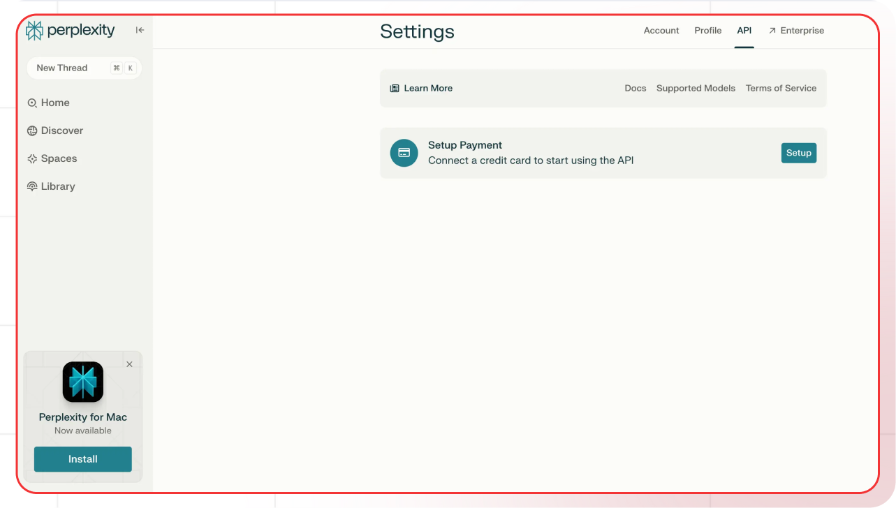

[Perplexity AI Settings]: https://perplexity.ai/settings/api
[Perplexity AI Docs]: https://docs.perplexity.ai/
[Perplexity AI Models]: https://docs.perplexity.ai/docs/models

[Lamatic.ai Studio]: https://studio.lamatic.ai
[Lamatic support]: https://lamatic.ai/docs/slack

import { IntegrationOverviw } from "@/components/IntegrationOverviw"

# Perplexity AI
<IntegrationOverviw slug="perplexity-ai" type="models" />

Perplexity AI is a modern search and information discovery platform that revolutionizes how people find and understand information online. Through their perplexity.ai website and mobile apps, they provide an AI-powered search experience that delivers direct answers rather than just links, combining real-time information gathering with advanced AI processing.
<Callout type="info">Provider Slug: `perplexity-ai`</Callout>

<video controls loop width="100%" autoplay muted controlslist="nodownload" className="mt-4">
    <source src="/public/videos/models/perplexity.mp4" type="video/mp4" />
    Your browser does not support the video tag.
</video>

## Setup

### Step 1: Create Perplexity AI Account
1. Visit the [Perplexity AI Settings][Perplexity AI Settings]
2. Sign up for a new account or log in to your existing account
3. Complete the account verification process

### Step 2: Generate API Key
1. Navigate to the **API Keys** section in your Perplexity AI settings
2. Click **Generate New Key**
3. Give your API key a descriptive name
4. Copy the generated API key (you won't be able to see it again)

### Step 3: Configure in Lamatic
1. Open your [Lamatic.ai Studio]
2. Navigate to **Models** section
3. Select **Perplexity AI** from the provider list
4. Paste your API key in the designated field
5. Save your changes

## Key Features

- **Real-Time Information**: Access to current and up-to-date information from the web
- **AI-Powered Search**: Advanced search capabilities with direct answer generation
- **Comprehensive Coverage**: Access to a wide range of information sources
- **High Accuracy**: Reliable and accurate information retrieval
- **Cost Effective**: Competitive pricing for search and information services
- **Developer Friendly**: Simple API integration and comprehensive documentation
- **Multimodal Support**: Text and image search capabilities

## Available Models

Perplexity AI offers several model variants:

- **Search Models**: Specialized models for web search and information retrieval
- **Answer Models**: Models optimized for generating direct answers from search results
- **Research Models**: Models designed for comprehensive research tasks
- **Creative Models**: Models for creative writing and content generation

Check the [Perplexity AI Models][Perplexity AI Models] documentation for the latest model specifications and capabilities.

## Configuration Options

- **API Key**: Your Perplexity AI API key for authentication
- **Model Selection**: Choose from available Perplexity AI models
- **Custom Parameters**: Configure temperature, max_tokens, top_p, and other generation parameters
- **Streaming**: Enable real-time text generation streaming
- **Search Configuration**: Configure search parameters and filters
- **Source Selection**: Choose specific information sources if needed

## Best Practices

- **API Key Security**: Keep your API keys secure and never share them publicly
- **Rate Limiting**: Be aware of Perplexity AI's rate limits and implement appropriate throttling
- **Model Selection**: Choose the appropriate model based on your use case:
  - Use search models for information retrieval
  - Use answer models for direct responses
  - Use research models for comprehensive analysis
- **Error Handling**: Implement proper error handling for API failures and rate limits
- **Cost Optimization**: Monitor your usage and optimize queries to reduce costs
- **Information Quality**: Verify information accuracy when using for critical applications
- **Source Attribution**: Consider source credibility and attribution in your applications

## Troubleshooting

**Invalid API Key:**
- Verify your API key is correct and hasn't expired
- Check if your account has sufficient credits
- Ensure the API key has the necessary permissions

**Rate Limit Exceeded:**
- Implement exponential backoff in your requests
- Consider upgrading your Perplexity AI plan for higher limits
- Monitor your usage in the Perplexity AI dashboard

**Model Not Available:**
- Check if the model is available in your region
- Verify your account has access to the specific model
- Contact Perplexity AI support for model availability issues

**Authentication Errors:**
- Ensure your API key is properly formatted
- Check if your account is active and verified
- Verify you're using the correct API endpoint

**Search Issues:**
- Check if your search query is properly formatted
- Verify that the information you're seeking is available
- Consider using different search parameters or filters

## Important Notes

- Keep your API keys secure and never share them
- Regularly rotate your API keys for enhanced security
- Monitor your usage and costs in the Perplexity AI dashboard
- Test your integration after adding each key
- Some models may require additional setup or approval
- Be aware of Perplexity AI's terms of service and usage policies
- Verify information accuracy for critical applications
- Consider source credibility and attribution

## Additional Resources

- [Perplexity AI API Documentation][Perplexity AI Docs]
- [Model Documentation][Perplexity AI Models]
- [Perplexity AI Community](https://discord.gg/perplexity)

Need help? Contact [Lamatic support]