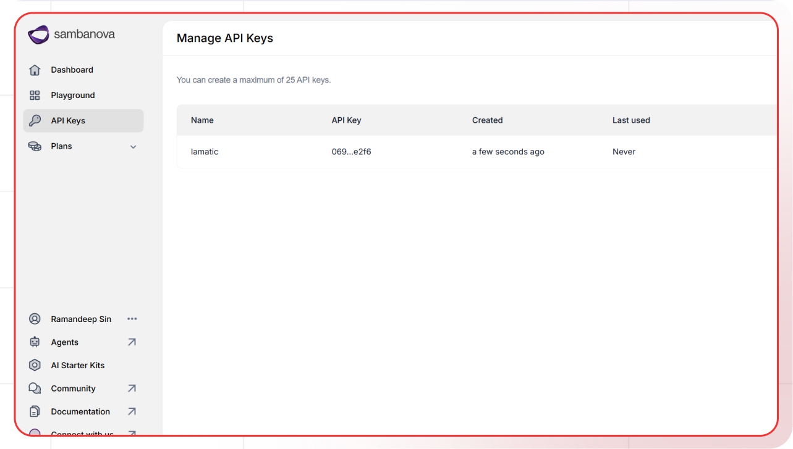

[SambaNova AI Account Setting]: https://cloud.sambanova.ai/profile
[SambaNova AI Docs]: https://docs.sambanova.ai/cloud/docs
[SambaNova AI Models]: https://docs.sambanova.ai/cloud/docs/get-started/supported-models

[Lamatic.ai Studio]: https://studio.lamatic.ai
[Lamatic support]: https://lamatic.ai/docs/slack

import { IntegrationOverviw } from "@/components/IntegrationOverviw"

# SambaNova
<IntegrationOverviw slug="sambanova" type="models" />

SambaNova provides an advanced platform that enables developers, researchers, and enterprises to train, fine-tune, and deploy AI models at scale. It offers access to cutting-edge models and delivers powerful tools for custom model development and optimization.

<Callout type="info">Provider Slug: `sambanova`</Callout>

## Setup

### Step 1: Create SambaNova Account
1. Visit the [SambaNova Account Setting][SambaNova AI Account Setting]
2. Sign up for a new account or log in to your existing account
3. Complete the account verification process

### Step 2: Generate API Key
1. Navigate to the **API Keys** section in your SambaNova dashboard
2. Click **Generate New Key**
3. Give your API key a descriptive name
4. Copy the generated API key (you won't be able to see it again)

### Step 3: Configure in Lamatic
1. Open your [Lamatic.ai Studio]
2. Navigate to **Models** section
3. Select **sambanova** from the provider list
4. Paste your API key in the designated field
5. Save your changes

## Key Features

- **Wide Model Access**: Access to hundreds of open-source and proprietary models
- **Custom Model Training**: Tools for training and fine-tuning your own models
- **Cost Effective**: Competitive pricing for model inference and training
- **High Performance**: Optimized infrastructure for fast model serving
- **Developer Friendly**: Comprehensive API and documentation
- **Scalable**: Automatic scaling based on demand
- **Research Support**: Specialized tools for AI research and development

## Available Models

SambaNova supports a wide variety of models including:

- **Production Models**: DeepSeek-R1, DeepSeek-V3-0324, Llama-3.3 70B Instruct, and others
- **Preview Models**: Early-access options like Llama-4 Maverick, Whisper-Large-v3, Qwen3-32B, and Mistral-7B Instruct
- **On-Request Models**: Legacy or specialized models available upon request
- **Open Source Models**: Llama, DeepSeek, Qwen, and additional community models
- **Research & Specialized Models**: Built for reasoning, coding, experimentation, and research workflows

Check the [SambaNova AI Models][SambaNova AI Models] documentation for the complete list of available models and their specifications.

## Configuration Options

- **API Key**: Your SambaNova API key for authentication
- **Model Selection**: Choose from available SambaNova AI Models
- **Custom Parameters**: Configure temperature, max_tokens, top_p, and other generation parameters
- **Streaming**: Enable real-time text generation streaming
- **Custom Model Endpoints**: Use your own trained models if available
- **Training Configuration**: Configure model training parameters if applicable

## Best Practices

- **API Key Security**: Keep your API keys secure and never share them publicly
- **Rate Limiting**: Be aware of SambaNova's rate limits and implement appropriate throttling
- **Model Selection**: Choose the appropriate model based on your use case and budget
- **Error Handling**: Implement proper error handling for API failures and rate limits
- **Cost Optimization**: Monitor your usage and optimize prompts to reduce token consumption
- **Performance Monitoring**: Track model performance and latency for your specific use cases
- **Custom Model Management**: If using custom models, ensure proper versioning and deployment

## Troubleshooting

**Invalid API Key:**
- Verify your API key is correct and hasn't expired
- Check if your account has sufficient credits
- Ensure the API key has the necessary permissions

**Rate Limit Exceeded:**
- Implement exponential backoff in your requests
- Consider upgrading your SambaNova plan for higher limits
- Monitor your usage in the SambaNova dashboard

**Model Not Available:**
- Check if the model is available in your region
- Verify your account has access to the specific model
- Contact SambaNova support for model availability issues

**Authentication Errors:**
- Ensure your API key is properly formatted
- Check if your account is active and verified
- Verify you're using the correct API endpoint

**Custom Model Issues:**
- Verify your custom model is properly deployed and running
- Check model endpoint configuration
- Ensure proper permissions for custom model access
- Verify model compatibility and versioning

## Important Notes

- Keep your API keys secure and never share them
- Regularly rotate your API keys for enhanced security
- Monitor your usage and costs in the SambaNova dashboard
- Test your integration after adding each key
- Some models may require additional setup or approval
- Be aware of SambaNova's terms of service and usage policies
- Custom models may have different pricing and availability
- Consider model licensing and usage rights for custom models

## Additional Resources

- [SambaNova API Documentation][SambaNova AI Docs]
- [Model Documentation][SambaNova AI Models]

Need help? Contact [Lamatic support]