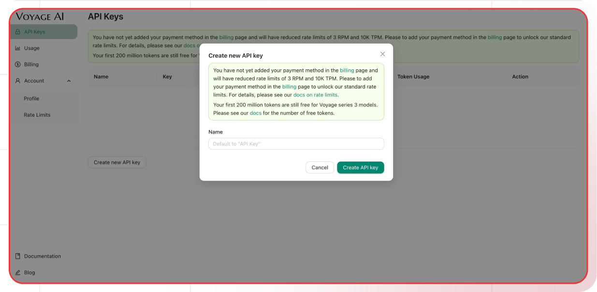

[Voyage AI Dashboard]: https://dash.voyageai.com/
[Voyage AI pricing]: https://docs.voyageai.com/docs/pricing
[Voyage AI Docs]: https://docs.voyageai.com/
[Voyage AI Models]: https://docs.voyageai.com/docs/models

[Lamatic.ai Studio]: https://studio.lamatic.ai
[Lamatic support]: https://lamatic.ai/docs/slack

import { IntegrationOverviw } from "@/components/IntegrationOverviw"

# Voyage AI
<IntegrationOverviw slug="voyage-ai" type="models" />
Voyage AI represents a specialized player in the enterprise AI landscape, focusing on transforming how organizations handle their information retrieval and knowledge management needs. They specialize in advanced embedding models and search capabilities.

<Callout type="info">Provider Slug: `voyage-ai`</Callout>

## Setup

### Step 1: Create Voyage AI Account
1. Visit the [Voyage AI Dashboard][Voyage AI Dashboard]
2. Sign up for a new account or log in to your existing account
3. Complete the account verification process

### Step 2: Generate API Key
1. Navigate to the **API Keys** section in your Voyage AI dashboard
2. Click **Generate New Key**
3. Give your API key a descriptive name
4. Copy the generated API key (you won't be able to see it again)

### Step 3: Configure in Lamatic
1. Open your [Lamatic.ai Studio]
2. Navigate to **Models** section
3. Select **Voyage AI** from the provider list
4. Paste your API key in the designated field
5. Save your changes

## Key Features

- **Advanced Embeddings**: High-quality text embeddings for semantic search and RAG
- **Enterprise Focus**: Specialized solutions for enterprise information retrieval
- **Knowledge Management**: Tools for organizing and searching large knowledge bases
- **High Performance**: Optimized for fast and accurate information retrieval
- **Cost Effective**: Competitive pricing for embedding and search services
- **Developer Friendly**: Simple API integration and comprehensive documentation
- **Scalable**: Designed to handle large-scale enterprise deployments

## Available Models

Voyage AI offers specialized models for information retrieval:

- **Embedding Models**: High-quality text embeddings for semantic search
- **Rerank Models**: Models for improving search result relevance
- **Search Models**: Specialized models for information retrieval tasks
- **Enterprise Models**: Models optimized for enterprise use cases

Check the [Voyage AI Models][Voyage AI Models] documentation for the latest model specifications and capabilities.

## Configuration Options

- **API Key**: Your Voyage AI API key for authentication
- **Model Selection**: Choose from available Voyage AI models
- **Custom Parameters**: Configure embedding dimensions, search parameters, and other options
- **Batch Processing**: Configure batch sizes for large-scale operations
- **Search Configuration**: Configure search parameters and filters
- **Reranking Options**: Configure reranking parameters for improved results

## Best Practices

- **API Key Security**: Keep your API keys secure and never share them publicly
- **Rate Limiting**: Be aware of Voyage AI's rate limits and implement appropriate throttling
- **Model Selection**: Choose the appropriate model based on your use case:
  - Use embedding models for semantic search
  - Use rerank models for improving search relevance
  - Use search models for information retrieval
- **Error Handling**: Implement proper error handling for API failures and rate limits
- **Cost Optimization**: Monitor your usage and optimize operations to reduce costs
- **Performance Monitoring**: Track embedding quality and search performance
- **Data Quality**: Ensure high-quality input data for optimal embedding results

## Troubleshooting

**Invalid API Key:**
- Verify your API key is correct and hasn't expired
- Check if your account has sufficient credits
- Ensure the API key has the necessary permissions

**Rate Limit Exceeded:**
- Implement exponential backoff in your requests
- Consider upgrading your Voyage AI plan for higher limits
- Monitor your usage in the Voyage AI dashboard

**Model Not Available:**
- Check if the model is available in your region
- Verify your account has access to the specific model
- Contact Voyage AI support for model availability issues

**Authentication Errors:**
- Ensure your API key is properly formatted
- Check if your account is active and verified
- Verify you're using the correct API endpoint

**Embedding Quality Issues:**
- Check if your input text is properly formatted
- Verify that the text length is within model limits
- Consider preprocessing text for better results

## Important Notes

- Keep your API keys secure and never share them
- Check provider's pricing before generating API keys: [Voyage AI pricing][Voyage AI pricing]
- Regularly rotate your API keys for enhanced security
- Monitor your usage and costs in the Voyage AI dashboard
- Test your integration after adding each key
- Some models may require additional setup or approval
- Be aware of Voyage AI's terms of service and usage policies
- Consider data privacy and security for enterprise deployments

## Additional Resources

- [Voyage AI API Documentation][Voyage AI Docs]
- [Model Documentation][Voyage AI Models]
- [Pricing Information][Voyage AI pricing]
- [Voyage AI Community](https://discord.gg/voyage-ai)

Need help? Contact [Lamatic support]