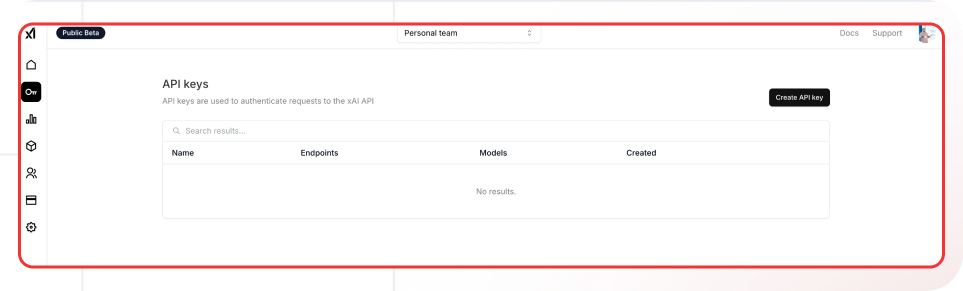

[xAI Console]: https://console.x.ai/
[xAI Docs]: https://docs.x.ai/
[xAI Models]: https://docs.x.ai/models

[Lamatic.ai Studio]: https://studio.lamatic.ai
[Lamatic support]: https://lamatic.ai/docs/slack

import { IntegrationOverviw } from "@/components/IntegrationOverviw"

# xAI 

<IntegrationOverviw slug="xai" type="models" />

xAI primarily provides Grok, an AI assistant that stands out for its integration with X's (formerly Twitter) platform and its unique personality-driven approach to AI interactions. Grok is designed to be more conversational and engaging than traditional AI assistants.

<Callout type="info">Provider Slug: `xai`</Callout>

## Setup

### Step 1: Create xAI Account
1. Visit the [xAI Console][xAI Console]
2. Sign up for a new account or log in to your existing account
3. Complete the account verification process

### Step 2: Generate API Key
1. Navigate to the **API Keys** section in your xAI console
2. Click **Generate New Key**
3. Give your API key a descriptive name
4. Copy the generated API key (you won't be able to see it again)

### Step 3: Configure in Lamatic
1. Open your [Lamatic.ai Studio]
2. Navigate to **Models** section
3. Select **xAI** from the provider list
4. Paste your API key in the designated field
5. Save your changes

## Key Features

- **Grok Integration**: Access to Grok, xAI's flagship AI assistant
- **Personality-Driven**: Unique conversational approach with personality
- **Real-Time Information**: Access to current information through X integration
- **Conversational AI**: Designed for natural, engaging conversations
- **X Platform Integration**: Seamless integration with X (formerly Twitter)
- **Developer Friendly**: Simple API integration and documentation
- **Cost Effective**: Competitive pricing for AI assistant services

## Available Models

xAI currently offers:

- **Grok Models**: The main Grok AI assistant models
- **Conversational Models**: Models optimized for natural conversations
- **Information Models**: Models with access to real-time information

Check the [xAI Models][xAI Models] documentation for the latest model specifications and capabilities.

## Configuration Options

- **API Key**: Your xAI API key for authentication
- **Model Selection**: Choose from available xAI models
- **Custom Parameters**: Configure temperature, max_tokens, and other generation parameters
- **Streaming**: Enable real-time text generation streaming
- **Personality Settings**: Configure Grok's personality and behavior
- **Information Access**: Configure access to real-time information sources

## Best Practices

- **API Key Security**: Keep your API keys secure and never share them publicly
- **Rate Limiting**: Be aware of xAI's rate limits and implement appropriate throttling
- **Model Selection**: Choose the appropriate model based on your use case
- **Error Handling**: Implement proper error handling for API failures and rate limits
- **Cost Optimization**: Monitor your usage and optimize prompts to reduce costs
- **Personality Configuration**: Leverage Grok's unique personality for engaging interactions
- **Real-Time Information**: Use Grok's access to current information when needed

## Troubleshooting

**Invalid API Key:**
- Verify your API key is correct and hasn't expired
- Check if your account has sufficient credits
- Ensure the API key has the necessary permissions

**Rate Limit Exceeded:**
- Implement exponential backoff in your requests
- Consider upgrading your xAI plan for higher limits
- Monitor your usage in the xAI console

**Model Not Available:**
- Check if the model is available in your region
- Verify your account has access to the specific model
- Contact xAI support for model availability issues

**Authentication Errors:**
- Ensure your API key is properly formatted
- Check if your account is active and verified
- Verify you're using the correct API endpoint

**Information Access Issues:**
- Check if real-time information access is enabled
- Verify X platform integration if needed
- Contact xAI support for information access issues

## Important Notes

- Keep your API keys secure and never share them
- Regularly rotate your API keys for enhanced security
- Monitor your usage and costs in the xAI console
- Test your integration after adding each key
- Some models may require additional setup or approval
- Be aware of xAI's terms of service and usage policies
- Consider Grok's unique personality and conversational style
- Be mindful of X platform integration and data access

## Additional Resources

- [xAI API Documentation][xAI Docs]
- [Model Documentation][xAI Models]
- [xAI Community](https://discord.gg/xai)

Need help? Contact [Lamatic support]